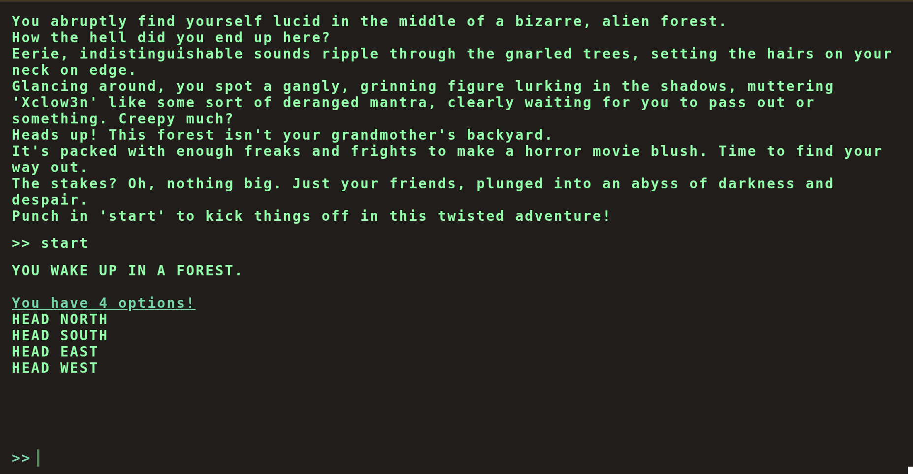
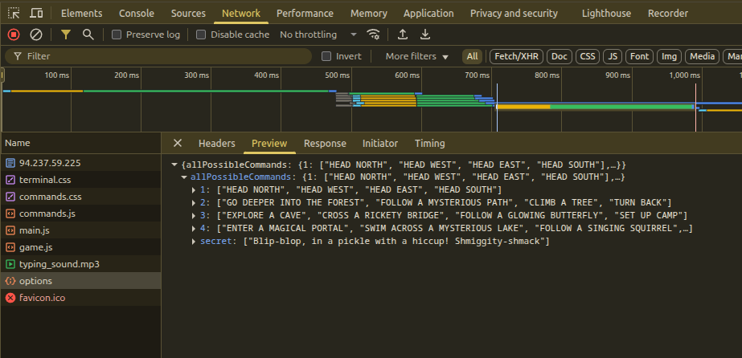
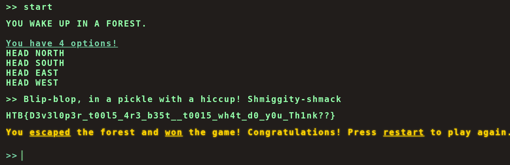

## Intoruction

This is a writeup for the web exploitation challenge within hackthebox named [FlagCommand](https://app.hackthebox.com/challenges/Flag%2520Command)

## Manual Surfing

First things first we check the website normally and it is a gamefied website that consists of a game of trying to escape a forest and contains many choices.

After playing the game for some time I realized that neither of the choices will take you out of the forest so we need to break this website somehow maybe by injecting some special input.

## Network Tab

After Checking the network tab we realise that the website fetches from an endpoint called **options** and we find all possible inputs and we find a secret input.

## Inserting the special input 

After we insert the special input : `Blip-blop, in a pickle with a hiccup! Shmiggity-shmack`

The website returns the flag directly as shown in the image below.

## Conclusion

From simple reconnaissance techniques like checking the network tab we can eventually find the key of the application/challenge, one needs a proper methedology to not skip any cruicial corners. In the next articles coming we will try to solve more challenges and after we gain more experience we're going to generate a methedology for web exploitation CTFs.

