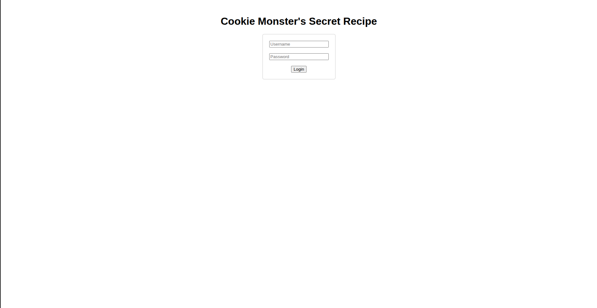
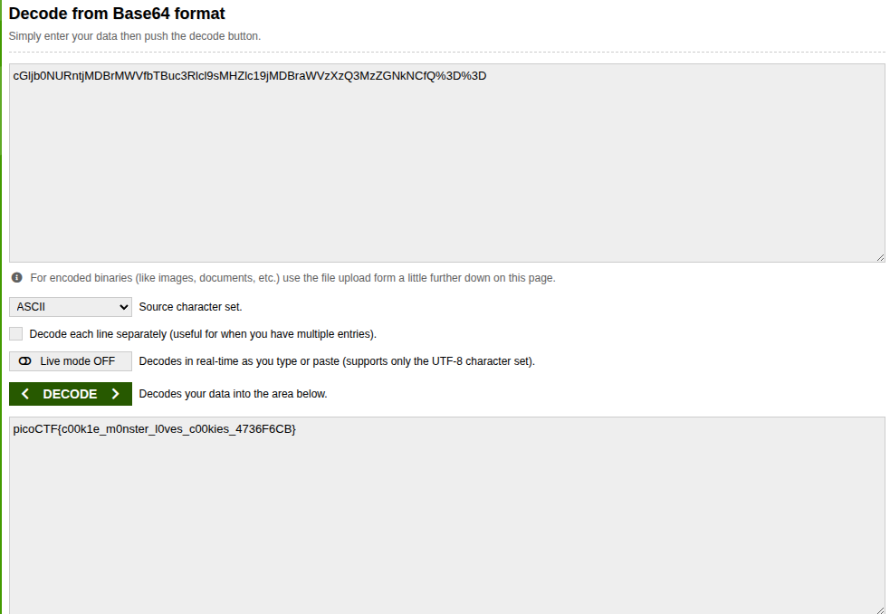

## Introduction 

[Monster Cookie Secret Recipe](https://play.picoctf.org/practice/challenge/469?category=1&difficulty=1&page=1) is a beginner PicoCTF challenge that is good if you want to understand more about where cookie tokens are stored and the structure of head request and base64 encoding.

## Hints

From the challenge name I think this is about cookies impersonation.

## Manual surfing

We get an input of username and password and a login click button let's try it.



After we do some arbitrary credentials we get this 


So yeah it is mainly about cookie impersonation or something so let's try to check the cookie.

## HEAD request

Cookies info is always stored within the header of HTTP response so let's try to send a `HEAD` request to the page and we find the following response.

```sh
HTTP/1.1 302 Found
Date: Fri, 14 Nov 2025 10:12:52 GMT
Server: Apache/2.4.54 (Debian)
X-Powered-By: PHP/7.4.33
Set-Cookie: secret_recipe=cGljb0NURntjMDBrMWVfbTBuc3Rlcl9sMHZlc19jMDBraWVzXzQ3MzZGNkNCfQ%3D%3D; expires=Fri, 14-Nov-2025 11:12:52 GMT; Max-Age=3600; path=/
Location: /
Content-Type: text/html; charset=UTF-8
```

what does this secret_recipe mean what is this encoding let's check it.

## Base64 Encoding

so `cGljb0NURntjMDBrMWVfbTBuc3Rlcl9sMHZlc19jMDBraWVzXzQ3MzZGNkNCfQ%3D%3D` appears to be base64 encoding and when we decode it we find the flag 
`picoCTF{c00k1e_m0nster_l0ves_c00kies_4736F6CB}`



## What We Leaned

- If you want to get information about cookies always start with HEAD request to get metadata about the page since cookies are part of it.