## Introduction

This article is a part of a series where we delve into different web vulnerabilities and exploitation techniques + PoC. In this article we are going to talk about the famous **Cross-Site-Scripting** vulnerability AKA - **XSS** - with a full [lab](https://github.com/KoussayDhifi/xss-cookie-stealer-lab) demonstrating the vulnerability.

## Prerequisites and Notes

- You need to know web basics like Javascript and HTML.
- This is for educational purposes only ** DO NOT TRY THIS ON REAL WEBSITES **.
- To try this vulnerability practically and safely I created a lab in this [github repo](https://github.com/KoussayDhifi/xss-cookie-stealer-lab) you can clone it and try it - PS: read README for documentation -.


## What is XSS

Before we get into a definition of cross-site-scripting we need to understand in a high level overview how a browser shows you all the stuff you are watching right now.

### How a browser shows things

At its default state a browser is not an intelligent software it basically runs browser code such as HTML, JS and CSS mindlessly without sanitizing or making sure what the content of the page is, so to demonstrate, a browser takes a file whether it is HTML/CSS/JS and runs all of it from top to bottom - Again at its normal state - as shown in the following figure.

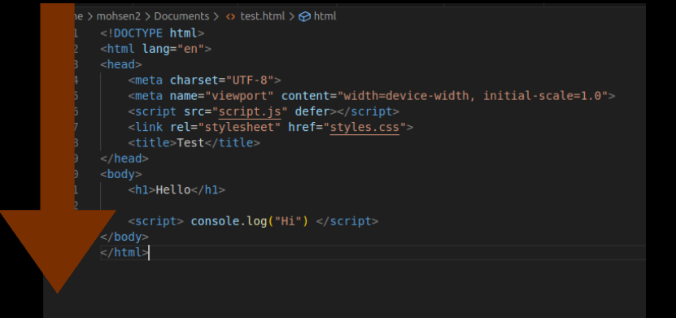

### Websites Showing User Input

If you run the [lab](https://github.com/KoussayDhifi/xss-cookie-stealer-lab) I gave you in the beginning. The victim website is a small social network app that you can log in into it by just typing any username and you'll find that the website greets you by typing `Hello <YourName>`.

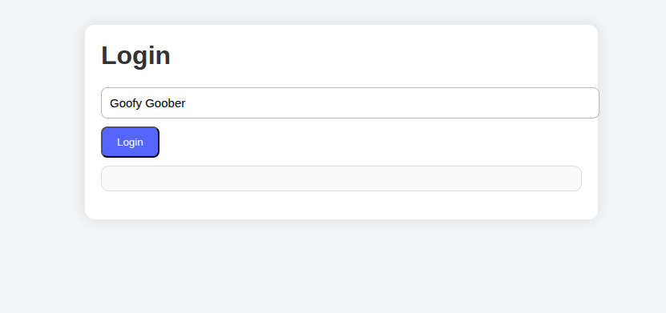

So basically the website shows user input and such websites can be vulnerable to XSS if misconfigured.

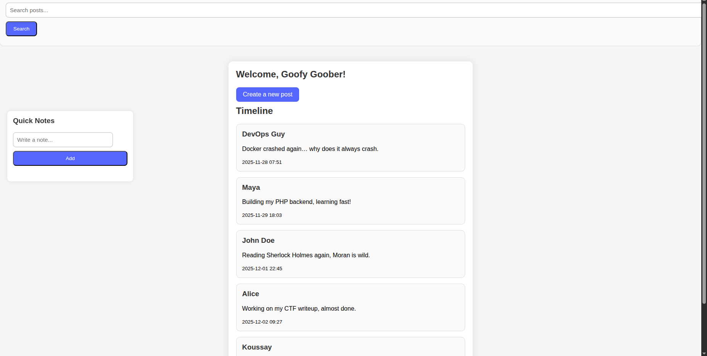


So since these websites show what the user typed exactly **then it even shows special characters such as `< , >`** and you can see where this is going.

### Input Injection

So if we insert `<h3>Hello</h3>` within the input and the browser shows it again then it will be shown and executed as `h3` tag within HTML.

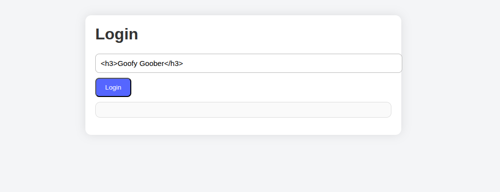

See how the input is shown as h3 instead of h1

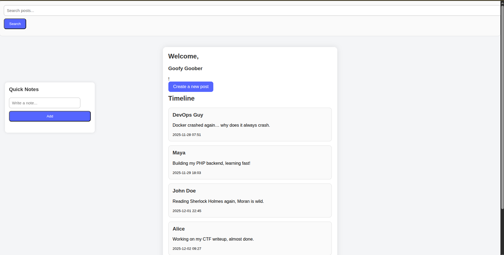


The same goes for `<script> alert(1) </script>` With that you'll have the ability to execute arbitrary javascript code.

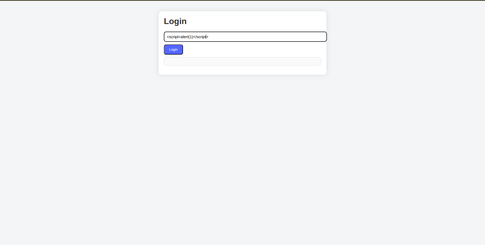

So you can see how we have the ability to arbitrarily execute javascript code.

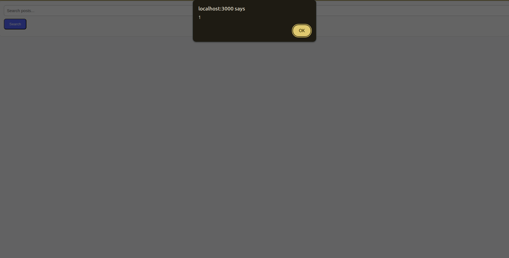


### XSS - Cross Site Scripting

So XSS (Cross Site Scripting) is the process of injecting browser code within a website's input so the browser executes it as trusted content.


## Types Of XSS

XSS is about browser code injection but there are several types of it.
We will be using the [lab](https://github.com/KoussayDhifi/xss-cookie-stealer-lab) to demonstrate all types.


### Reflected XSS

That is one of the most common types of XSS, basically it consists of the server getting your malicious input and injecting it into the HTML page which is being built by the server, then it returns the page to the browser to show it with your malicious input.

#### Video Demonstration

The following video showcases how exactly reflected XSS happens in terms of client/server architecture.


#### Lab Demonstration

For the lab demonstration we can see the search bar to search for different articles if we perform a search we realize that it rewrites the input we entered.

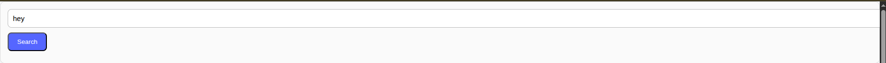

And it types exactly what you entered.

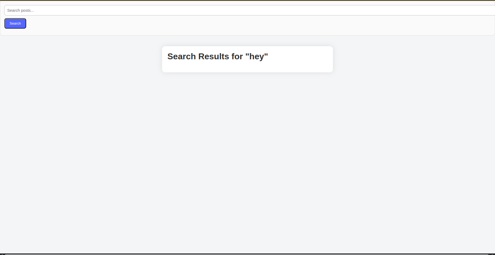


Now we can insert the famous payload `<script> alert(X) </script>`

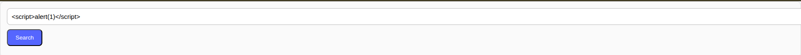

And you can see the result VOILA.

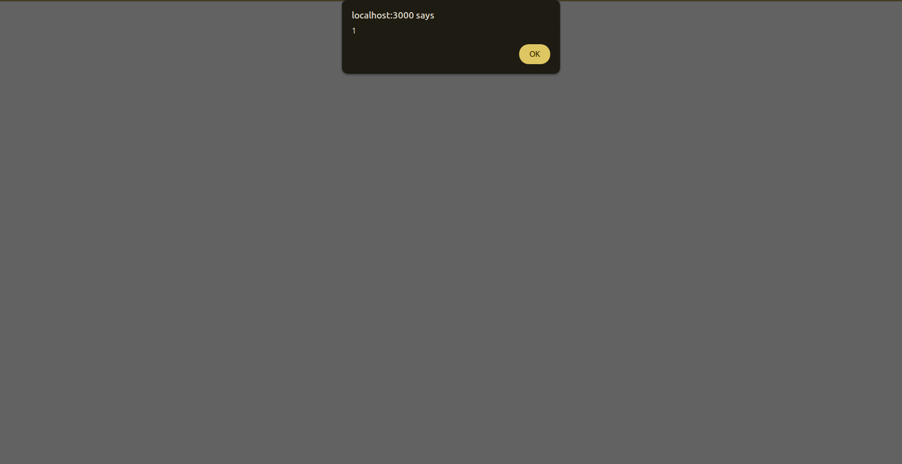


And you can check if it is reflected XSS by checking the URL `http://localhost:3000/search_post.php?query=%3Cscript%3Ealert%281%29%3C%2Fscript%3E`
We realize that the script is sent as a query to the server.

### Stored XSS

This is one of the most severe types and you can perform it also on the provided lab.

It consists of injecting a browser code that would be stored within the database and can be shown to other users if they consult that page.

So almost everyone using the website can be affected if they can consult that page that contains the malicious code.


#### Video Demonstration

The following video shows how exactly stored XSS works in terms of client/server architecture.


#### Lab Demonstration

So intuitively you can guess that creating a post with a malicious payload is the best way to demonstrate such an attack.

So we start by injecting the payload of JS `<script>alert(0)</script>` and then we consult the page using any other user and the malicious code will run directly.

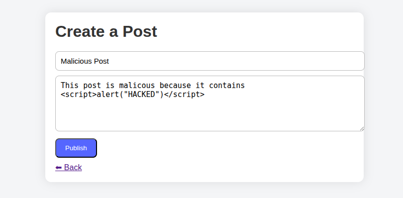


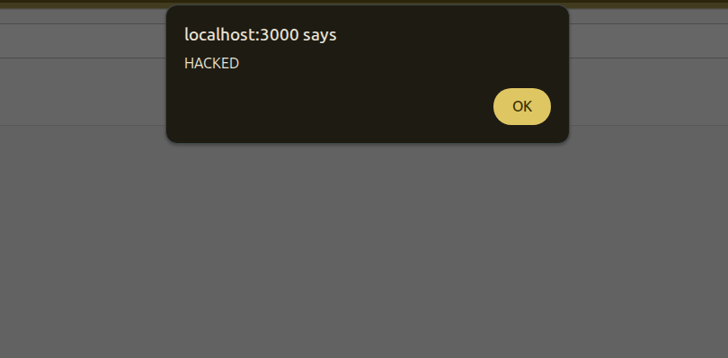


### DOM-Based XSS

This type of XSS may appear to be like reflected XSS but in reflected XSS the input is sent to the server and the server builds the HTML page with the malicious input and returns it to the browser but in DOM-Based-XSS nothing is sent to the server, the browser actually takes malicious input and injects it directly to the [DOM](https://www.w3schools.com/js/js_htmldom.asp). So in this type of attack everything happens in the browser.

#### Video Demonstration

The following video is a simple demonstration on how DOM-XSS works.


#### Lab Demonstration

In the main page of the app we realize that developers left a nice feature for website users. So when you scroll mindlessly in your feed you can before that add a note so you won't forget your important tasks when you do some "Brain Rot" activity.

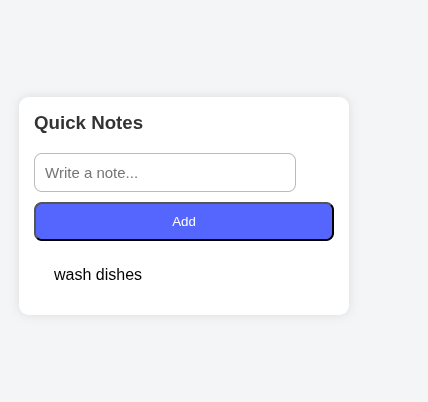

So when you add a task you realize that the url changed and it becomes
` http://localhost:3000/index.php?note=wash+dishes `


And when we check the code source we find this function that takes care of adding a task.

```js
window.onload = () => {
    const params = new URLSearchParams(window.location.search);
    const note = params.get("note");

    if (note) {
        // DOM XSS — injected via innerHTML
        document.getElementById("notes-list").innerHTML += `${note}`;
    }


    document.getElementById("add-note-btn").onclick = () => {
        const noteContent = document.getElementById("note-input").value;
        const noteList = document.getElementById("notes-list");

        params.set("note", noteContent);
        const newURL = window.location.pathname + "?" + params.toString();
        window.location.href = newURL;
        
        
        noteList.innerHTML = params.get("note");

        document.getElementById("note-input").value = "";
    }
};
```
So the logic is basically it adds that task to the URL and then it shows it again within the list of notes using innerHTML`noteList.innerHTML = params.get("note");`.

Means that everything happens in the browser and this could be an attack vector for DOM-Based-XSS.

So fellow developers should note that **innerHTML** is not a safe attribute to use when adding user input to the DOM because this leads to shooting yourself in the foot because an attacker will inject a malicious payload there.

So by injecting some payload you'll activate XSS. But in this example the cliche payload of `<script>alert(0)</script>` doesn't work because sometimes a browser considers it as an outsider and won't run it because browsers here do not execute inserted `<script>` tags. But another payload runs perfectly which is `` so the browser still executes DOM events like `onclick, oninput, onerror ...`.

So as shown here this payload works perfectly

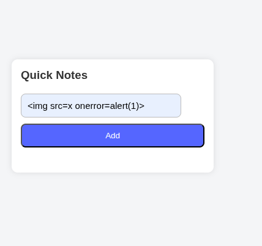

and here is the result

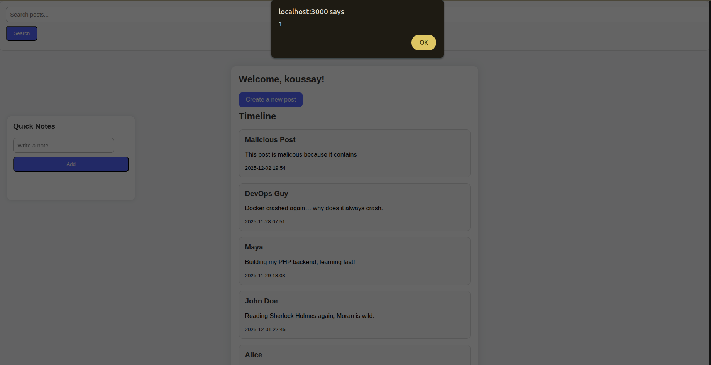

**NOTE: There are many payloads of XSS so you can check some word lists available online and fuzz different inputs LEGALLY with them using some automation tools this can be a good part of a bigger methodology. So do not stick with one payload because it may not work for many reasons.**

### Blind XSS

It is a subtype of stored XSS where the injection is stored in the database but executed in another interface or subsystem, sometimes completely internal (e.g Admin Dashboard), within this vulnerability the payload may execute after some time from injecting it and **the attacker does not see the effect directly**.

Think of it as setting a trap and waiting for someone in another interface at another time to fall for it.

#### Video Demonstration

The following video demonstrates how blind XSS may work for a specific scenario.


#### Lab Demonstration

If you investigate the victim folder you can see that there is an `admin.php` which represents an admin dashboard that manages the posts of the blog.

So if an attacker created a post or a username where he injected some JS code -Like we did previously on stored XSS - the payload will execute on the admin dashboard.


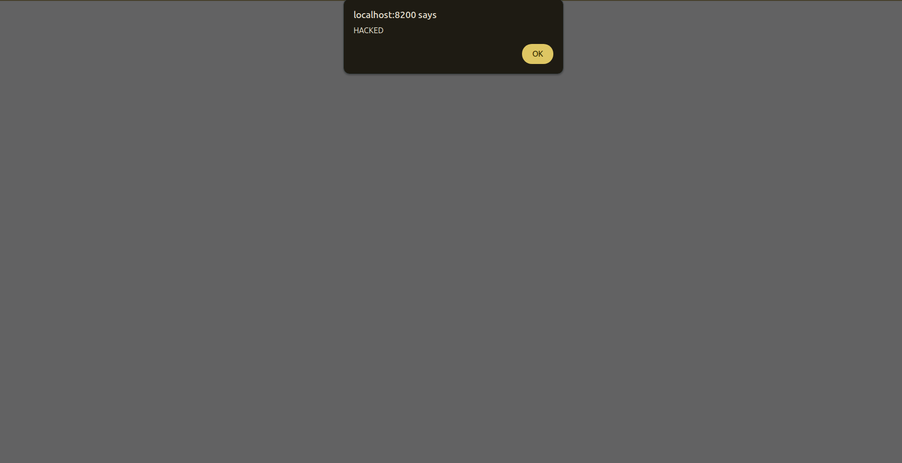

And then you can see the admin dashboard after you clicked ok

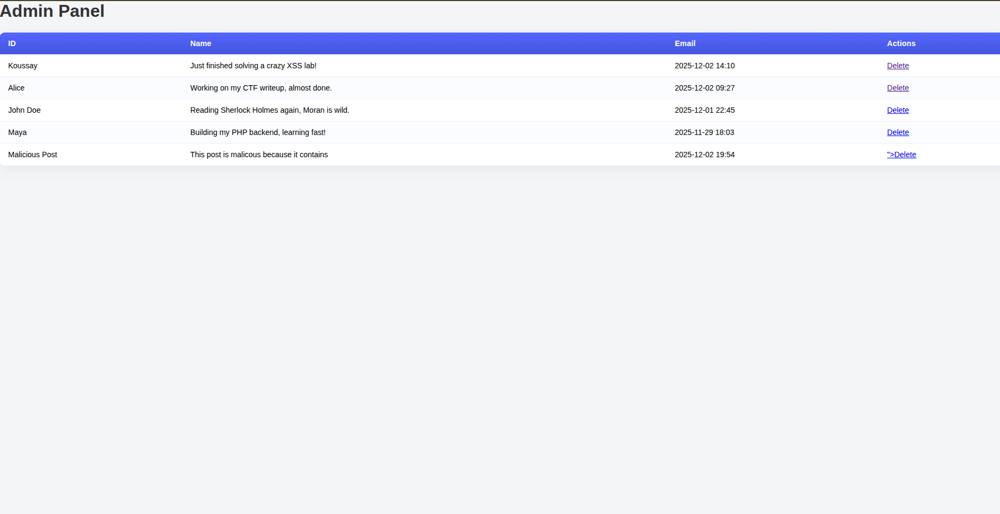


## Conclusion

This article delved into XSS and its different types. But some of you may be asking *is that it?*, "that's xss?? just injecting a simple alert?*, *how can it even affect users aside from some unwanted browser behavior?*. And in the next article - INSHALLAH - we will be seeing different attack scenarios of XSS. Keep this lab you'll need it - INSHALLAH - for the next article.