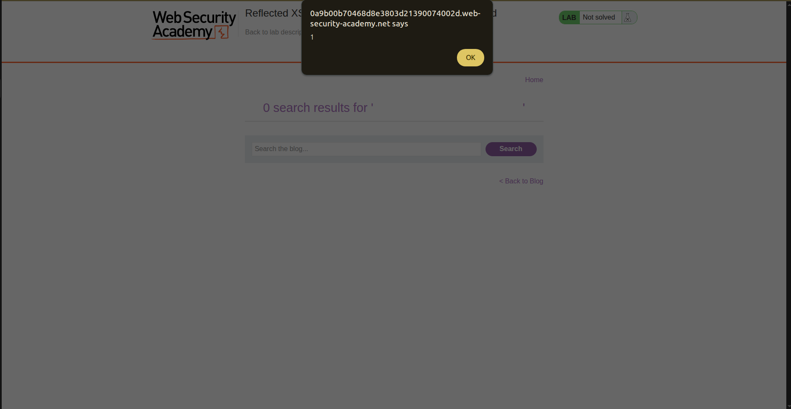
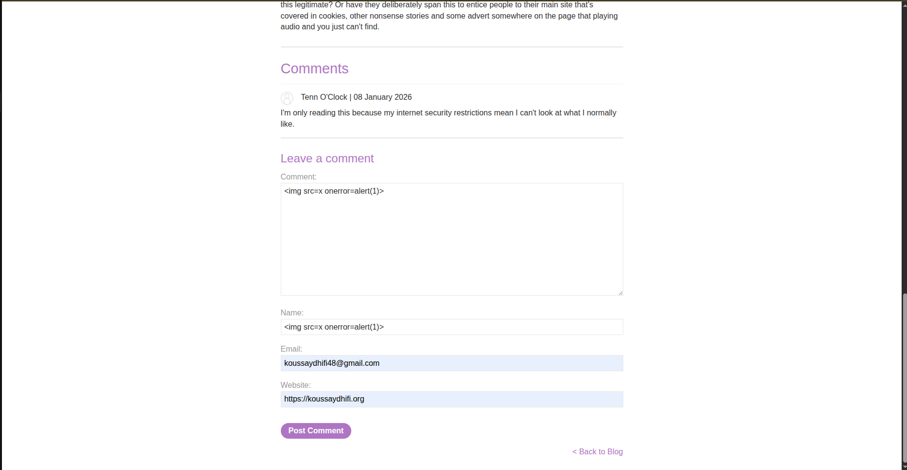
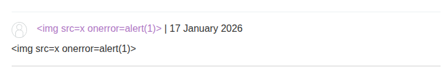

## Introduction

So after learning theories of XSS now time to practice with portswiggers lab.
This writeup delves into the first XSS lab in port swigger titled [Lab: Reflected XSS into HTML context with nothing encoded](https://portswigger.net/web-security/cross-site-scripting/reflected/lab-html-context-nothing-encoded)

## Investigation

So the website is a blog that contains many posts and a **search bar** also when you view some post you can comment on a post by inserting some data about yourself first. So in XSS we usually look for different inputs we have or more specifically data that is sent to the server or data that the JS takes.

### Testing Inputs

This section is about testing different inputs to find the XSS vulnerability.

#### Search Bar

When we type something in the search bar we realise that it is sent to the server and reflected on the same page by typing `X search results for 'WhatYouTyped'`

and we can check it more within the url `/?search=article`. And to be more sure we can intercept the traffic using burpsuite and check the header and we find: `GET /?search=article HTTP/1.1`.

And the result is shown like this : `<h1>1 search results for 'article'</h1>`
So if the input is not sanatized It'll lead to XSS so let's try the famous payload ``. 

And it actually worked the alert worked and the lab is solved.

#### Comment

It is true that this is a reflected XSS lab but can't we escalate it for a little bit? Let's try typing this payload in a comment.

And interesting ... the payload did not work this time. The lab is already solved but I wanted to test its limits. 

And by checking burpsuite we realize that the input is sanatized : `
&lt;img src=x onerror=alert(1)&gt;
`.

## Conclusion

This lab is intentionally simple:

- no encoding

- no filtering

- direct reflection into HTML

It’s not meant to be clever, it’s meant to teach you what XSS looks like when nothing stands in your way.
