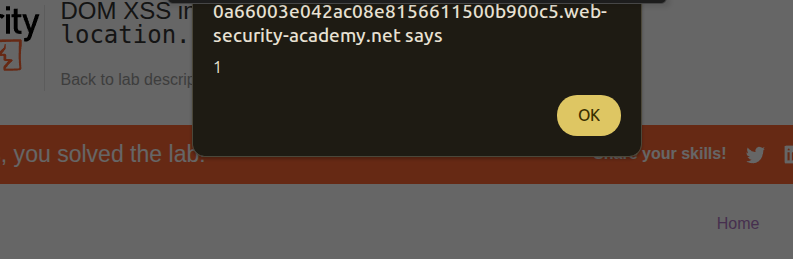

## Introduction

So this is another lab and this time it is about DOM-XSS.

This is the writeup of the lab in portswigger named [DOM XSS in document.write sink using source location.search](https://portswigger.net/web-security/cross-site-scripting/dom-based/lab-document-write-sink).


## Investigation

We have almost the same structure and the same website. But maybe the functionality is different. Let's try to investigate the searchbar again.


### Search Bar

So after fuzzing it with a simple input we realize it is normal so let's check the source code

```js
    <script>
        function trackSearch(query) {
            document.write('');
        }
        var query = (new URLSearchParams(window.location.search)).get('search');
        if(query) {
            trackSearch(query);
        }
    </script>
```

So it basically inserts an image? that has the same name of the search attribute within the URL?

`https://blah.web-security-academy.net/?search=hey`

So that is werid? I've never seen such thing? querying and image? So let's try to inject something like this:

`'> '` So let's try make the query something that closes the img tag and opens another tag which will be alert. So we start closing the img tag by adding a `'>` So we have a closed img tag like this `''">'` now let's try to make another tag by considering the `'">'` so we should add `'`So we need to fix the payload much more but addmin `>'` and now we have `'' '">'`
So the payload the final one is `'>'` I hope this will work. AAAAAAAAAAAAAAAAnd it did not work.

I'm missing something either document.write does sanatization or there is some url encoding.


After some research I discovered that document.write is even worse than innerHTML so let's make sure how the URL works. I realized that the encoding in url is : `/?search=%27>%27` So there is url encoding let's try and inject a script tag within the url itself.

So even after inserting a `script` tag within the URL like `/?search=<script>alert(0)</script>` We still got the same result and after opening burpsuite we realized that there is input sanatization 

```html
<h1>0 search results for '&lt;script&gt;alert(1)&lt;/script&gt;'</h1>
```
So there should be another attack vector, but what it should be?


I realized that my first payload `'>'` was actually the correct attack vector and I should've ended the `src` using double quotes not singe ones.


So the correct payload is `">` => and we got it correct.





## Conclusion

New payload learned and to inject XSS within an src we should close it first using a double quote and a closing html tag.
