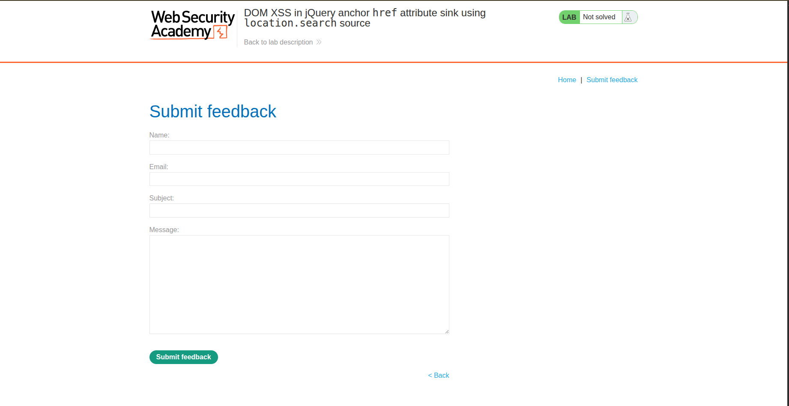
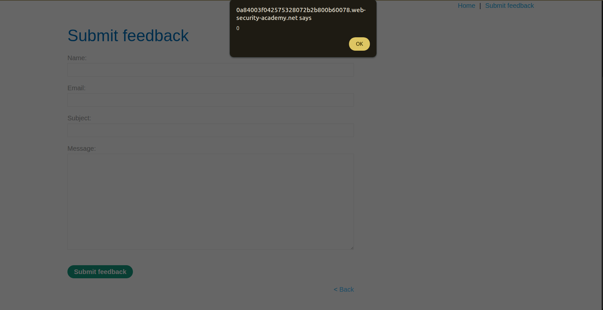

--- 
title: DOM XSS in jQuery anchor href attribute sink using location.search source 
description: This writeup delves into the fifth XSS lab in PortSwigger. 
author: Koussay Dhifi 
categories: [Vulnerabilities, WebExploitation] 
tags: [WebExploitation, XSS, Labs] 
pin: true 
math: true 
mermaid: true 
--- 

## Introduction 

So another lab in PortSwigger XSS until I find my first real bug. What are we going to meet today? This lab is titled [DOM XSS in jQuery anchor href attribute sink using location.search source](https://portswigger.net/web-security/cross-site-scripting/dom-based/lab-jquery-href-attribute-sink) 

## Investigation 

So the usual website, but the lab title says it'll be DOM-XSS for jQuery this time. So I'll try to investigate everything. 

 

### Submit Feedback 

We realize that a new link has been added which is **Submit feedback**. Let's try and check it out. So the page is a form where you insert your name, email, subject and message. 

 

So since this is a DOM based XSS, let's check the source code - I know, lazy, but the title is so leading xD - So we check the source code and we find this:
```js
$(function() {
    $('#backLink').attr("href", (new URLSearchParams(window.location.search)).get('returnPath'));
});
``` 

So when we click the back button we get redirected to what returnPath equals to. But I don't see any way we can leverage from this unless we perform some phishing or CSRF, but that's another story. So where can I find the attack vector for XSS? So we just submit a feedback and that's it, nothing more and nothing less. Maybe we got it wrong, maybe nothing juicy here. 

 

So by just changing the URL: `https://blah.web-security-academy.net/feedback?returnPath=` by changing the returnPath param, we get redirected to any page we want. But I remember a famous payload they used to type which is `javascript:alert(0)` because when I tried other payloads, the usual ones, it redirected me to a page and told me page not found. And after using that payload we got our alert: `https://blah.web-security-academy.net/feedback?returnPath=javascript:alert(0)` 

 

And it is solved. Dude, that thing I did was some experience stuff. I don't know the meaning of this payload, I just remembered it, so let's check why it did what it did. 

 

## Why it worked 

So after some research, I discovered the meaning of the source code of jQuery (pardon me, I ain't a dinosaur, I don't know jQuery syntax xD). So that syntax means that the href attribute of #backLink will be equal to the returnPath value, so by injecting `javascript:alert(0)` which is called **JavaScript URL scheme**, it will execute that JavaScript code instead of redirecting to a page. JavaScript URL scheme works on href. So another tip is that XSS is not only injecting normal HTML code, it can also be injection of JavaScript URL Scheme. 

## Conclusion 

Nice! I learned something new, a new payload and when to use it.