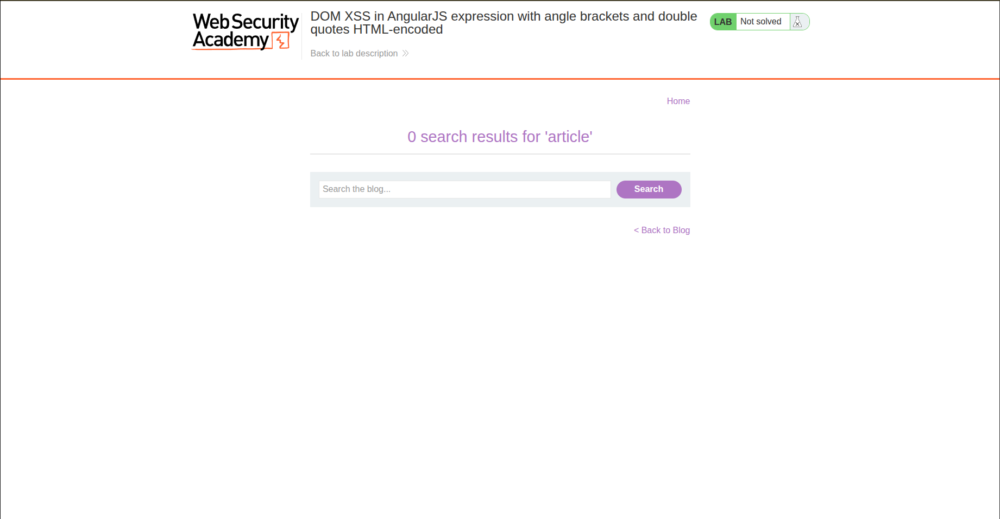
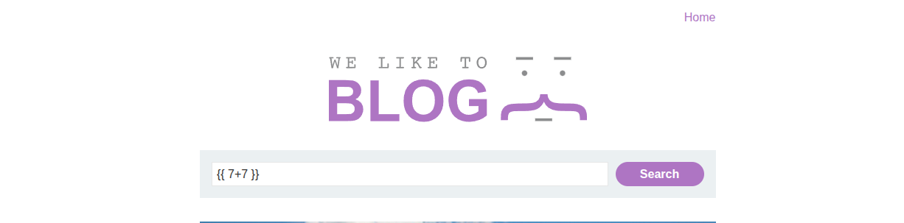
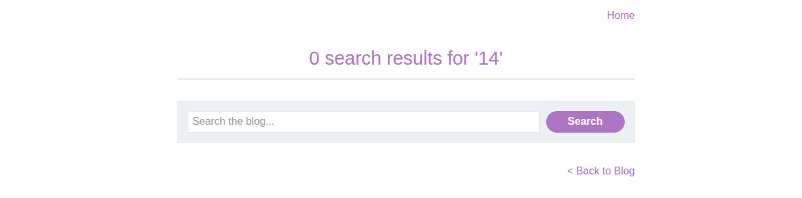
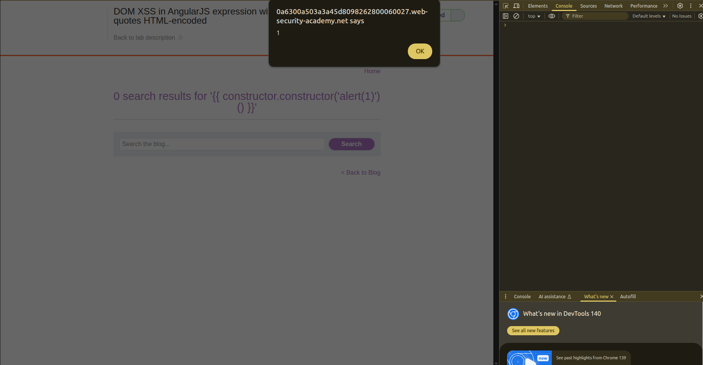

## Introduction

This lab is for DOM-XSS in AngularJS, the JavaScript library. We will be trying to exploit the double curly brackets to run JS code within the page.

## Investigation

We have the usual setup, which is a blog post and a search bar.

When we perform a search on the page, we get our result as a usual string.

When we check the source code of the page, we find this: `<body ng-app>`

So inside the body tag, we can add directives and expressions, and they can work.

One of those expressions is the curly brackets: `{{ }}`

So let's try typing `{{ 7+7 }}` in the search bar, and it gets evaluated.

So we need to find a way to inject a carefully crafted payload because `{{ alert(1) }}` won't work directly. This is because AngularJS expressions are within a sandbox, and we need to escape that sandbox by calling it from other objects. Think of it more like SSTI.

A known payload that we can use here is this: `{{ constructor.constructor('alert(1)')() }}`

By reaching the constructor, we can reach `Function`, and with that, execute arbitrary JS code.

1- `constructor.constructor` resolves to `Function`
2- Inside the parentheses refers to the body of the `Function` being created
3- `()` indicates that we are going to call the function

And we got the execution.

## Conclusion

This website uses AngularJS 1.7.7. In other words, with old AngularJS, we can perform XSS attacks by escaping from the AngularJS sandbox.
