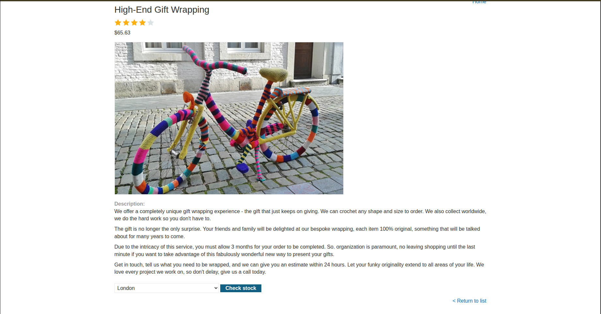
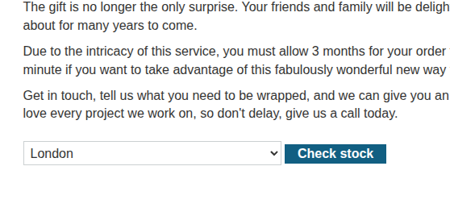
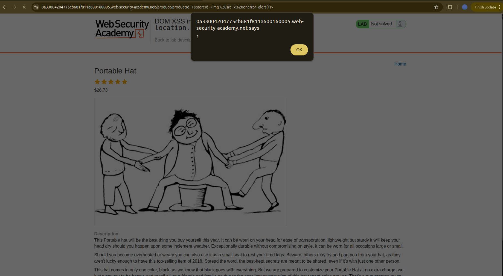
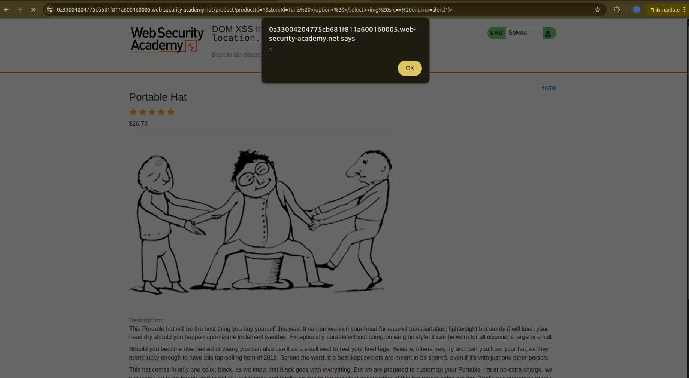

## Introduction

This will be a harder [xss lab](https://portswigger.net/web-security/cross-site-scripting/dom-based/lab-document-write-sink-inside-select-element) than the previous ones and hopefully more exciting. Let’s check it out.

## Investigation

It is actually different!!

This time, instead of a blog post, we have a shop — some kind of e-commerce, I guess.


### Functionality

We have a grid list of items with their prices and ratings attached to each one. If we want to check an item, we click on **View details**. Let’s check it out, shall we?

When we open a specific item, we find a description and then a feature that allows us to choose which store we want to buy from: London, Paris, or Milan.





If we click on **Check stock**, we get the number of units available for that specific store.


### Vulnerability Scan

My XSS instincts tell me that there is something fishy about the **Check stock** functionality.

So let’s check its source code. We find the following form:

```html
<form id="stockCheckForm" action="/product/stock" method="POST">
     <input required type="hidden" name="productId" value="1">
        <script>
            var stores = ["London","Paris","Milan"];
            var store = (new URLSearchParams(window.location.search)).get('storeId');
            document.write('<select name="storeId">');
            if(store) {
                document.write('<option selected>'+store+'</option>');
            }
            for(var i=0;i<stores.length;i++) {
                if(stores[i] === store) {
                   continue;
                }
                document.write('<option>'+stores[i]+'</option>');
            }
                document.write('</select>');
        </script>
        <button type="submit" class="button">Check stock</button>
</form>
```

There is a hidden input that contains the product ID, so it will be sent along with the selected store. This gives us an idea of what data is being sent to the server: `{ productId, store }`.

However, there is a fishy line ... A vulnerable one:

```js
document.write('<option selected>'+store+'</option>');
```

We have `document.write()` combined with **unsanitized input**, and the `store` variable is getting its value directly from the `storeId` parameter in the URL, as shown here:

```js
(new URLSearchParams(window.location.search)).get('storeId');
```

We also realize that `storeId` does not exist by default, but if it is not `null`, it will be added as an option. So if we alter the URL by typing:

```
product?productId=1&storeId=1
```

we get a new option with the value `1`.


So let’s try adding the classic payload:

```html

```

And it actually worked.



But the lab is not solved yet… I guess they want us to break out of the `<select>` option and inject malicious HTML.

So we do that by:

1. Inserting any value for the option, for example `Tunis`
2. Closing the option tag: `Tunis </option>`
3. Closing the select tag: `Tunis </option> </select>`
4. Adding the payload:

```html
Tunis </option> </select>
```

Aaaand we got it — the lab is solved.




## Why it alerted in the first attempt

When the browser sees:

```html
<option>

</option>
```

it enters **auto-recovery mode**, corrects the markup, and turns it into:

```html
<option></option>

```

That’s why the alert triggered the first time.

## Conclusion

That was a nice lab. I learned about the browser’s auto-recovery mode and how it can even lead to XSS when abused intentionally.
