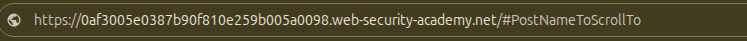
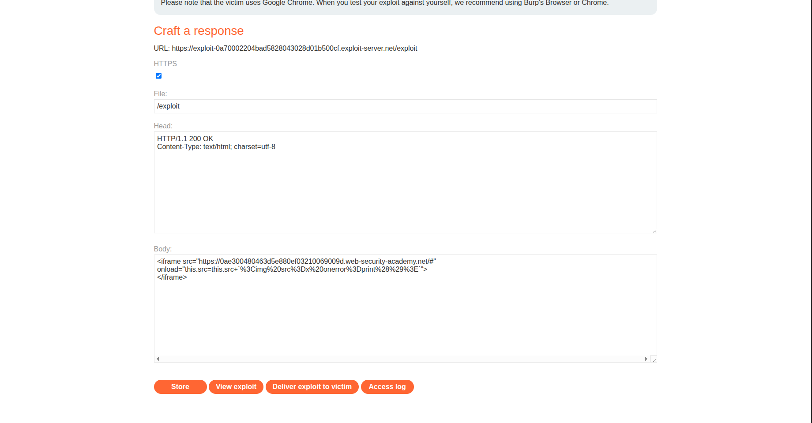
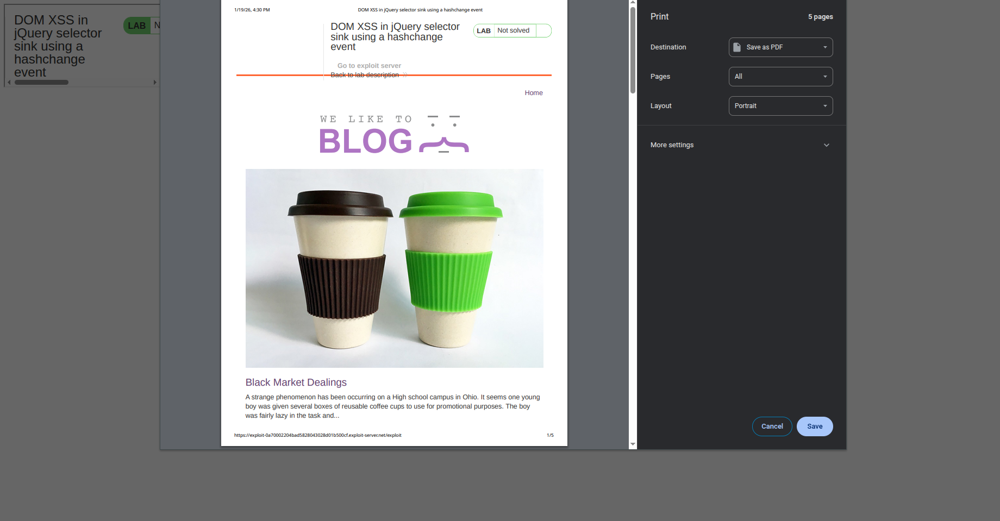

## Introduction

So this is **Lab 6** in my XSS mastering journey. It is also a **DOM-XSS** lab.

## Investigation

We have the same app as in the previous labs: a simple blog with posts. Let’s do some investigation by looking at the page source.


### Checking Source Code

We found the following script:

```js
<script>
	$(window).on('hashchange', function(){
       var post = $('section.blog-list h2:contains(' + decodeURIComponent(window.location.hash.slice(1)) + ')');
       if (post) post.get(0).scrollIntoView();
	});
</script> 
```

From what I understand, this code listens for changes on the `window` object. When the URL hash changes (`URL#hash`), it executes a function that searches for blog posts whose titles contain the hash value and then scrolls directly to that post.



However, this looks potentially vulnerable. Why? Because the hash value is directly concatenated using `+`, and from what I know, `decodeURIComponent()` does not sanitize input. This means that by inserting a specific payload into the hash, we might be able to trigger something malicious.

To simplify things, let’s rewrite the critical line as:

```js
var post = $('section.blog-list h2:contains(' + X + ')');
```

## Payload Building

So we need to replace `X` with a payload that:

1. Closes the parentheses
2. Adds a semicolon
3. Triggers an alert

So `X` should be equal to `);alert(`.
The payload becomes:

```js
#);alert(
```

This resulted in the following console error:

```js
Uncaught Error: Syntax error, unrecognized expression: section.blog-list h2:contains();alert()
```

This means we are close, but we still need to make some tweaks. After some thinking, I realized that the whole payload is still being treated as part of the string inside `$()`.

So I tried closing the string using a single quote:

```
#');alert(
```

And it did not work. Let's look into further things.


After some research, I realized that we can only close the `contains()` selector and not the `$()` itself. This means we are still limited to selectors, and selectors alone are not enough to achieve XSS.

At this point, I started asking myself: **where is the real attack vector?**


## The Real Vulnerability and Building The Real Payload

After checking a write-up, I discovered that the version of jQuery used by the lab is already vulnerable.

```js
<script src="/resources/js/jquery_1-8-2.js"></script>
<script src="/resources/js/jqueryMigrate_1-4-1.js"></script>
```

`jquery_1.8.2` is vulnerable because, in older jQuery versions (1.x → early 2.x), when you pass an element that does not exist to `$()`, jQuery treats it as an HTML element and creates it in memory, even though it is not inserted into the DOM.

So by injecting:

```
#
```

the payload is interpreted as HTML, and the `onerror` handler executes.

At this point, `print()` works, but the lab is still **not solved**.

Why? Because the vulnerable code only runs when a **hash change** occurs. If we send a crafted link directly to a victim, the `hashchange` event will not trigger.

So we need to find a way to force a hash change.

To do this, we create an attacker page and embed the target inside an iframe:

```html
<iframe src="https://0a41005b045a51b2809edffb00500032.web-security-academy.net/#"
	onload="this.src=this.src+`%3Cimg%20src%3Dx%20onerror%3Dprint%28%29%3E`">
</iframe>
```



We URL-encode the HTML so that spaces do not break the URL. When a user visits the page we created, the iframe loads the target page and then modifies the hash, triggering the vulnerable code.




And it executes.

## Conclusion

A strong opponent today… but we learned something new: **jQuery internals**.

Funny enough, I used to be a web developer, yet I never really understood jQuery at this level 😄.

PS: *I would like to thank chatgpt for correcting the grammatical mistakes that I did writing this blog.*
