## Introduction

This lab is about (reflected DOM-XSS)[https://portswigger.net/web-security/cross-site-scripting/dom-based/lab-dom-xss-reflected]. Probably, we will find a new trick to get XSS.

## Reflected-DOM XSS

So reflected DOM-XSS is a hybrid between DOM-XSS and reflected XSS.

The payload is sent within the request, like reflected XSS,

while the execution of the payload happens in the DOM.

## Investigation

We got the usual blog post and a search bar again.


### Search Bar

When we perform a search, it returns to us any post that contains the words or characters we entered.
And the URL is like this: `?search=hi`

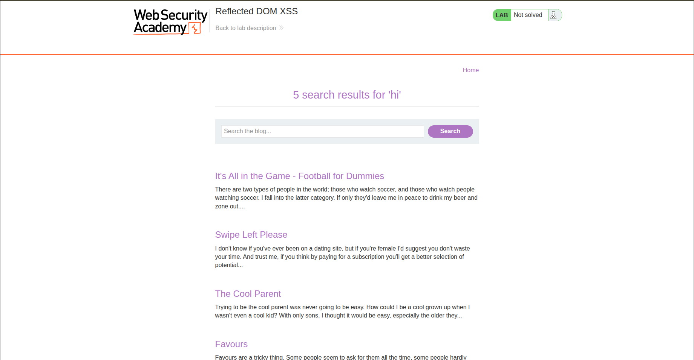

### Comments

In each post, we can comment as usual by filling the following inputs:

* Comment
* Name
* Email
* Website

So let's try to add a comment, and we realize that the name becomes clickable and takes you to the website you entered using an `href`, like this:
`<a id="author" href="https://koussaydhifi.org">johnSmith</a>`


So let's try the payload `javascript:alert(1)`.

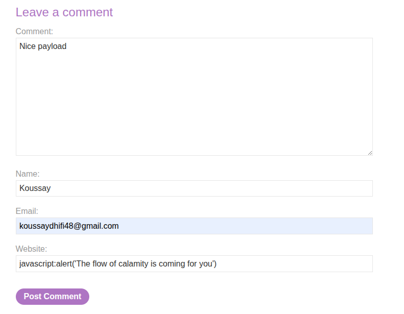

But it seems there is a pattern that needs validation.

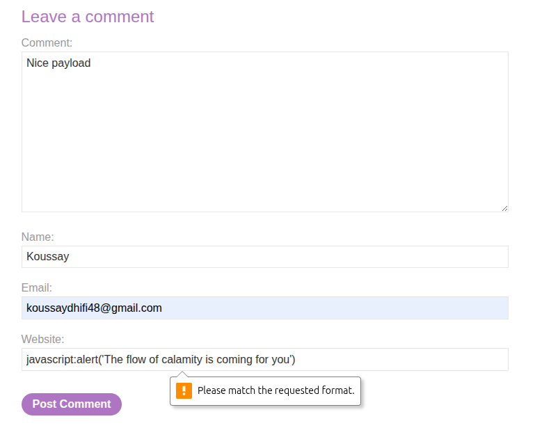

We check the pattern, and it is like this:

`<input pattern="(http:|https:).+" type="text" name="website">`

So let's try to act smart and remove the pattern.

If we act smart, the website acts smarter. In the backend, it tells us that this is an invalid website.

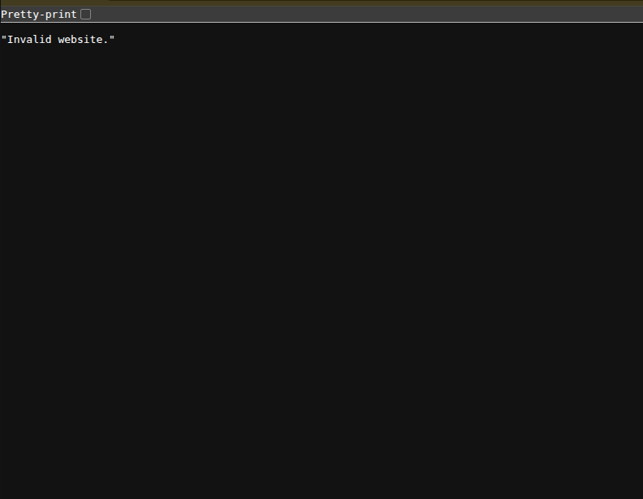

So let's try to inject code within the other inputs, shall we?

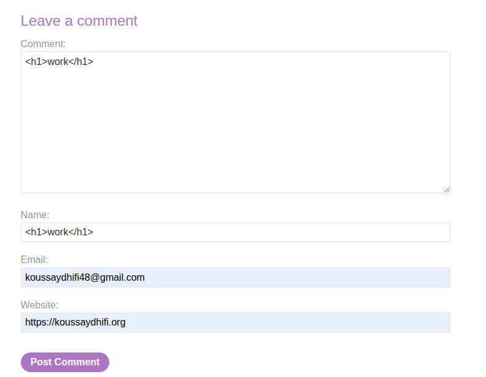

This did not work either, but something is interesting here:

`<a id="author" href="https://koussaydhifi.org">&lt;h1&gt;work&lt;/h1&gt;</a>`

So the website input goes into the `href`. Let's try a payload like this:
`https: " onclick=alert(1)`

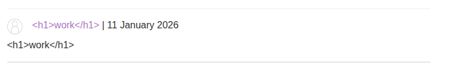

Aaand the input is sanitized.

### Source Code

So let's try checking the source code of the main page.

Nothing much in the source code.

### Intercept Traffic with Burp Suite

Since we did not find anything, let's try intercepting some requests using Burp Suite. We will start by intercepting the search bar request.

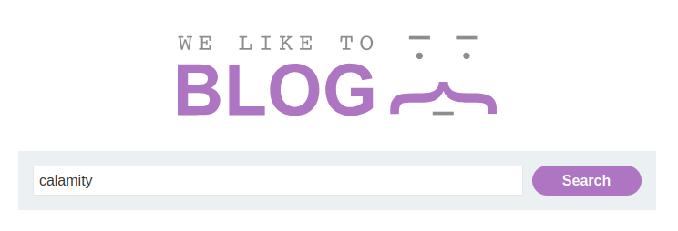

So we send it to Repeater. 

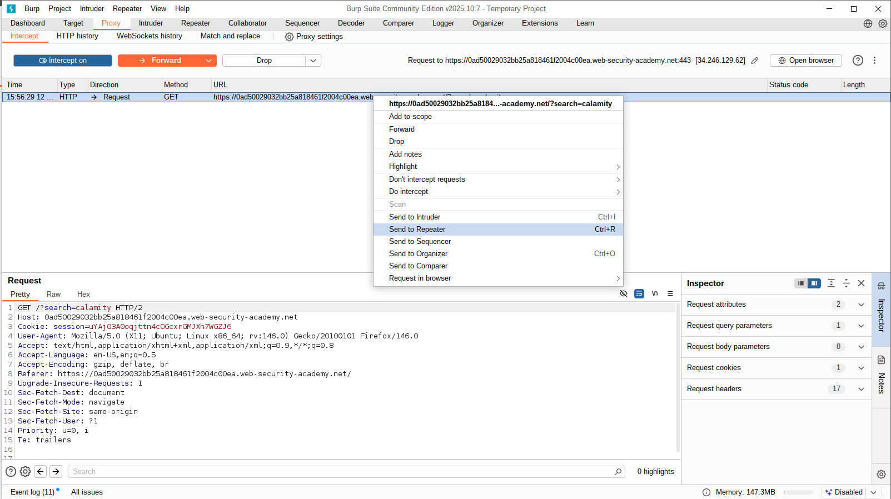

And then we check the Target tab to see the files sent by the website. 

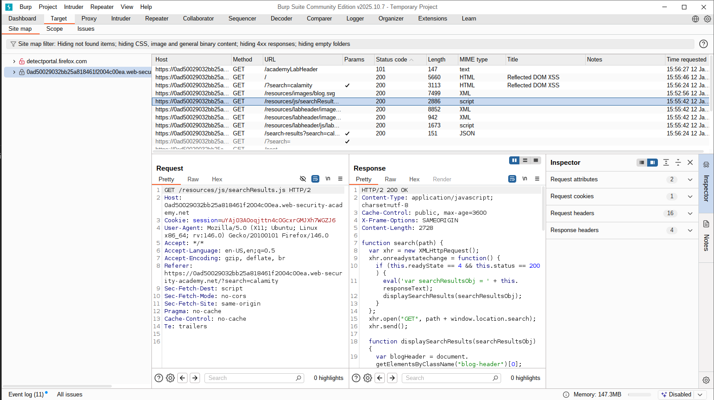

We see a JS file that contains how the search functionality works, and we discover something crucial:

```js
function search(path) {
    var xhr = new XMLHttpRequest();
    xhr.onreadystatechange = function() {
        if (this.readyState == 4 && this.status == 200) {
            eval('var searchResultsObj = ' + this.responseText); // HERE
            displaySearchResults(searchResultsObj);
        }
    };
    xhr.open("GET", path + window.location.search);
    xhr.send();
```

So the search is using `eval`, and `this.responseText` contains the response text, which is `X search results for 'Input'`. Since this is `eval`, and `eval` basically runs JS syntax within a string, we can insert something like this:

1- Add `;` to end the instruction
2- Add `alert(1);`

It did not work, so I needed to see what the content of `responseText` actually is.

After checking the Target tab again, I found this:

```js
HTTP/2 200 OK
Content-Type: application/json; charset=utf-8
X-Frame-Options: SAMEORIGIN
Content-Length: 49

{"results":[],"searchTerm":"; alert(1);"}
```

So our goal is to escape this JSON string to get code execution.

If we act smart again and try the payload `nice"} alert(8");`, so we can close the string, we discover that the double quote is being escaped:

```js
HTTP/2 200 OK
Content-Type: application/json; charset=utf-8
X-Frame-Options: SAMEORIGIN
Content-Length: 49

{"results":[],"searchTerm":"nice\"} alert(8\");"}
```

So we need to escape this escape (see what I did there xD? … ok I’ll stop). Let’s try adding `\` and see the results: `\"};alert(1)//`

1- Add `\` to escape the escape and actually close the JSON string
2- `;` to end the JSON instruction
3- `alert(1)`
4- `//` to comment out the `"` that is still there from the initial JSON

After that, tada, we got our alert.

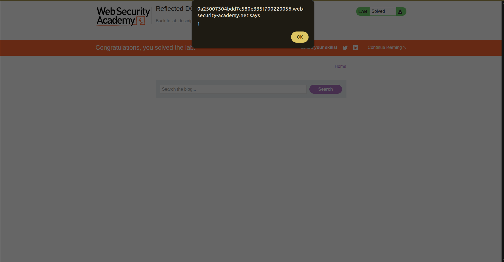

And the lab is solved -ALHAMUDLLAH-.

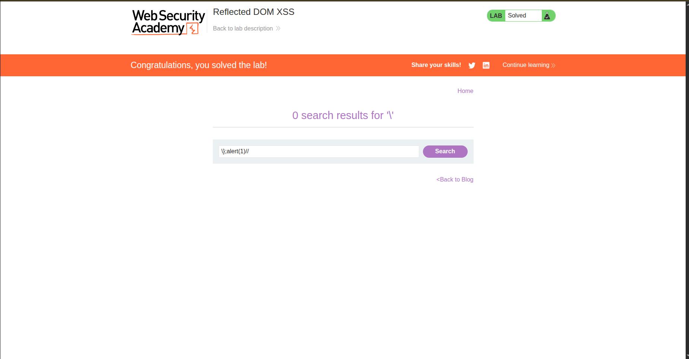


## Conclusion

This lab was amazing. I learned about the Target tab in Burp Suite; it helps triage traffic more efficiently and is better than relying only on the proxy by organizing intercepted traffic and revealing files that you can’t see in the source code.

I also crafted input that survives JSON escaping and breaks out during JavaScript evaluation.

