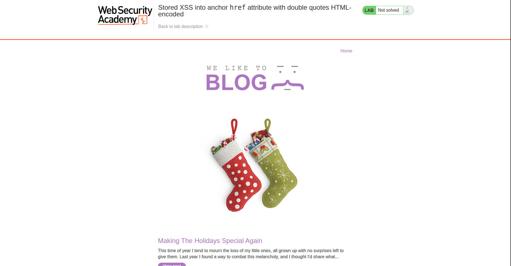
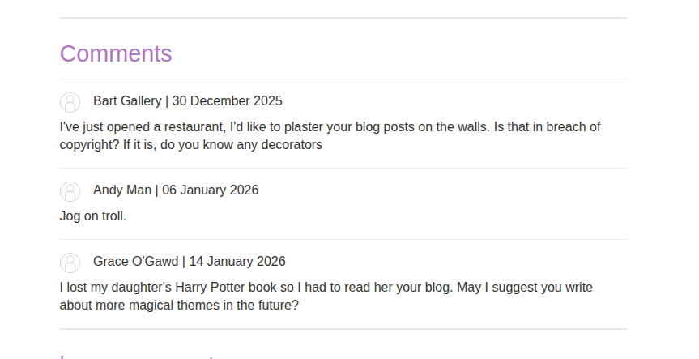
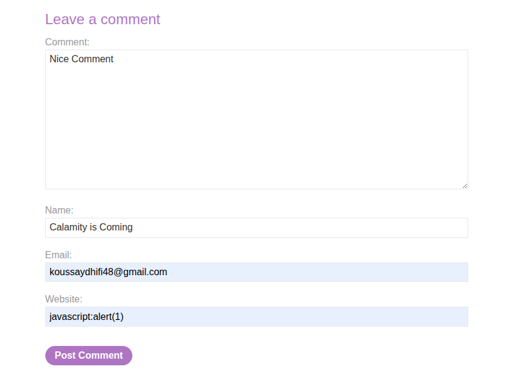
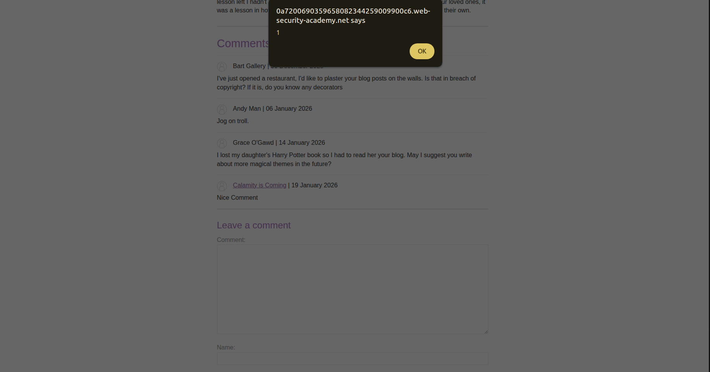

## Introduction

This is a lab for a [**stored XSS vulnerability**](https://portswigger.net/web-security/cross-site-scripting/contexts/lab-href-attribute-double-quotes-html-encoded). Let’s see what we can do with it.

## Investigation

We have almost the same website as usual: a blog with posts. Let’s check a post and try to comment on it.



Our goal is to click the username of a comment and trigger an alert. 



The username is rendered like this:

```html
<a id="author" href="https://koussaydhifi.org">Injected</a>
```

Basically, the `href` attribute is the key here. So what if we inject a JavaScript URL scheme like `javascript:alert(1)`?

The `href` normally points to a website, but in the website input we can add this payload. Then, when you click the username.



*tada* — the alert is triggered.



## Conclusion

Nice lab. Waiting for the next one, inshallah.

