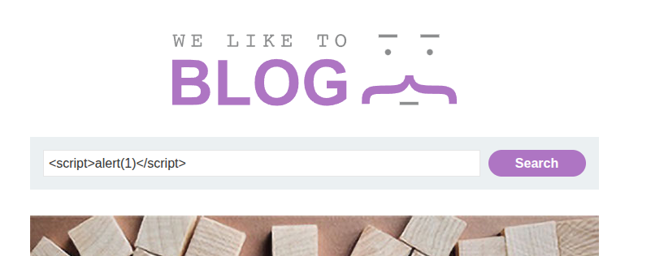

## Introduction

This lab is about [**reflected XSS**](https://portswigger.net/web-security/cross-site-scripting/contexts/lab-html-context-with-most-tags-and-attributes-blocked), but what makes it special is that it uses a **WAF (Web Application Firewall)** to protect against common XSS attacks and payloads.


## Investigation

In this section, we will investigate the web application.

### Checking the WAF

Let’s check which WAF is being used by our target using **wafw00f**.

```sh
$ wafw00f https://0a60006303f34dac8016038f0086000c.web-security-academy.net/ -a
```

```text
[*] Checking https://0a60006303f34dac8016038f0086000c.web-security-academy.net/
[+] Generic Detection results:
[-] No WAF detected by the generic detection
[~] Number of requests: 7
```

There is no known WAF detected on this application, so we cannot determine which one is being used. We need another reconnaissance approach.

You may be asking why knowing the WAF matters. By identifying the WAF, we can often craft **WAF-specific payloads** by understanding how it sanitizes or filters input.

So let’s try inserting a classic payload:
`<script>alert(1)</script>`



Sometimes, WAFs reveal themselves when blocking obvious payloads—almost like saying *“My name is X and you shall not pass.”* A bit narcissistic, I know.

Aaand… it gets blocked.

.png)

It didn’t explicitly reveal which WAF it is, but maybe it left a hint—or maybe this isn’t a known WAF at all, just a shallow, custom one.

Instead of guessing the WAF, let’s **infer its behavior** by feeding it different payloads and observing the response.

Let’s start by sending only a `<` character.

.png)

Aaaand bingo—it is accepted. So the WAF does not outright block `<` or `>`, but it does block specific payloads like `<script>`.

Now let’s try:
`<h1>Hi WAF, what's shakin'? I'm harmless, I swear</h1>`

Blocked again. Damn it—even after telling it I’m harmless.

This suggests the WAF may rely on a **blacklist of HTML tags**. If that’s the case, maybe we can find a tag that isn’t blocked. That would normally mean brute forcing… and I hate brute forcing.


### Burp Suite Usage

Let’s try using **Burp Suite** to detect the WAF’s behavior. Maybe the **Target** tab or headers will give us something useful.

Unfortunately, Burp didn’t reveal anything helpful. Even the request and response headers are useless—no WAF fingerprint.

.png)

```http
HTTP/2 400 Bad Request
Content-Type: application/json; charset=utf-8
Content-Length: 20

"Tag is not allowed"
```


### Manual Testing and Crafting a Payload

Some script-kiddies might ask:
*“wHy nOt jUsT bRuTe fOrCe?”*

But instead of jumping straight to brute forcing, let’s manually analyze the behavior first.

#### Anchor Tag Injection

Let’s try inserting `<a>`.

.png)

Blocked.

#### `img` Tag

Trying `` also results in a block.

Now for a pro-gamer move: adding a space between `<` and `img`.

`< img src=x onerror=alert(1)`

This bypasses the initial filter but still results in an error later.

### Space Problem

At this point, I realized that inserting a space inside HTML tags makes them **invalid HTML**. So while it bypasses filtering, it won’t execute.

So maybe… brute force after all?


### Brute Forcing

Yeah, yeah, I know—you’ve been waiting for this.

We’re going to brute force the input to find which tags are accepted by this WAF wannabe. We’ll use **Burp Intruder**, a GUI tool.

Some of you might ask:
*“Why not use ffuf?”*

That’s a valid question. ffuf is faster, but we’re working on a lab, not a professional red-team engagement. A GUI is fine here and more beginner-friendly.

Let’s activate the Burp proxy and intercept the search request.


* Click **Add** to select the parameter for brute forcing.

.png)

* In the **Payloads** section, click **Load** and import a list of HTML tags.

.png)

* You can use the tag list from the [PortSwigger XSS cheat sheet](https://portswigger.net/web-security/cross-site-scripting/cheat-sheet).
* Start the attack.

We observe that blocked tags return **HTTP 400**, while allowed tags return **HTTP 200**.

.png)

Bingo — we found a tag that gets injected successfully which is body.

.png)
.png)
.png)


### Event Attribute Brute Force

Now we need an event handler. However, this WAF blocks common events like `onload` and `onerror`.

So we brute force **event attributes** using the same method in Burp Intruder:

* Clear the previous payload list
* Load event handlers from the same PortSwigger cheat sheet
* Start the attack

.png)

We discover that the event **`onresize`** is allowed.

.png)

This means that when the `<body>` element is resized, the event fires.


### Payload and Exploitation

If we inject the following payload into the search bar:

```html
<body onresize=print()></body>
```
and then resize the browser window, the function executes.

However, this alone does not solve the lab—we need to **trigger it automatically**.

So we use the exploit server and craft the following payload:

```html
<iframe src="https://0a3400b404d6865f81a8b62900b900e4.web-security-academy.net/?search=%3Cbody+onresize%3Dprint%28%29%3E+%3C%2Fbody%3E"
onload=this.style.width="600px"></iframe>
```
The `onload` attribute resizes the iframe, which triggers the `onresize` event inside it.


.png)

And tada 🎉 — once the exploit is delivered to the victim, the lab is solved.


.png)


## Conclusion

This lab was actually challenging. I didn’t initially want to rely on brute forcing, but analyzing the WAF’s behavior and crafting the exploit made it worthwhile.

Overall, it was a solid lab and a good exercise in **WAF evasion and payload creativity**.

