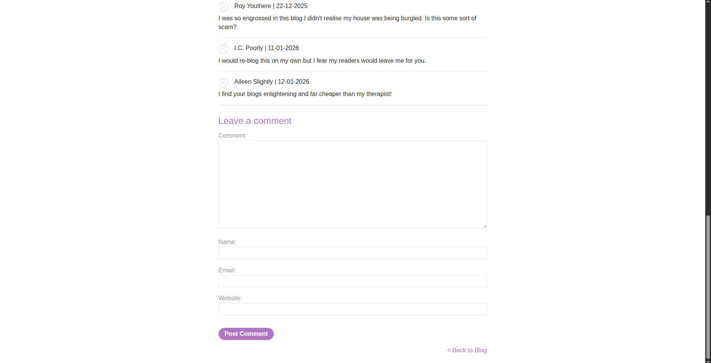
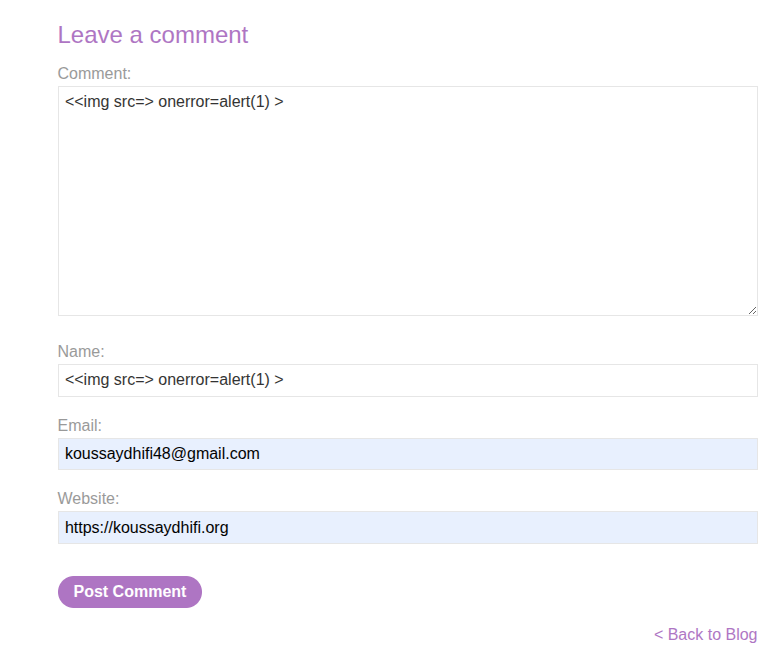
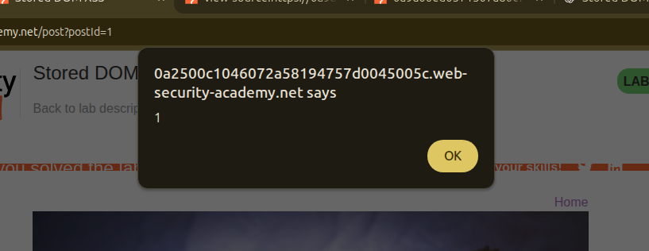

## Introduction

This lab tackles a **stored DOM-XSS** vulnerability. Let’s try to find it.

## Investigation

We have the usual setup: a blog with posts and the ability to view individual posts, but in this case, there is **no search bar**.


Since we are dealing with **stored DOM-XSS**, the payload must be stored persistently somewhere in the website—either in `localStorage`, a database, etc.

So let’s check something persistent. The persistent input we can enter here is… you guessed it: **a comment**.



When viewing a specific post, we are able to leave a comment on that post.

Instead of immediately trying our classic payload like
`<script>alert(1)</script>`,
it’s better to first inspect the source code and understand how comments are handled.


## Checking Source Code and Crafting the Payload

While inspecting the page source, we find the following scripts:

```html
<script src='/resources/js/loadCommentsWithVulnerableEscapeHtml.js'></script>
<script>loadComments('/post/comment')</script>
```

Let’s take a look at the `loadCommentsWithVulnerableEscapeHtml.js` file.

After reviewing the source code, we see the following:

```js
function loadComments(postCommentPath) {
    let xhr = new XMLHttpRequest();
    xhr.onreadystatechange = function() {
        if (this.readyState == 4 && this.status == 200) {
            let comments = JSON.parse(this.responseText);
            displayComments(comments);
        }
    };
    xhr.open("GET", postCommentPath + window.location.search);
    xhr.send();

    function escapeHTML(html) {
        return html.replace('<', '&lt;').replace('>', '&gt;');
    }

    function displayComments(comments) {
        let userComments = document.getElementById("user-comments");

        for (let i = 0; i < comments.length; ++i)
        {
            comment = comments[i];
            let commentSection = document.createElement("section");
            commentSection.setAttribute("class", "comment");

            let firstPElement = document.createElement("p");

            let avatarImgElement = document.createElement("img");
            avatarImgElement.setAttribute("class", "avatar");
            avatarImgElement.setAttribute("src", comment.avatar ? escapeHTML(comment.avatar) : "/resources/images/avatarDefault.svg");

            if (comment.author) {
                if (comment.website) {
                    let websiteElement = document.createElement("a");
                    websiteElement.setAttribute("id", "author");
                    websiteElement.setAttribute("href", comment.website);
                    firstPElement.appendChild(websiteElement)
                }

                let newInnerHtml = firstPElement.innerHTML + escapeHTML(comment.author)
                firstPElement.innerHTML = newInnerHtml
            }

            if (comment.date) {
                let dateObj = new Date(comment.date)
                let month = '' + (dateObj.getMonth() + 1);
                let day = '' + dateObj.getDate();
                let year = dateObj.getFullYear();

                if (month.length < 2)
                    month = '0' + month;
                if (day.length < 2)
                    day = '0' + day;

                dateStr = [day, month, year].join('-');

                let newInnerHtml = firstPElement.innerHTML + " | " + dateStr
                firstPElement.innerHTML = newInnerHtml
            }

            firstPElement.appendChild(avatarImgElement);

            commentSection.appendChild(firstPElement);

            if (comment.body) {
                let commentBodyPElement = document.createElement("p");
                commentBodyPElement.innerHTML = escapeHTML(comment.body);

                commentSection.appendChild(commentBodyPElement);
            }
            commentSection.appendChild(document.createElement("p"));

            userComments.appendChild(commentSection);
        }
    }
};
```

We immediately notice that the `escapeHTML` function uses a **vulnerable sanitization technique**. It relies on the `.replace()` method to escape `<` and `>`, but `.replace()` only replaces the **first occurrence**, not all occurrences.

This means we can craft a payload such as:

```
< onerror=alert(1) >
```

What happens internally is:

* The first `<` is replaced with `&lt;`
* The first `>` (inside `src=>`) is replaced with `&gt;`
* The final `>` remains untouched

As a result, the payload becomes:

```
&lt;
```



This is still interpreted by the browser as valid HTML, allowing the `onerror` handler to execute.

We can inject this payload into either the **author** field or the **comment body**, since both use the same vulnerable `escapeHTML` function.

And… boom 💥 — we get the alert exactly as expected.



## Conclusion

This was a great lab. I learned how **stored DOM-XSS** works: stored user input is later rendered into the DOM using JavaScript, and improper client-side sanitization leads to code execution.

A small mistake in escaping logic can be enough to introduce a serious vulnerability.
