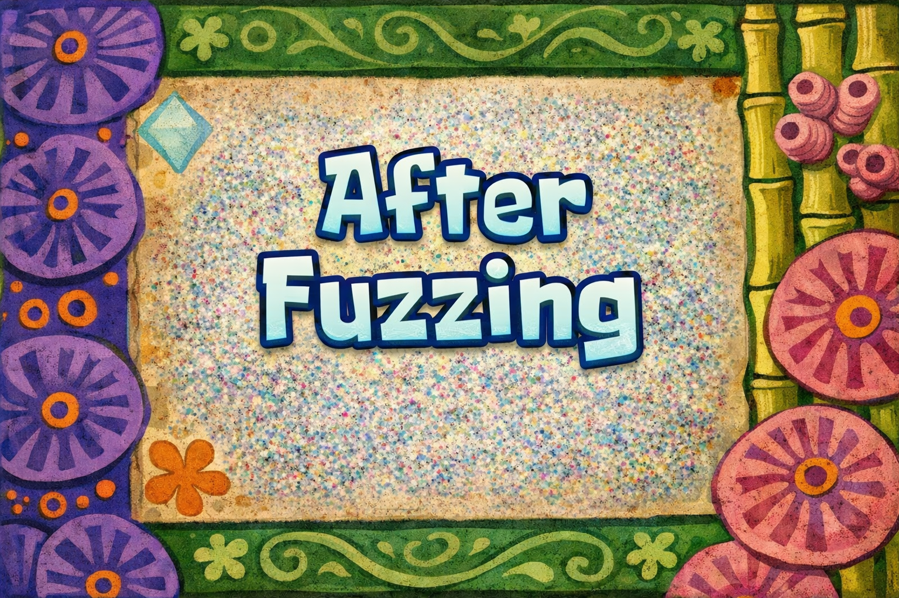

## Introduction

This [lab](https://portswigger.net/web-security/cross-site-scripting/contexts/lab-some-svg-markup-allowed) delves into reflected XSS but using SVG markup? I have no idea how this is going to go; I'm literally writing this and solving at the same time.

## Investigation

We have the usual PortSwigger vulnerable web app: a blog post with a search bar.


## Vulnerability Discovery

Let's try to fuzz the search bar again and see if some HTML is allowed or not.

.png)

Interesting, the tag itself is not allowed, but from what I read from the description, SVG is allowed, so let's try it.

.png)

.png)

And SVG is actually accepted. This can be a great payload actually.

.png)

## Payload Crafting

So SVG is accepted. Let's try to make this simple payload `<svg onload=alert(1)></svg>`. It turns out that the event is not allowed, so maybe we need to brute-force events.

.png)

.png)

Even `onclick` is not allowed. So let's try to brute-force to find an allowed event.

### Brute Forcing Using BurpSuite

For brute forcing, we are going to use our usual tool, Burp Suite.

So we intercept the search traffic and send it to Intruder.

.png)

Then, in the URL, we change the event and make it the placeholder for brute forcing. For event brute forcing, you can check [PortSwigger's cheat sheet](https://portswigger.net/web-security/cross-site-scripting/cheat-sheet).

Then we load the list of tags.

.png)

Then we start the attack and try to investigate which event returns a response other than 400.

.png)

We found an event that returns a 200 response, which is `onbegin`.

.png)

But what is `onbegin` exactly?


After some research, I found that `onbegin` is an event trigger that is linked to a process like an animation or an AJAX request, and it starts right before a process or animation starts.

I discovered that this event can only be linked to SVG child elements that are responsible for animations, like the following:

```html
<animate>
<animateTransform>
<animateMotion>
<set>
<mpath>
```

and maybe much more. The problem is that these elements may be blocked by the WAF.

So let's fuzz them by hand; they aren't that many.



I found out that `<animateTransform>` is actually accepted by the website, but we need an SVG element that can be animated. However, SVG elements are actually filtered, so let's try to see possible SVG elements and maybe brute-force them.

So after fuzzing different elements by hand—ChatGPT gave them to me—I found out that `<text>` is accepted, so now we can craft the payload, inshallah.

```html
<svg width="400" height="200">
  <!-- Text element -->
  <text x="50" y="100" font-size="30" fill="blue" id="myText">
    Hello SVG!
    <!-- Animate the text with rotation -->
    <animateTransform
      attributeName="transform"
      type="rotate"
      from="0 100 100"
      to="360 100 100"
      dur="3s"
      begin="0s"
      id="rotateAnim"
      onbegin="alert(1)"
      repeatCount="indefinite"
    />
  </text>
</svg>
```

We insert it into the input, we get the alert, and the lab is solved.

.png)

.png)

## Another Payload

Soooo it turns out that `animateTransform` can work without a shape to animate, so literally:

```html
<svg>
	<animatetransform onbegin="alert(1)"/>
</svg>
```

This one works perfectly fine—no need for parkour, but still... nice one.

## Conclusion

It was a nice lab that taught us how even SVG can be exploited in XSS, and this is one of those forgotten payloads that we should not overlook.