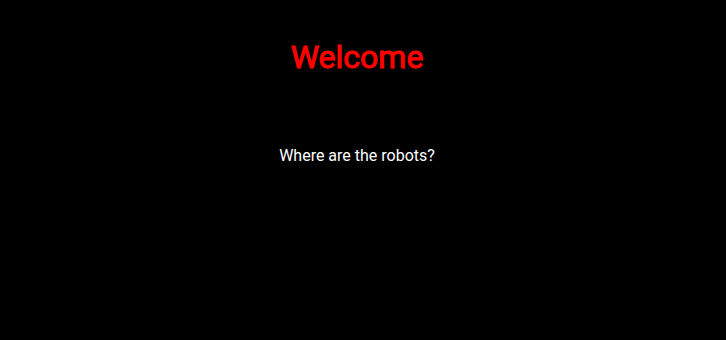
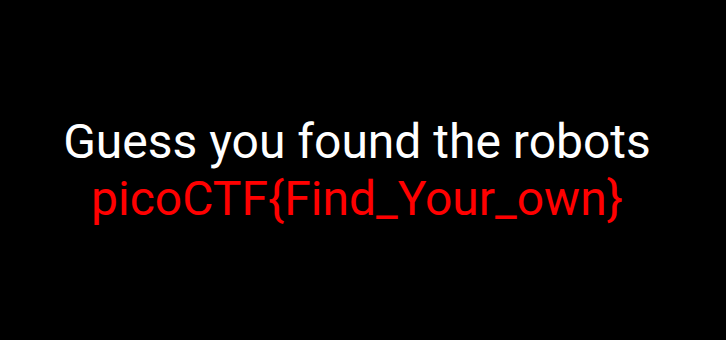

## Introduction

This is another easy web PicoCTF challenge titled [where are the robots](https://learn.cylabacademy.org/library/4?category=1&page=2&difficulty=1). It has the following description: **Can you find the robots?**

## Recon

When the challenge website is opened, we get the following simple UI:



Intuitively, I would check `robots.txt`.

## What is robots.txt?

Search engines like Google or DuckDuckGo index a website's content when you search for something and list it for you. However, developers sometimes do not want certain pages, like `/admin`, to be indexed. To prevent this, they use a text file named `robots.txt` to list resources or paths that search engines are not allowed to index. In other words, we are telling the crawler/search engine, *"See the disallowed paths listed in this file? Do not index them."*

## Lab Solving

When we check `/robots.txt`, we get the following contents:

```txt
User-agent: *
Disallow: /cc6b1.html
```

This means that developers do not want anyone to visit or index the page `/cc6b1.html`. By navigating to this path, we find the flag, as shown in the following screenshot:



## Conclusion

This was a recon-based challenge, as expected for an easy web PicoCTF task, and it is a great way to learn about the purpose and function of `robots.txt`.
