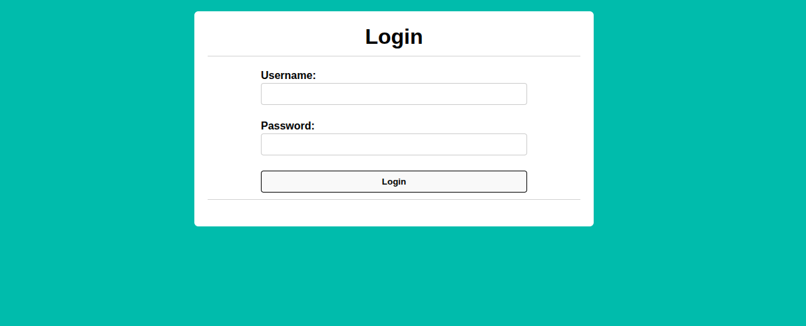

## Introduction

This is a medium PicoCTF challenge titled Fool the Lockout. The goal is to bypass an IP-based rate limit and log in as a valid user.

The implemented safeguard is flawed because it resets the request counter after a certain time window. That makes it possible to stay under the rate limit by pacing requests correctly.

## Recon

The challenge provides a login page, a credential list, and the application source code. The rate limiter tracks the number of failed requests per IP and temporarily blocks the IP after too many attempts.



The source shows that the request counter is reset when the time since the first attempt exceeds a threshold.

## Exploitation

The trick is to make requests in batches that stay under the limit, then wait long enough for the counter to reset before sending the next batch.

A simple script can automate the process and eventually discover the correct credentials.

```python
for each credential batch:
    send 9 requests
    wait 33 seconds
    continue
```

The correct credentials are found to be:

```text
nadir:vides
```

After logging in, the flag is revealed.

## Conclusion

This challenge is a good example of a logic bug in security controls. A rate limiter that resets too aggressively can be bypassed with careful timing and patience.
