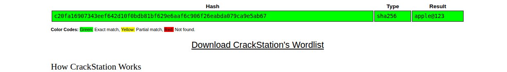
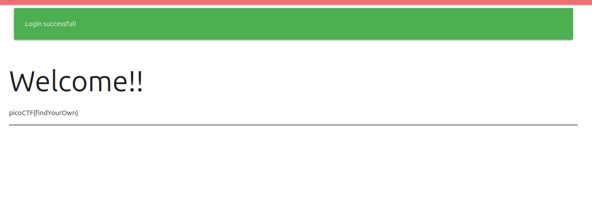
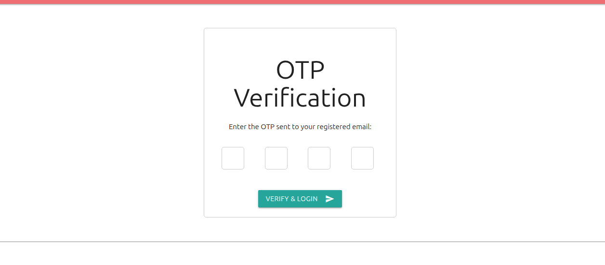
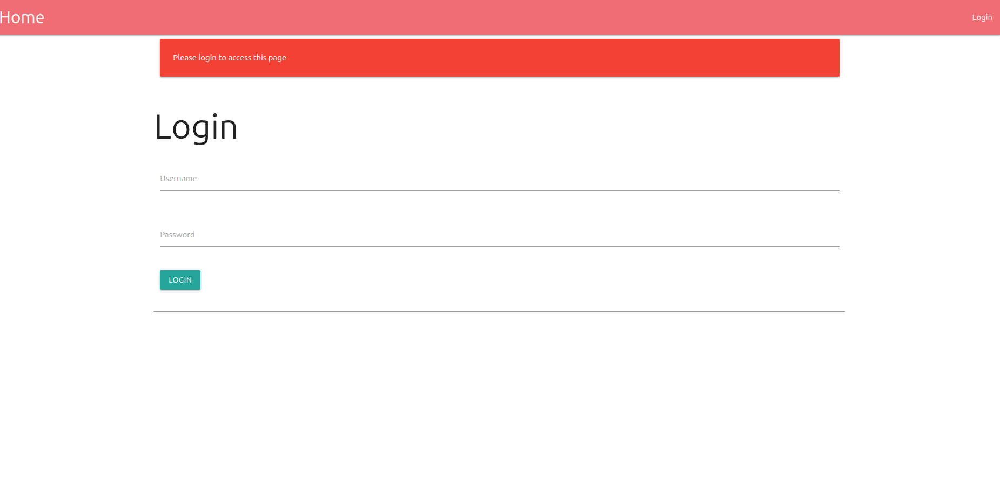

## Introduction

This is a medium web ctf challenge from picoCTF titled [No FA](https://learn.cylabacademy.org/library/765?category=1&page=1&difficulty=2).

It has the following description : **Seems like some data has been leaked! Can you get the flag?**

This is my first medium picoCTF challenge let's try it.

## Recon

We are provided with the backend code of the website alongsite a database and the actual website. First things firs we are going to do manual investigation and finish unknown pieces with the code so we can have a full picture.

### Manual Investigation

When we enter the website we get redirected to `/login` page that contains username field and password field with a login button as shown in the following image.



When I try to insert default creds like `admin:admin` I get an error message stating `Invalid username or password`.

When I check the html code it is a normal form with a post request to `/login`. Now let's intercept the traffic with burpsuite before we check the provided code source to check more information.

Basically the burp interception is normal nothing fishy there as shown.

```sh
POST /login HTTP/1.1
Host: foggy-cliff.picoctf.net:53962
User-Agent: Mozilla/5.0 (X11; Ubuntu; Linux x86_64; rv:152.0 Gecko/20100101 Firefox/152.0
Accept: text/html,application/xhtml+xml,application/xml;q=0.9,*/*;q=0.8
Accept-Language: en-US,en;q=0.9
Accept-Encoding: gzip, deflate, br
Content-Type: application/x-www-form-urlencoded
Content-Length: 37
Origin: http://foggy-cliff.picoctf.net:53962
Connection: keep-alive
Referer: http://foggy-cliff.picoctf.net:53962/login
Upgrade-Insecure-Requests: 1
Priority: u=0, i

username=admin&password=admin&action=
```

The data is sent in the format of `x-www-form-urlencoded`.

Now basically we checked every manual thing let's see the code source.

### Code Source Investigation

So after checking the code source we found that it is a normal website for logging in and there is ofcourse the flag in the admin account what is interesting is that some accounts are protected with some kind of '2fa' the problem with that 2fa is it stores the otp(**One Time Password**) not in the database but it does a bad practice I used to make in my early dev days -16 yo- where I store the confirmation number in the session in the user's browser :) ... So basically any guy who knows basic burp can get this number and bypass that useless '2fa'.

```py
if user['two_fa']:
                # Generate OTP
                otp = str(random.randint(1000, 9999))
                session['otp_secret'] = otp # Here the otp is stored in the session so we can retrieve it
                session['otp_timestamp'] = time.time()
                session['username'] = username
                session['logged'] = 'false'
                # send OTP to mail ---
                return redirect(url_for('two_fa'))
```

The problem here is where do we get the email and passwords the challenge provided us with the leaked database and after checking it we get the following.

```sql
sqlite> .tables
users
sqlite> select * from users
   ...> ;
1|john.doe|john.doe@nfa.com|599a4410e2af69d1585f16d82d4b5f0abf3ad09fa42b9d55d7b7a50671ccf8c1|0
2|jane.smith|jane.smith@nfa.com|81c68634d1b211e0d5632839f7efc8601c743f1ef0c94da8220e26ab221efff1|0
3|robert.jones|robert.jones@nfa.com|aaf120fcb16e20e2d18e63e668e060b5e4a52c5e0b3f038777365fe87ca2ccdb|0
4|emily.brown|emily.brown@nfa.com|9e85668a071a595fe9222725bfb591cdaa0d880e3a7c7de1d9ddd3d4b7d08772|0
5|admin|iamadmin@nfs.com|c20fa16907343eef642d10f0bdb81bf629e6aaf6c906f26eabda079ca9e5ab67|1
6|michael.davis|michael.davis@nfa.com|576454d8921440f30609200a7f79073ec5b69ee284f27bbb860620d56416ad94|0
7|linda.wilson|linda.wilson@nfa.com|082a6006d9c87749adff6be260461171b508744a90a45f75abe78d92995485c5|0
8|david.garcia|david.garcia@nfa.com|faa32a09d4798d21486344a140fd0977cbec33d5b045bca83c04efb364c49d9|0
9|jennifer.rodriguez|jennifer.rodriguez@nfactf.org|c1488b6d9ed8352a64f979506583f33d80aa4119190f7892bc481e8984c880d0|0
10|christopher.williams|christopher.williams@nfa.com|0bf3a14c03e9c7034b9588a69f828840fd32bd739c37b613f41c4aecee26e277|0
11|angela.martinez|angela.martinez@nfa.com|e64b5893827166e4568af8ece105d8c0839772ae10fba3c11e77b5fb3c0ef0c6|0
12|kevin.anderson|kevin.anderson@nfa.com|8bac48021ebd453dbd876d43fa28c8e383fc16176fc8b12fa474b01eb9fa4df5|0
13|melissa.thomas|melissa.thomas@nfa.com|564c89c28d93e8485b76a41deca21ab28e60a32c506e479b925f4643722e9f83|0
14|brian.jackson|brian.jackson@nfa.com|7fccba2f216750414443626058128539ef5a8859f7cb20da2b22d8d787ec6fc2|0
15|stephanie.white|stephanie.white@nfa.com|64acea3bdefef67d65e6a36ee66ac66e85d39931639ea926d1fc98fedd28905b|0
16|eric.harris|eric.harris@nfa.com|b9590eaeaa25401398ebd4b98e10182f4e265f396f23a11eb8fdb18d66a1685c|0
17|michelle.martin|michelle.martin@nfa.com|9b68124e23f3bb700682d28d1d750bec95794a193097b59526ef038f810cb34c|0
18|patrick.thompson|patrick.thompson@nfa.com|1549f62e486c006cbbacee5947c3f6815a0c5f3ef54c80f1f0b17c2ae9da5866|0
19|nicole.garrett|nicole.garrett@nfa.com|5647517c88d64c95170fdb734dc22ba45e284f219d1266eb14f4d9dd7a099ce3|0
20|joseph.cole|joseph.cole@nfa.com|49a57175de704a0ec2a006746d20d375814581bb3552ce0a0b13683426fd232|0
```

What interests us here is the line 5 of the admin account actually it requires 2fa since its value is 1.

What is remaining is guessing the admin's password now and since it is sha-256 it can be crackable in some cases and we are going to use my favourite website for this which is [https://crackstation.net/](https://crackstation.net/). It is the best one out there with ready wordlists and everything calculated for you so no need for johntheripper or hashcat.

After we insert the admin hash we actually get it and it is `apple@123` as shown in the following image.



Now we have everything ready let's open burp and get the otp.

## Exploitation

After we log in as `admin:apple@123` we get redirected to the otp page.



and in burp we get the session encoded `.eJwty0sKgCAQANC7zFpixgI_lwnJSQR_qK2iu9ei7YN3Q6ohsAcLp0uDQUCdbR98dJ4fEm3mtxkzj-lyA0tKk0FUJJeVNKIUcA3uxWX-jvM5FnheKZwcFA.ajWlqA.Vd0J1VK4kzsMShCci8ZNIb9whW8` all we have to do is decode it now. We can use [https://www.kirsle.net/wizards/flask-session.cgi](https://www.kirsle.net/wizards/flask-session.cgi) and with that we get the full cookie session.

```json
{
    "logged": "false",
    "otp_secret": "1149",
    "otp_timestamp": 1781900712.318002,
    "username": "admin"
}
```

And with that we insert it before it expires and **kaboom** the lab is solved.



## Conclusion

That was actually an easy one for a medium lab no exploitation actually just understanding the logic and checking cookie session.
