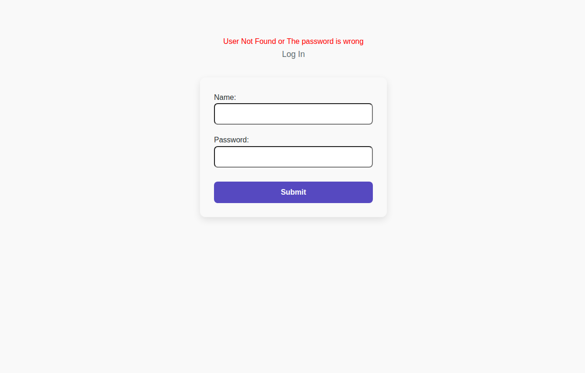
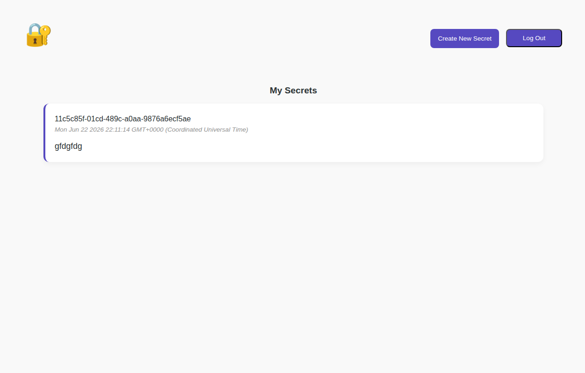
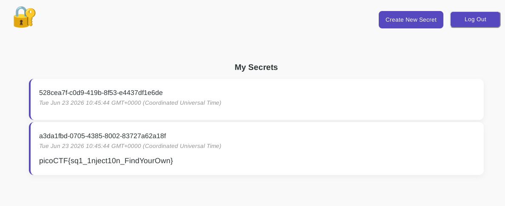

## Introduction

This is a medium PicoCTF web challenge titled Secret Box. The application allows users to create and view secrets, but the backend uses a vulnerable SQL query when inserting new secrets.

The challenge description hints that the admin's secret contains the flag, so the goal is to make the application reveal it.

## Recon

The application presents signup and login pages. After creating an account and logging in, the user can create a secret.



The secret creation endpoint uses an unsafely constructed SQL query.

```sql
INSERT INTO secrets(owner_id, content) VALUES ('${userId}', '${content}')
```

This is vulnerable because user-controlled input is included directly in the SQL statement.

## Exploitation

By injecting SQL into the secret content field, we can cause the database to insert a second row that references the admin account's secret. The application later shows our own secrets, making the injected value visible.

A payload similar to the following can be used:

```sql
'),('<insertUID>', (SELECT content FROM secrets WHERE owner_id='admin-id')) --
```

Once the payload is inserted, the flag appears in the secrets list.



The application also allows the password to be revealed in the same way, but the flag is the main objective.



## Conclusion

This challenge demonstrates how SQL injection can be abused in an insert statement to retrieve data that should not be visible to the current user. It is a classic example of trusting unvalidated input inside SQL queries.
