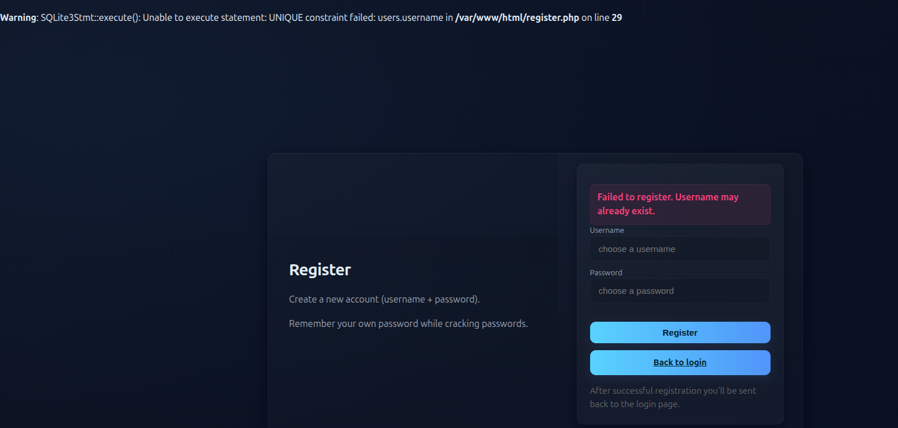
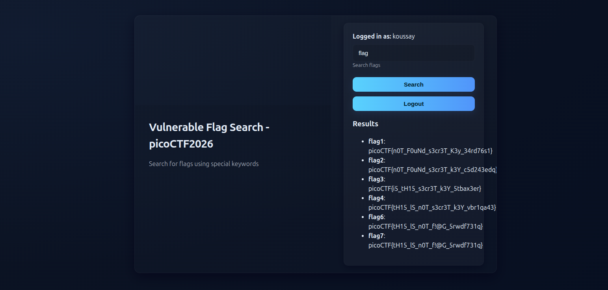
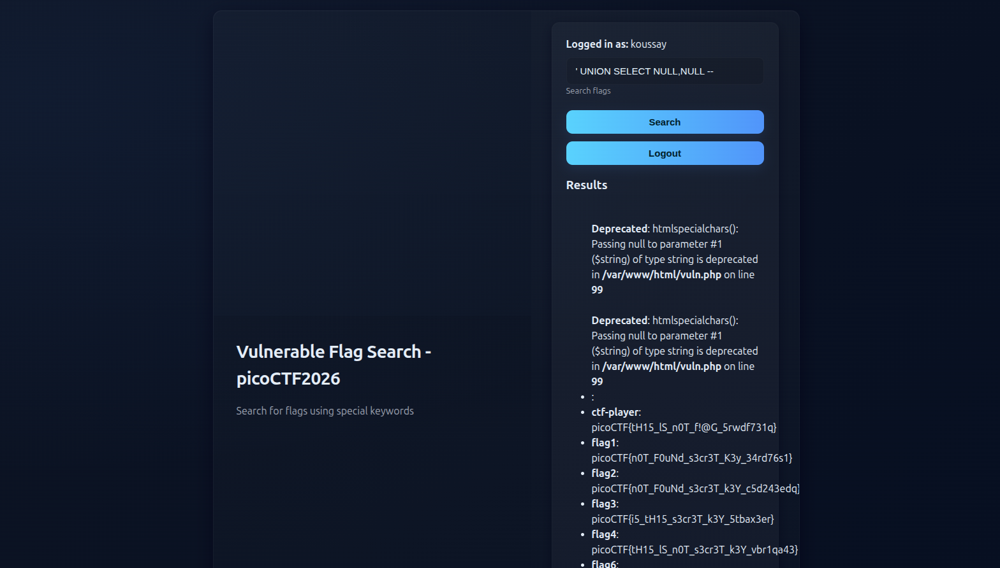
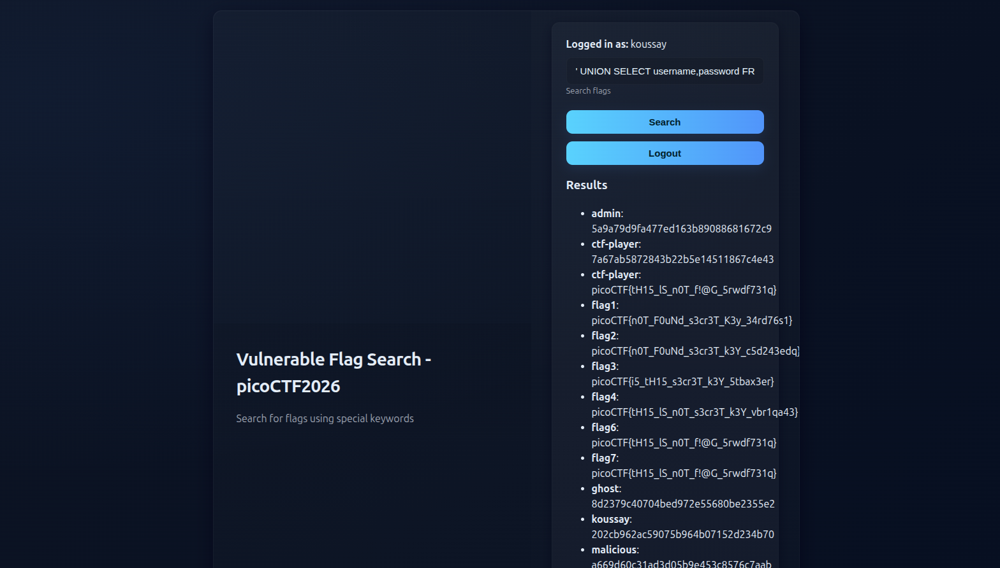
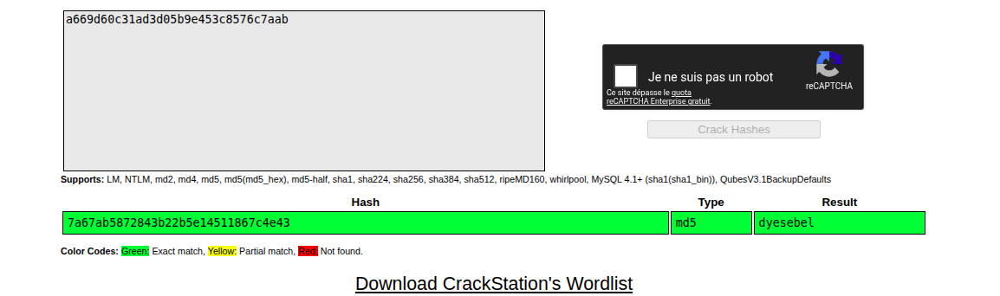
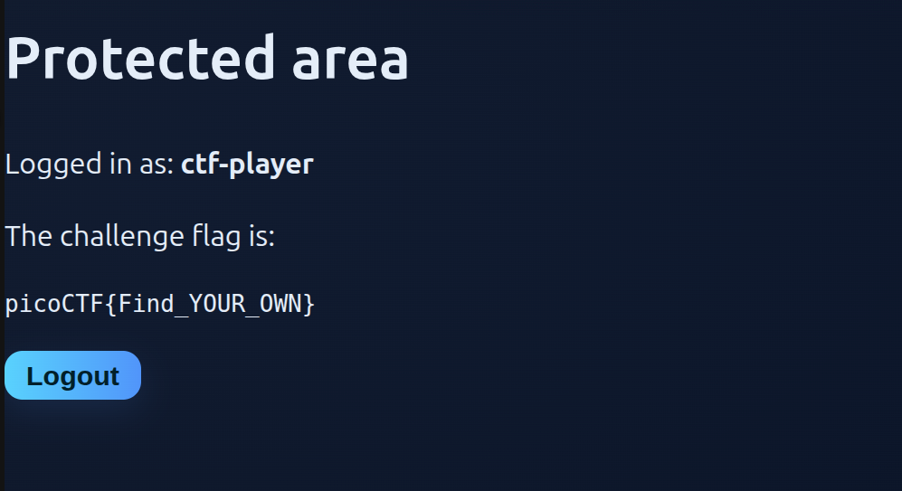
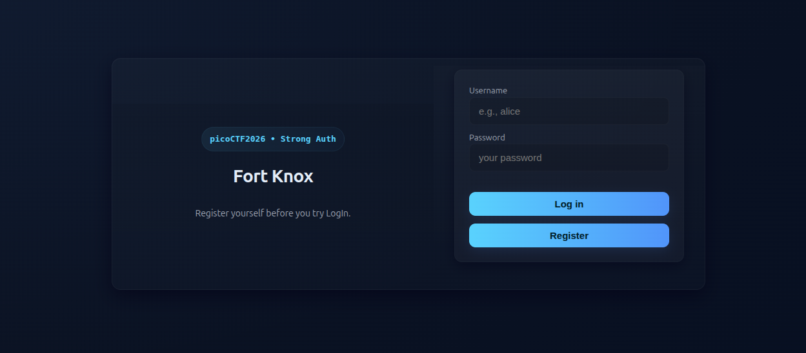

## Introduction

This is another PicoCTF medium web challenge titled [Sql Map1](https://learn.cylabacademy.org/library/729?category=1&page=1&difficulty=2).

It has the following description: **You’ve been hired by a shadowy group of pentesters who love a good puzzle. The system looks ordinary, but appearances lie. Somewhere inside, sloppy code and legacy hashing practices left a tiny, perfect doorway for an attacker. Your mission — should you choose to accept it — is to slip through that doorway, act as a legit user, and retrieve the secret flag.**

The important things in this description are:

1. Sloppy code — there may be some logical errors.
2. Legacy hashing practices.

The challenge name is SQLMAP1, so I think we will exploit a SQL injection vulnerability to extract user passwords, and that password is hashed with some legacy algorithm, such as SHA-1, so we will crack it.

## Recon

We are faced with a login form, as shown in the following image.



We try some trivial credentials like `admin:admin`, and we find that either the username or the password is wrong.

We try to create an account with the name `admin` to see if it accepts it, and we find something interesting: a SQLite error is generated when we insert `admin`, with the note that this username is already taken.



The error is as follows:

```sql
Warning: SQLite3Stmt::execute(): Unable to execute statement: 1, near "'%'": syntax error in /var/www/html/vuln.php on line 39
```

The error says that the UNIQUE constraint has failed because we inserted a non-unique username that already exists in the database.

When we create a normal account, say with the credentials `koussay:123`, we are faced with the following page that tells us to fetch any item we want.

If we type `flag`, we get a list of non-valid flags, as shown in the following image.



## Vulnerability Detection and Analysis

Let's try to mess around a little, since I saw the SQLite error from before. I will try to insert `flag'` in the items field, and we get the following error.

```sql
Warning: SQLite3::query(): Unable to prepare statement: 1, near "'%'": syntax error in /var/www/html/vuln.php on line 39

Fatal error: Uncaught Error: Call to a member function fetchArray() on bool in /var/www/html/vuln.php:40 Stack trace: #0 {main} thrown in /var/www/html/vuln.php:40
```

From what I understand from the error, the query may contain something like `WHERE item LIKE '%USERINPUT%'`, because the error mentions a syntax error near `'%'`. So we need to inject a payload that knows how to handle `%`. This screams SQL injection because our user input is not treated as text but as SQL code, and the evidence is that we generated a SQL error from our messy input.

## Payload and Exploitation

First, we need to know how many columns the first SQL `SELECT` clause returns, because we are going to perform a `UNION` attack. My assumption is that it returns two columns, because when we search for `flag`, initially two items are shown: each line is shown with a label and its value. So let's try to inject `' UNION SELECT NULL,NULL -- `, and we eventually get a valid result, as shown in the following image.



So let's try to inject the payload `' UNION SELECT username,password FROM users -- ` as a test, since the previous error showed that there is a table named `users`. It may work, and we will not waste much time doing recon on the database.

Eventually, a list of usernames and hashed passwords — just as I predicted — is shown within the HTML, as shown in the following image.



The admin credentials are `admin: 5a9a79d9fa477ed163b89088681672c9`, so let's use CrackStation to see if this hash is weak or not — spoiler: it is.

If we try to crack it, we find that it is not found. Weird. Let's try another user's password, such as `ctf-player`, and eventually we get its plain password, which is the following.



Those credentials are `ctf-player:dyesebel`, and after we log in, we find the flag, as shown in the following image.



## Conclusion

That was an easy challenge rather than a medium one. I mean, it is an easy medium, as always, for PicoCTF challenges.
