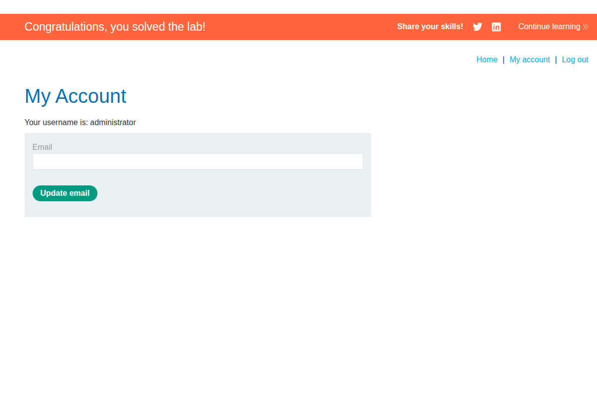
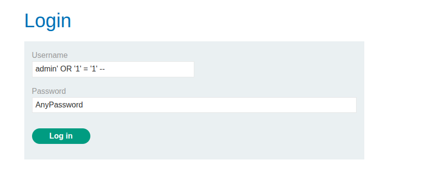
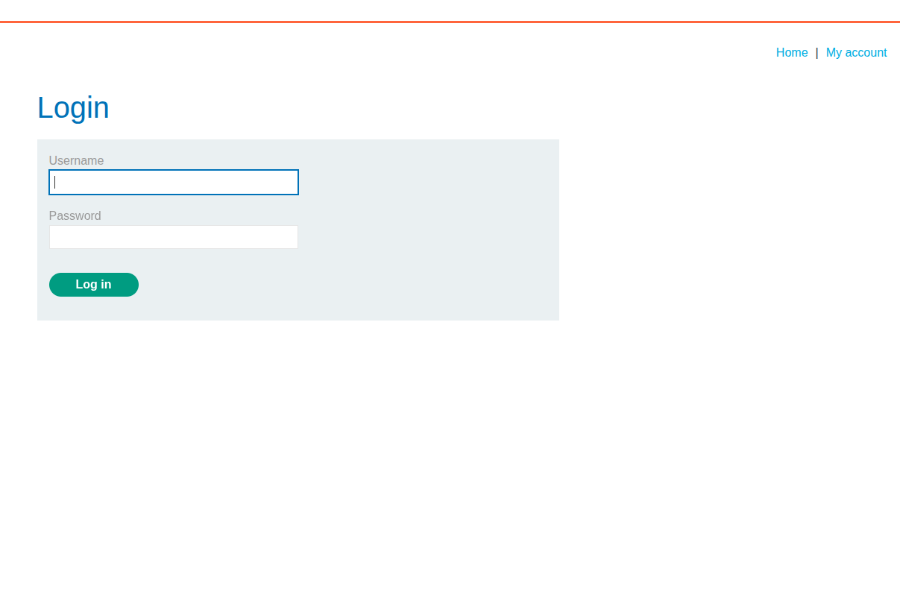

## Introduction

This lab is all about bypassing authentication with SQL injection in a login form.

The backend logic is probably something like:

```sql
SELECT * FROM users WHERE username = '' AND password = '';
```

The goal is to log in as a valid user without knowing the password.

## Recon

When we open the login page, the username and password fields are the obvious injection points.



## Exploitation

A simple payload like this works:

```sql
admin' OR '1'='1' --
```

It closes the username string, forces the condition to true, and comments out the rest.

So the query becomes effectively always true, which lets us authenticate.



Why not just use `admin' --`? Because if the admin user does not exist, the query still fails. Using `OR '1'='1'` is safer and more reliable.



## Conclusion

This lab is a straightforward example of login bypass via SQL injection. It shows how a small injection can turn an authentication check into a universal pass.
