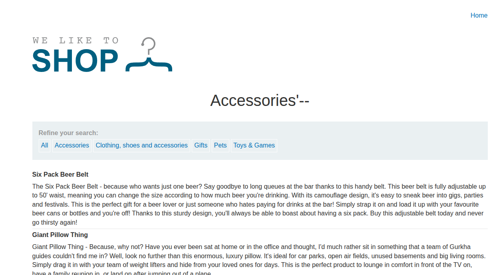
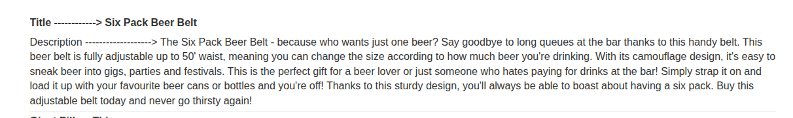

## Introduction

This lab introduces UNION-based SQL injection on Oracle. The goal is to retrieve the database version string.

The vulnerable parameter is the category filter, and the app is similar to the earlier labs.

## Recon

The product catalog looks normal, but the category filter is the injection point.


## Detecting the Vulnerability

Sending a single quote breaks the query and confirms SQL injection.

```text
/filter?category=Accessories'
```

This is a strong sign that the input is interpreted as SQL.



## Exploitation

Oracle requires a `FROM` clause even for simple `SELECT` statements, so we use the `dual` table.

First, we find the number of columns with:

```sql
' UNION SELECT NULL FROM dual --
```

Then we add more `NULL` values until the error disappears.

Once the column count is known, we extract the version string with:

```sql
' UNION SELECT BANNER, NULL FROM v$version --
```

That reveals the Oracle version and solves the lab.



## Conclusion

This lab is a great introduction to Oracle UNION injection. The main difference from other databases is the Oracle-specific syntax.
