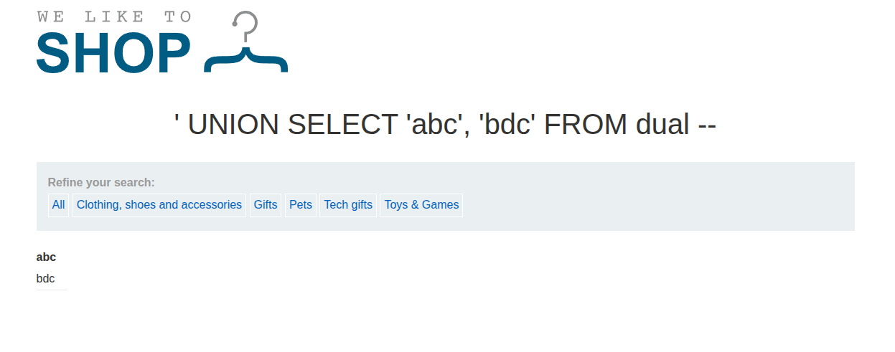
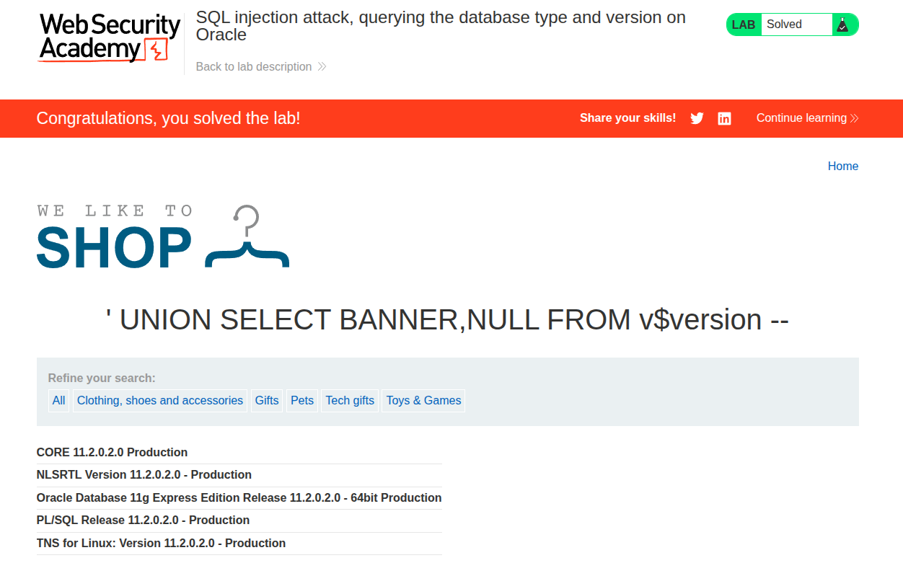

## Introduction

This is another SQLi PortSwigger lab titled [SQL injection attack, querying the database type and version on Oracle](https://portswigger.net/web-security/sql-injection/examining-the-database/lab-querying-database-version-oracle).

The description is as follows:

**This lab contains a SQL injection vulnerability in the product category filter. You can use a UNION attack to retrieve the results from an injected query. To solve the lab, display the database version string.**

## Recon

The website is the usual e-commerce website we get in SQLi PortSwigger labs, with categories queried via the URL `/filter?category=Accessories`.


The goal of the challenge is to display the Oracle server version, and we can do this by using `UNION`.

## Vuln Detection and Analysis

First, we have to check or assume how the SQL clause is written, based on the injection we will be performing within the URL `/filter?category=Accessories`.

So let's assume that the SQL clause within the server is written as follows:

```sql
SELECT * FROM PRODUCTS WHERE Category = 'Accessories';
```

If we add a `'` to the URL as follows: `/filter?category=Accessories'`, we get the following error, as shown.


So some theories:

- Our input is interpreted as SQL, not as text, and thus we got this type of error since we altered the SQL query.
- The error may be generated because of bad SQL syntax. If we assume that the query we assumed is correct, then what we did was:

```sql
SELECT * FROM PRODUCTS WHERE Category = 'Accessories'';
```

So it will generate a server error.

And if we add `--` after the `'` as a comment, we get the same usual page for accessories.


So there is a huge possibility that the SQL clause we proposed is correct, so we are going to work with that. If our assumptions are wrong, we will know when injecting other payloads and changing strategy.

## Exploitation and Payload

If we want to show the Oracle version, we use the following clause:

```sql
SELECT BANNER FROM V$VERSION;
```

But writing that query directly with a `UNION` like this:

```sql
UNION SELECT BANNER FROM v$version -- 
```

Will generate the same internal server error, because we do not know how many columns the first `SELECT` returns.

**UNION in SQL**

As we know, the `UNION` clause in SQL is used to return the combination of several `SELECT` clauses, but there is a constraint for it to work:

- Each `SELECT` clause should have the same number of columns.
- The type of the columns should be compatible.

```sql
SELECT int, float FROM X UNION SELECT int, int FROM Y; -- WRONG TYPE MISMATCH

SELECT int, float FROM X UNION SELECT int, float FROM Y; -- CORRECT
```

So the first column in `X` should be compatible with the first column in `Y`, and so on.

**Dual table in Oracle**

Sometimes in SQL we do not require retrieving data from tables to do some operations. For example, `SELECT 1+1` or `SELECT now()`. But unlike MySQL or PostgreSQL, Oracle requires a `FROM` clause in each SQL query. The table `dual` is an empty or placeholder table used to perform such operations in these cases.

So in MySQL:

```sql
SELECT Name FROM Categories UNION SELECT NULL;
```

**NOTE: We write `NULL` to verify that the type constraint is satisfied, so we will not be dealing with a type mismatch.**

But in Oracle we need `FROM dual`:

```sql
SELECT Name FROM Categories UNION SELECT NULL FROM dual;
```

So in our case, we do `' UNION SELECT NULL FROM dual -- `, and we keep adding columns (`NULL`) until that internal server error is removed. Then we know the number of columns returned by the SQL query.

If we do two columns, `' UNION SELECT NULL, NULL FROM dual -- `, we get normal result.




Then we do `' UNION SELECT BANNER,NULL FROM v$version --`. With that, the lab is solved, and the version is shown.



## Conclusion

It was a great lab. It taught us a new recon technique using `SELECT` and the `dual` table to know exactly what to write in a SQL injection payload.

