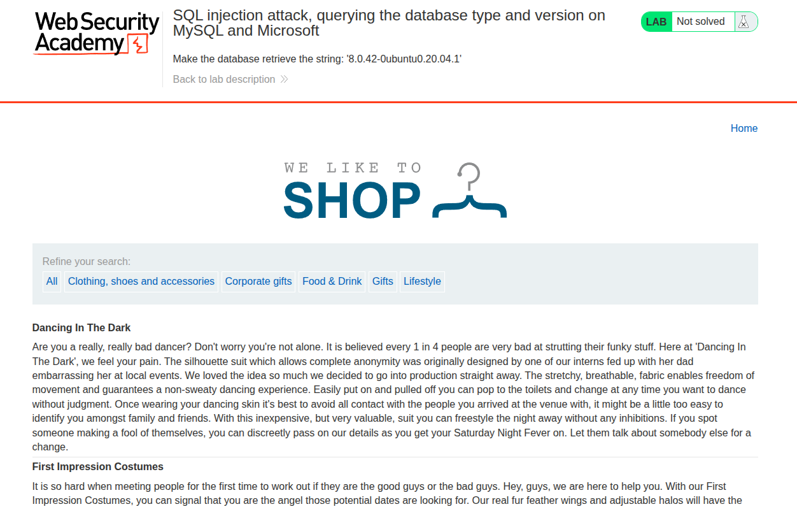
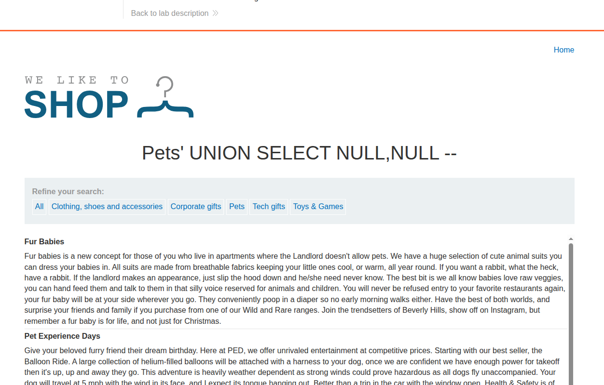
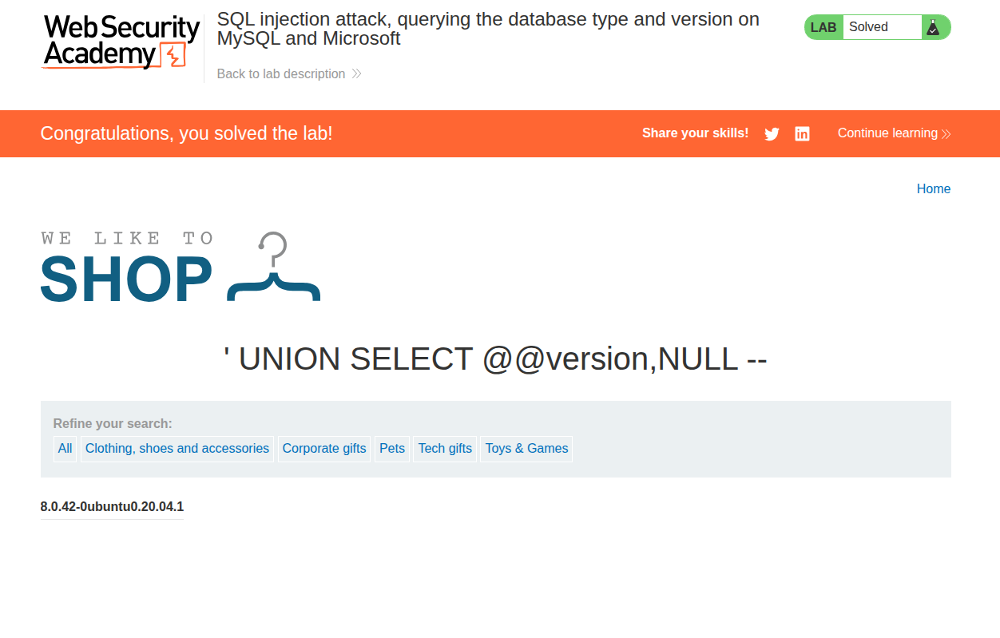

## Introduction

This is the fourth SQLi PortSwigger lab titled [SQL injection attack, querying the database type and version on MySQL and Microsoft](https://portswigger.net/web-security/sql-injection/examining-the-database/lab-querying-database-version-mysql-microsoft).

The description of the lab is as follows:

**This lab contains a SQL injection vulnerability in the product category filter. You can use a UNION attack to retrieve the results from an injected query. To solve the lab, display the database version string.**

## Recon

First, we have the usual e-commerce website with its categories, as shown in the following image.



If we select a specific category, we get redirected to the URL `/filter?category=Gifts`.


## Vulnerability Detection and Analysis

First of all, since there is a filter for the categories, we start by assuming the SQL query for this filter.

Since we are sure about the condition we are filtering by, which is `category=Gifts`, we can assume this clause:

```sql
SELECT .* FROM ITEMS WHERE category='Gifts';
```

We are also assuming the table name, but that is not the important part here. What is important is the condition: `WHERE category='Gifts'`.

Let's test whether the user input is treated safely by adding `'`.

If we add `'` to the URL `/filter?category=Gifts'`, we get an internal server error.


So the input is not treated safely, and there is a possibility that a SQL injection exists there. So let's try a more sophisticated payload: `' OR 1=1 --%20`. We added `%20` so it will add a space when decoded in the backend, since this is MySQL and a comment needs a space after it.

And it worked perfectly fine.


And thus SQL injection is confirmed, since the payload `' OR 1=1 --%20` worked perfectly fine.

## Exploitation and Payload

Since we are on MySQL, the way to show the version is:

```sql
SELECT @@version;
```

Now we need to craft a payload for this injection to show the version of the server.

If we are going to use `UNION`, we need to verify the two usual constraints:

1. Same number of columns
2. Each column should have a compatible type with the corresponding one

So it becomes:

```sql
SELECT INT,FLOAT FROM X UNION SELECT INT, FLOAT FROM Y;
```

Now we need to determine how many columns the base query returns by using the following method.

In MySQL, you can select some ready values without a table, like `SELECT 'abc'`. That clause will return `abc` directly. The same goes for `SELECT NULL,NULL`, which will return `NULL,NULL`.

What we will do is `SELECT 1,2,...n`; we keep adding columns in each request until there is no internal server error.

If we test `/filter?category=Pets' UNION SELECT NULL,NULL --%20` (where `%20` is a space), we get a normal result.



So we have 2 columns returned. Now we can write the final payload, which is `/filter?category=' UNION SELECT @@version,NULL --%20`. We removed `Pets` since we want only the version to be shown.

The order of `NULL` and `@@version` does not matter, since both columns are shown on the website: one as the title of a table and the other as a `<th>`.

The lab is solved, as shown.



## Conclusion

This lab teaches the same UNION injection technique, but with MySQL-specific output. The key is still to match the expected columns and then retrieve the version string.
