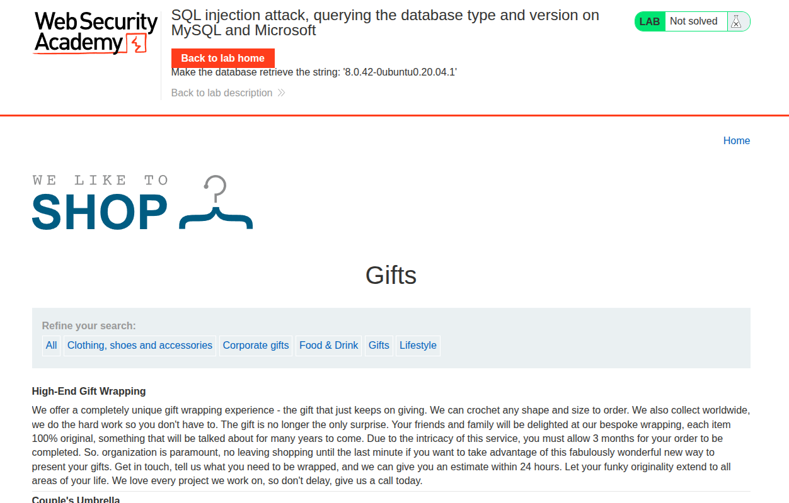
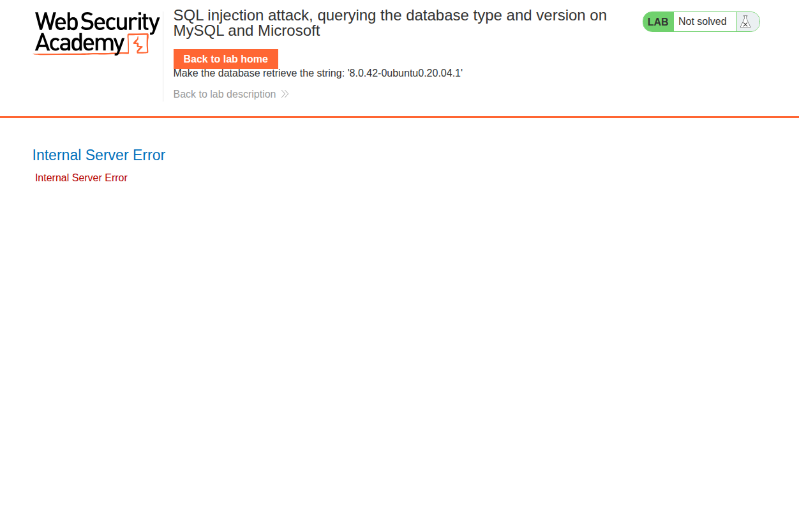
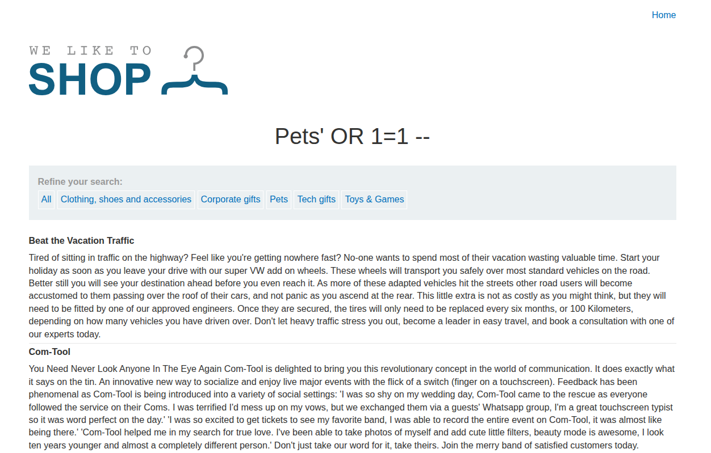

## Introduction

This lab is basically the same idea as the Oracle version lab, but with MySQL syntax.

The objective is to retrieve the database version string using SQL injection on the category filter.

## Recon

The app looks like the previous labs, with a catalog and a category filter.



## Exploitation

First we confirm the injection works with a boolean payload:

```sql
' OR 1=1 --
```

This is enough to show the parameter is injectable.

Once confirmed, we use a UNION-based payload to get the version. The MySQL server version is available via:

```sql
SELECT @@version;
```

So the payload becomes:

```sql
' UNION SELECT @@version, NULL --
```

That returns the server version in the page and solves the lab.





## Conclusion

This lab teaches the same UNION injection technique, but with MySQL-specific output. The key is still to match the expected columns and then grab the version string.
