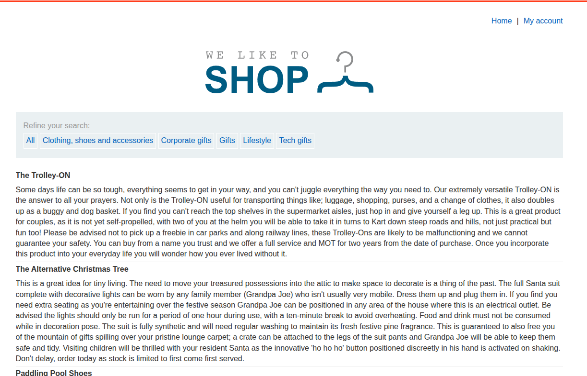
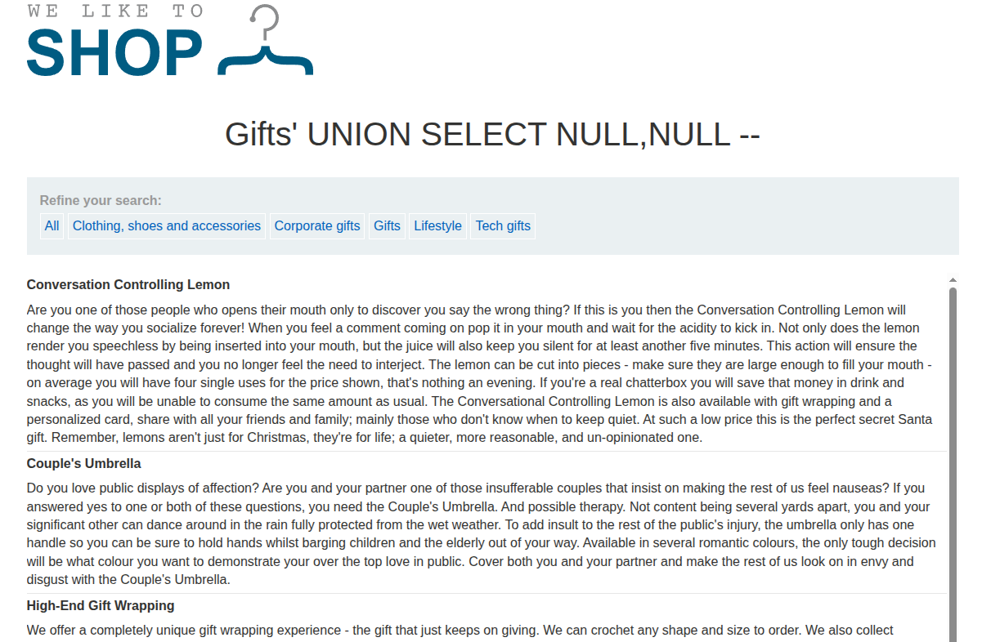
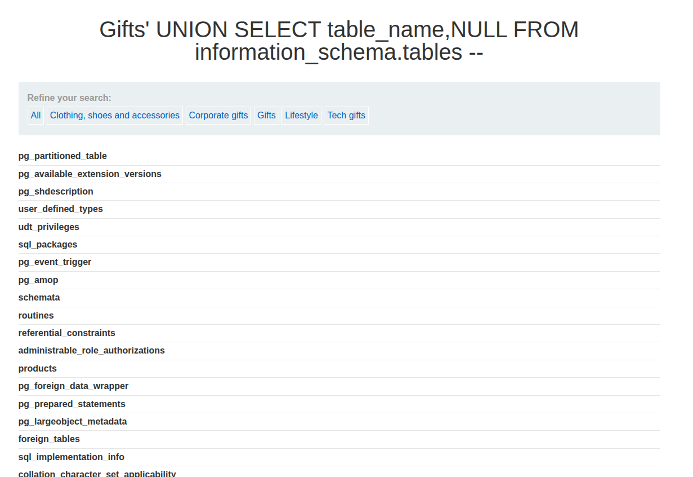
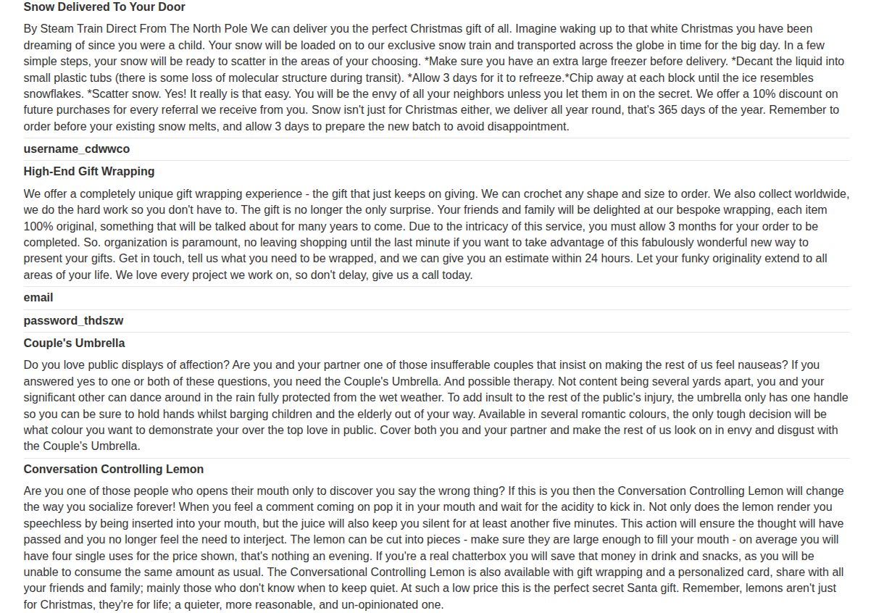

## Introduction

This is the fifth PortSwigger SQLi lab titled [SQL injection attack, listing the database contents on non-Oracle databases](https://portswigger.net/web-security/sql-injection/examining-the-database/lab-listing-database-contents-non-oracle).

The lab description says that there is a SQL injection vulnerability in the product category filter, and we need to leverage it to get the usernames and passwords from a specific table.

We do not know the name of the table, so we need to show the database contents.

## Recon

We see the usual e-commerce website with product titles, descriptions, and category selection, as shown in the following image.



As usual, if we select a specific category, we get redirected to the following link: `/filter?category=Gifts`.

## Vuln Detection and Analysis

If we add `' OR '1' = '1' -- ` to the URL `/filter?category=Gifts`, we get all the articles from all the categories instead of only gifts. That means that our user input is not treated safely, and this clearly indicates a SQLi vulnerability.

## Payload Crafting and Exploitation

Now we need to use a `UNION` attack to list the database contents. First, as we always mention, a `UNION` clause in SQL should have the following two conditions.

1. Each `SELECT` in the `UNION` query should have the same number of columns.
2. Each column should have a compatible type with the other columns in the same position. For example:

```sql
SELECT int,float FROM X UNION SELECT int,float FROM Y; -- Or a compatible type like '1' and 2
```

To determine how many columns we have on non-Oracle databases, we can use `UNION SELECT NULL` and keep adding `NULL` columns until no server error is present.

If we inject `' UNION SELECT NULL,NULL -- ` (do not forget the space after the comment) into the URL `/filter?category=Gifts`, we get a normal page, as shown in the following image.



Now we need to list the database contents using the clause `' UNION SELECT table_name,NULL FROM information_schema.tables`. The order of `NULL` does not matter here. If `table_name` is before `NULL`, the table name will be bold; if it is second, it will appear in the description text.

After we inject that payload, we get a list of all the tables in the database.



Most of these are default tables, so we try to look for a name that is not default. `users_olfmov` seems to be the one.

So let's try to list the column names of that table by injecting `' UNION SELECT column_name,NULL FROM information_schema.columns WHERE table_name = 'users_olfmov' -- `.

And we got the following results.



We need to select `username_cdwwco` and `password_thdszw` from the table `users_olfmov`, so we inject the final payload `' UNION SELECT username_cdwwco, password_thdszw FROM users_olfmov -- `.

As shown in the following image, we find a list of all users in the database.

## Conclusion

This lab is a solid introduction to database enumeration using UNION injection. It shows how to move from a simple exploit to dumping stored usernames and passwords.
