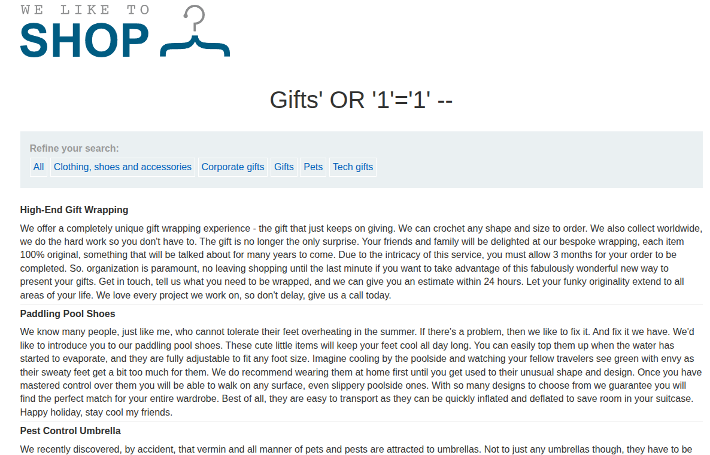
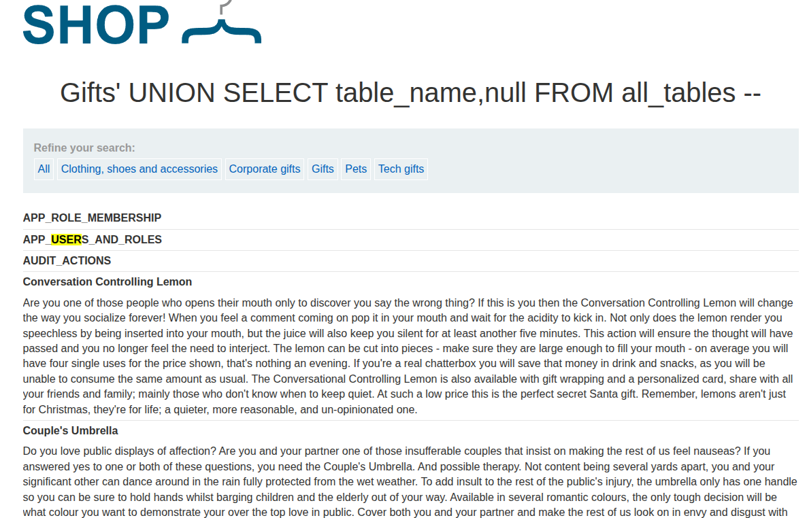
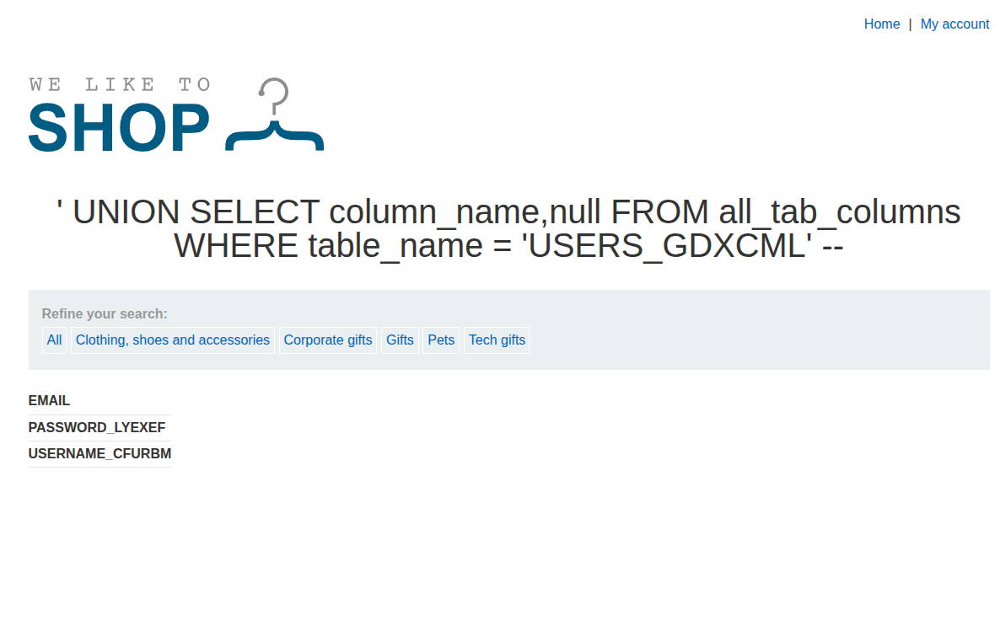

## Introduction

This lab is very similar to the previous one, but it targets an Oracle database instead of a non-Oracle one.

The goal is to enumerate the database structure and retrieve the administrator credentials.

## Recon

Like the other labs, the target is an e-commerce site with a category filter parameter that is vulnerable to injection.



## Exploitation

We first confirm the presence of SQL injection with a standard boolean-based payload:

```sql
' OR '1'='1' -- 
```

This causes the application to return unrelated results, which indicates that the parameter is injectable.

To enumerate tables on Oracle, we can use:

```sql
' UNION SELECT table_name, NULL FROM all_tables --
```

Then we inspect the columns of the interesting table with:

```sql
' UNION SELECT column_name, NULL FROM all_tab_columns WHERE table_name = 'USERS_GDXCML' --
```

Finally, we retrieve the credentials from the relevant columns and solve the lab.





## Conclusion

This lab is a useful reminder that Oracle uses different metadata views than MySQL or PostgreSQL. The overall approach is the same, but the syntax and system catalog differ.
