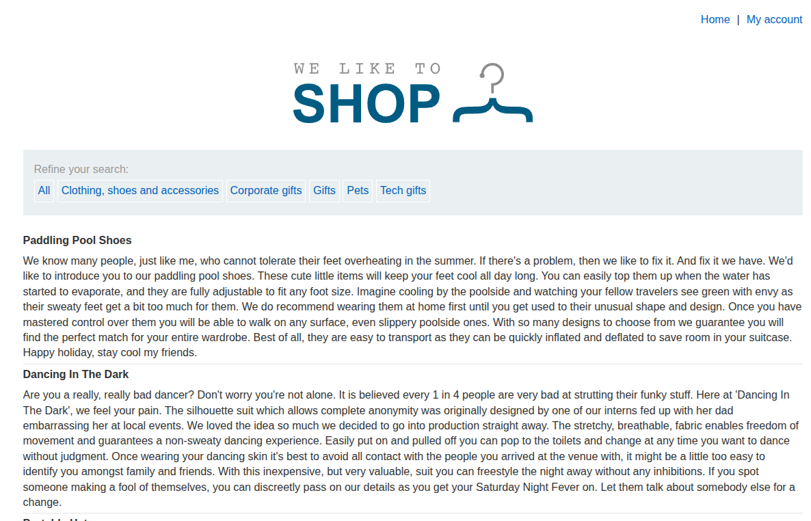
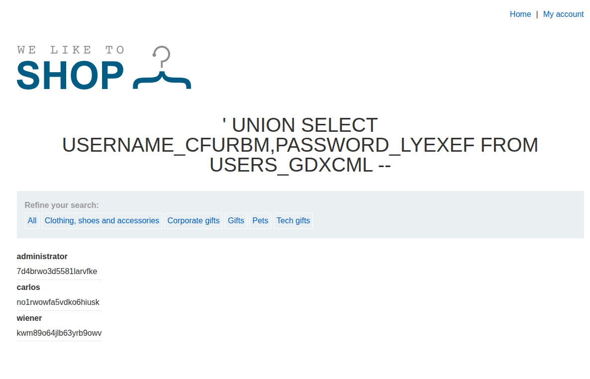
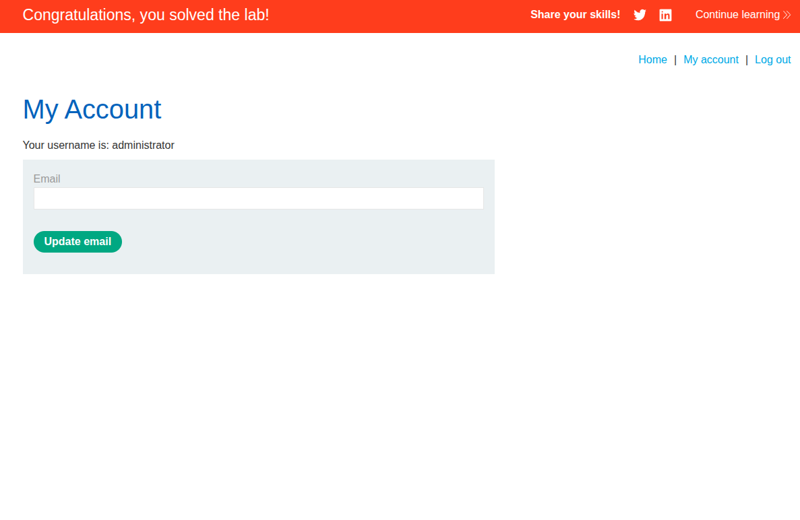

## Introduction

This is the sixth PortSwigger SQLi lab titled [SQL injection attack, listing the database contents on Oracle](https://portswigger.net/web-security/sql-injection/examining-the-database/lab-listing-database-contents-oracle).

It is similar to the previous lab, but the previous one was for non-Oracle databases, while this one is specifically for Oracle because their syntax differs.

## Recon

We find the usual e-commerce website with products and categories, as shown in the following image.



## Vulnerability Detection and Analysis

Let's try to add `' OR '1' = '1' -- ` to the URL to see if it works or not.

When we insert that payload with `/filter?category=Gifts`, we get all the categories instead of only the Gift category, as shown in the following image.


That clearly indicates a SQLi vulnerability, so now we need to move on to writing a more sophisticated payload to extract table names, then column names, and finally the admin credentials.

## Payload and Exploitation

We are going to write a `UNION` clause, and we need to verify the two usual conditions.

1. `SELECT` statements should have the same number of columns.
2. Each column with the same index should have compatible types.

```sql
SELECT int,float FROM Y UNION SELECT int,float FROM X;
```

So we need to use the usual trick that we learned in lab three, which is using the `dual` table to determine how many columns the first `SELECT` clause we are injecting returns. We add `' UNION SELECT NULL FROM dual -- ` and keep adding `NULL` columns until no internal server error exists.

If we insert `' UNION SELECT NULL,NULL FROM dual -- `, we get a normal webpage, which means that the `SELECT` statement returns two columns.

To list database tables in Oracle, we use `SELECT * FROM all_tables`, so we can inject it like `' UNION SELECT table_name,NULL FROM all_tables -- ` into the URL. If we do that, we get a long list of all the tables in the database, and most of them are default Oracle tables.


If we search within the tables, we can see a non-default one, `USERS_GDXCML`, so we have to list its contents with `' UNION SELECT column_name,NULL FROM all_tab_columns WHERE table_name = 'USERS_GDXCML' -- `.

We got the following column names.


So the last injection to show the username and password is `' UNION SELECT USERNAME_CFURBM,PASSWORD_LYEXEF FROM USERS_GDXCML -- `.

Now we get the following credentials.



We got the admin credentials: `administrator:7d4brwo3d5581larvfke`, and thus we can log in and solve the lab.





## Conclusion

This lab shows that Oracle uses different metadata views, but the overall UNION injection approach is the same.
