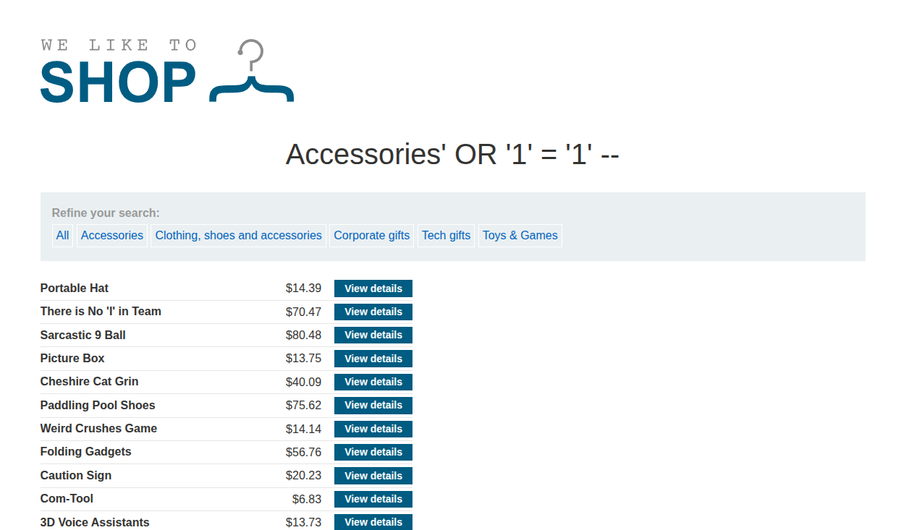

## Introduction

This lab focuses on a core UNION injection skill: determining how many columns the original query returns.

The challenge is to find the right number of columns so that future UNION payloads will work.

## Recon

The application is the same kind of e-commerce site as the earlier labs, with a vulnerable category parameter.



## Exploitation

The method is simple: inject `NULL` values into a UNION query and add more until the error disappears.

Example payloads:

```sql
' UNION SELECT NULL --
' UNION SELECT NULL, NULL --
' UNION SELECT NULL, NULL, NULL --
```

The point where the query stops failing tells us the number of columns returned by the original query.


## Conclusion

This lab is fundamental because correct UNION attacks depend on matching the column count of the original query. Once you understand this, more advanced injection techniques become much easier.
