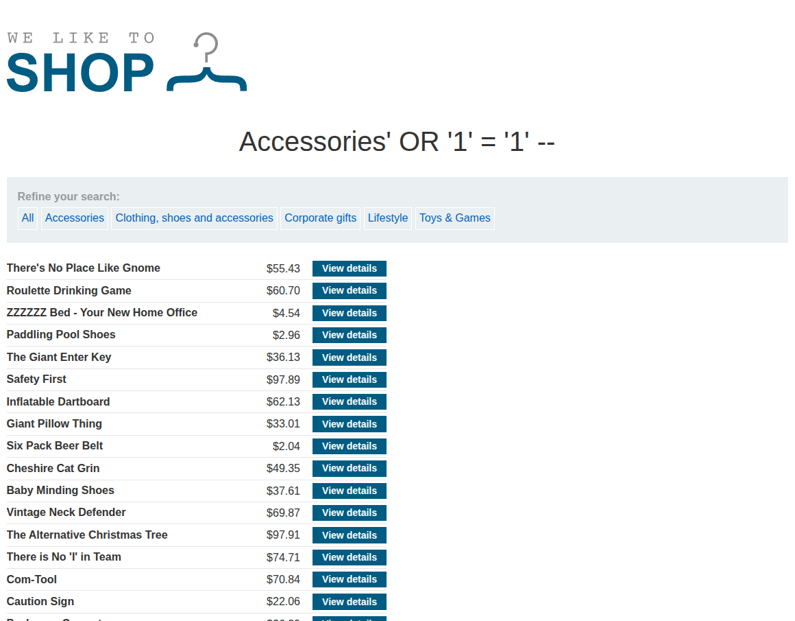
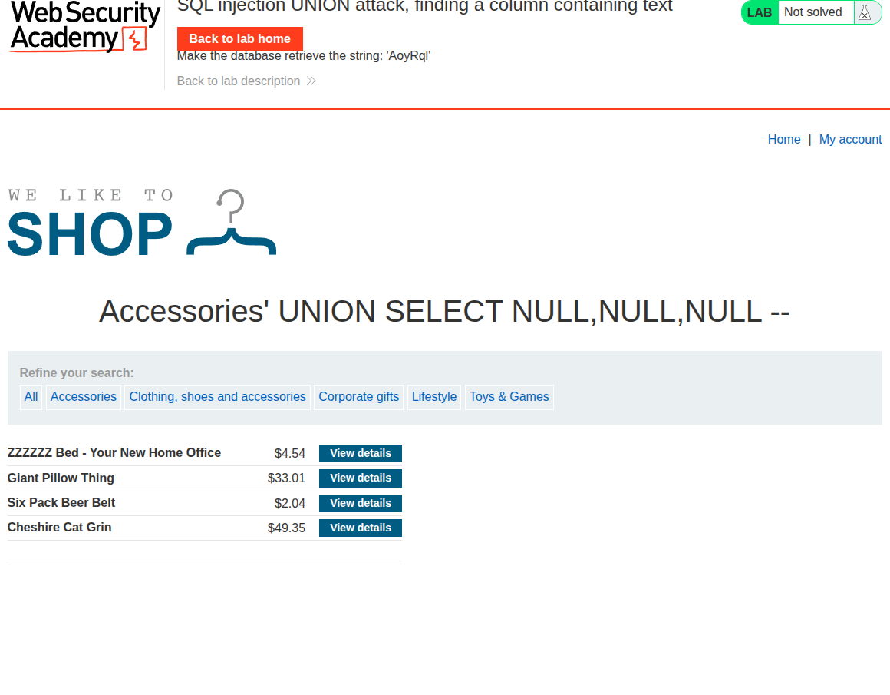

## Introduction

This final lab teaches how to identify which column in a UNION query can display string values.

The goal is to locate the column that accepts a text payload such as `AoyRql`, which allows us to solve the challenge.

## Recon

The app is the usual vulnerable e-commerce site with a category filter parameter.



## Exploitation

After determining the number of columns, we test each column by replacing `NULL` values with a string literal.

For example:

```sql
' UNION SELECT 'AoyRql', NULL, NULL --
```

If the page displays the string successfully, that column is compatible with string data.



## Conclusion

This lab closes the series by showing a practical way to identify the correct column for a UNION payload. It is another important skill for building successful SQL injection attacks.
