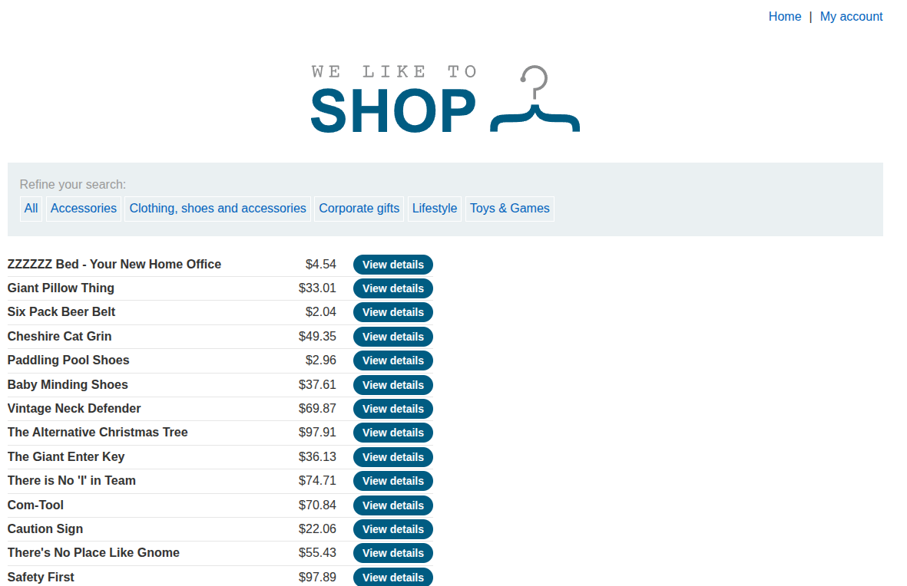
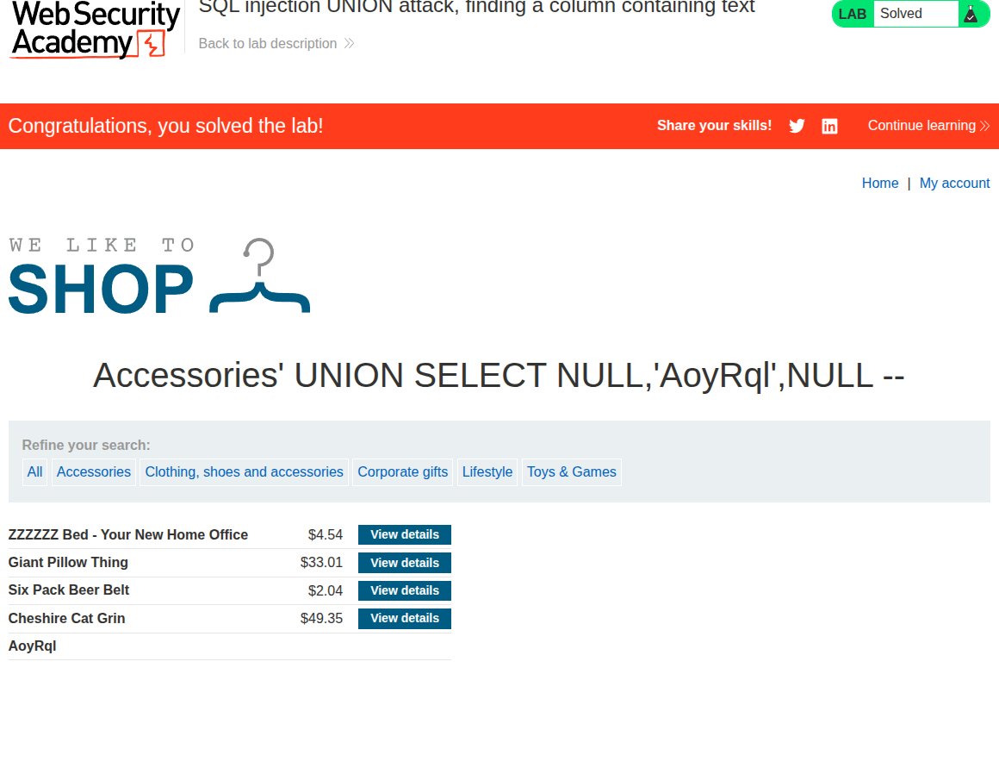

## Introduction

This is the eighth SQLi lab titled [Finding a Column That Accepts Strings](https://portswigger.net/web-security/sql-injection/union-attacks/lab-find-column-containing-text).

What we will try to do in this lab is a `UNION` attack to determine the number of columns returned by the first `SELECT` statement and which column has the string type.

## Recon

We are faced with the usual e-commerce website by PortSwigger, as shown in the following image.

If we select a specific category, we get redirected to the URL `/filter?category=Accessories`.

## Vuln Detection and Analysis

If we try to add the payload `' OR '1'='1' -- `, we get all the items regardless of their category, which means that this is vulnerable to SQL injection.

## Payload and Exploitation

First, we need to determine how many columns are being returned by the query that selects the category. We will add `' UNION SELECT NULL -- ` and keep adding `NULL` columns until no internal server error is shown.

If we inject `' UNION SELECT NULL,NULL,NULL -- `, the error disappears and everything seems fine, as shown in the following image.

The string that we need to select is `'AoyRql'`. So let's now determine which column accepts a string type.

Since we always mention this in almost every SQLi lab, the `UNION` clause requires two conditions:

1. Each `SELECT` statement should have the same number of columns.
2. Each column with the same index should have compatible types.

So we try `' UNION SELECT 'AoyRql',NULL,NULL -- `. It did not work and gave us an internal server error. If we try `' UNION SELECT NULL,'AoyRql',NULL -- `, it is correct, and the lab is solved. Therefore, the second column is of the string type.

## Conclusion

That was a relatively easy lab. All the previous labs were for understanding `UNION` attacks more and how they work in general. The most important aspect is the two conditions that I mention in almost every post.
