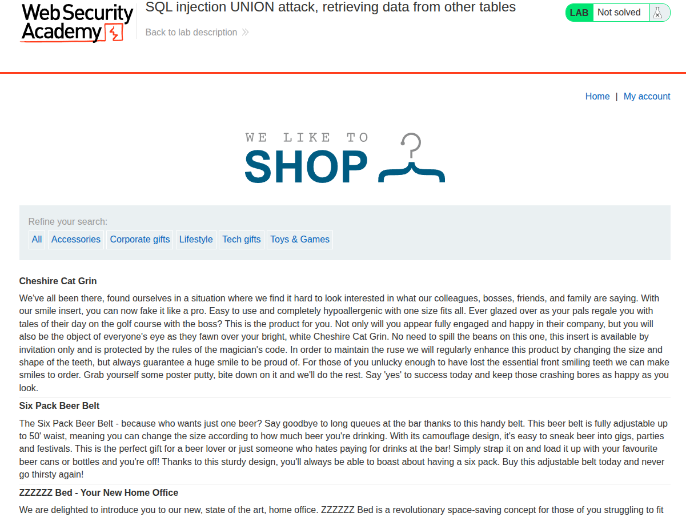

## Introduction

This is the ninth PortSwigger SQLi lab titled [SQL injection UNION attack, retrieving data from other tables](https://portswigger.net/web-security/sql-injection/union-attacks/lab-retrieve-data-from-other-tables).

It has the following description:

**This lab contains a SQL injection vulnerability in the product category filter. The results from the query are returned in the application's response, so you can use a UNION attack to retrieve data from other tables. To construct such an attack, you need to combine some of the techniques you learned in previous labs. The database contains a different table called users, with columns called username and password. To solve the lab, perform a SQL injection UNION attack that retrieves all usernames and passwords, and use the information to log in as the administrator user.**

We already did this in previous labs, so this should be a piece of cake.

## Recon 

We see the usual e-commerce-like website provided by PortSwigger, as shown in the following image.



When we click on a specific category, we basically send a GET request to `/filter?category=<Category-Name>`.

## Vuln Detection and Analysis

When we add the payload `' OR '1'='1' -- ` to the URL `/filter?category=<Category-Name>`, we get to see that all items from all categories are listed, as shown in the following image.


So, since that payload returned all items regardless of the category name we selected, this screams a SQLi vulnerability, and the SQL statement we injected looks something like this: `SELECT ... FROM Iteams WHERE Category='USERINPUT'`.

## Exploitation and Payload

So, we are trying to extract username and password from the users table; we can do this using a `UNION` attack by, of course, respecting the rules of the SQL UNION clause, which are:

1. Each SELECT clause should have the same number of columns
2. Columns with the same index should have compatible types

```sql
SELECT INT,FLOAT,CHAR FROM X UNION SELECT INT,FLOAT,CHAR; -- Correct
SELECT INT,FLOAT,CHAR FROM X UNION SELECT INT,CHAR,INT; -- False
SELECT INT,FLOAT,CHAR FROM X UNION SELECT INT,NULL,NULL; -- Correct NULL is compatible with almost everything
```
So, we will first see how many cols are returned by doing a UNION attack with NULL cols only.

If we inject `' UNION SELECT NULL,NULL -- `, we get normal results, which means that two columns are returned from the first select clause, and that's exactly how many cols we need for username and password.


If we inject `' UNION SELECT username,password FROM users -- `, we get all the credentials shown in the following image.


If we log in with those creds, we get to enter other users' accounts, especially admin's, and thus the lab is solved.

## Conclusion

This was an easy lab if you already worked with the others; the next one is more interesting: what if we wanted to extract two items while we are only allowed to extract one using a UNION attack?