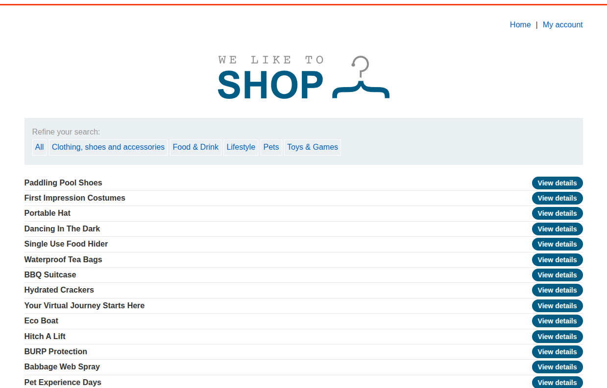

## Introduction

This is the 10th PortSwigger SQLi lab titled [SQL injection UNION attack, retrieving multiple values in a single column](https://portswigger.net/web-security/sql-injection/union-attacks/lab-retrieve-multiple-values-in-single-column).

It has the following description:

**This lab contains a SQL injection vulnerability in the product category filter. The results from the query are returned in the application's response so you can use a UNION attack to retrieve data from other tables. The database contains a different table called users, with columns called username and password. To solve the lab, perform a SQL injection UNION attack that retrieves all usernames and passwords, and use the information to log in as the administrator user.**

So basically, in the UNION attack this time we are only allowed to extract one column from the table, and we are supposed to exploit this.

## Recon

We are faced with the usual e-commerce-like website, as shown in the following image.



When we select a specific category, we are redirected to the URL `/filter?category=<CategoryName>`.


## Vuln Detection and Analysis

Let's try to find error-based SQLi by adding `'` to the URL, and indeed we get an internal server error, shown in the following image.


Let's make sure that there is SQLi by adding the famous payload `' OR '1' = '1' --` (without a space, to know if it is MySQL or not), and eventually we get all the items regardless of their categories; this screams SQLi because we are interfering with the SQL clause. By observing the behavior, it might be:

```sql
SELECT ... FROM Items WHERE Category='<USERINPUT>';
```


## Exploitation and Payload

We are going to perform a SQLi UNION attack, but first we need to know two things:

1. How many columns are returned by the initial `SELECT` clause.
2. What is the type of each column.

So first we inject `' UNION SELECT NULL -- ` to see if 1 column is returned; if it returns an internal server error, we try two NULLs and keep adding until no internal server error is present.

Eventually, if we inject `' UNION SELECT NULL,NULL -- `, it works perfectly, so we are trying to return username and password from users — both are strings — so let's see which column returns a string by trying `' UNION SELECT 'abc', NULL --` first, and if it doesn't work we try `' UNION SELECT NULL,'abc' -- `, and if that doesn't work we finally try `' UNION SELECT 'abc','abc' -- `.

After we inject `' UNION SELECT NULL,'abc' --`, it is the one injection that works, so the second column is a string and the first one is not. Basically, we are working with a SQL clause that only returns one string, and we need to extract two strings — username and password — to log in.

We can either extract them by query, like `' UNION SELECT NULL,username from users -- ` and then `' UNION SELECT NULL,password FROM users -- `.

But there is a clever approach to reduce the number of requests, which is string concatenation. We can concatenate two strings in a select statement depending on the database we are using.

```sql
Oracle	'foo'||'bar'
Microsoft	'foo'+'bar'
PostgreSQL	'foo'||'bar'
MySQL	'foo' 'bar' [Note the space between the two strings]
CONCAT('foo','bar')
```

What we are sure of is that this isn't a MySQL database because comments don't need spaces, and this isn't an Oracle database because we do not need a dual table to extract separate values like NULL, so either it is a Microsoft or a PostgreSQL database, and both have different concatenation syntax, so let's try the PostgreSQL method first — we are basically trying to eliminate.

So the payload is:

```sql
' UNION SELECT NULL,username||':'||password FROM users -- `
```
Eventually, if we try it, we get all credentials from the table users separated by `:`, as shown in the following image.


And we can use admin credentials to log in, and thus the lab is solved ALHAMDULLAH.


## Conclusion

That was a great way to learn more about UNION attacks, since we won't always have ideal cases where we can extract whatever we need and want.